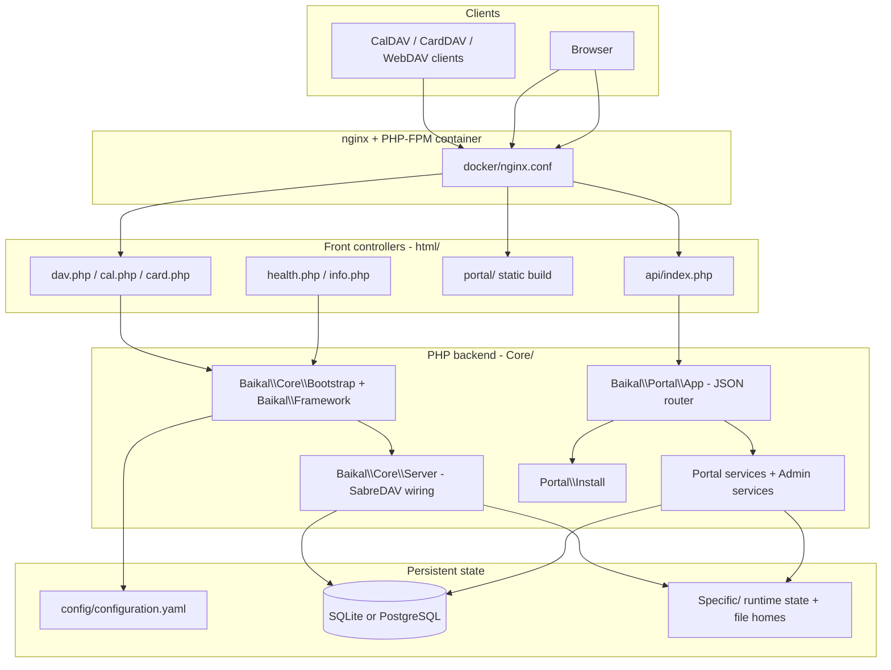

# AngaraDAV Architecture, Compatibility Boundaries, and Conventions

Reference map of the codebase as it exists: what each area is, where it lives, what it depends on, and the conventions it follows. Descriptive only — it records observed structure, not proposals.

Companion docs: [docs/architecture-and-conventions.md](docs/architecture-and-conventions.md) (Architecture and Conventions). [README.md](README.md) (product overview) · [AGENTS.md](AGENTS.md) (agent rules) · [portal/README.md](portal/README.md) (SPA internals) · [CHANGELOG.md](CHANGELOG.md) · [SECURITY.md](docs/SECURITY.md) · [patches/README.md](patches/README.md) · [docs/baikal-to-angara-migration-plan.md](docs/baikal-to-angara-migration-plan.md).

---

## 1. System overview

AngaraDAV is a self-hosted CalDAV/CardDAV/WebDAV server derived from Baïkal and powered by SabreDAV, plus a dependency-free TypeScript SPA ("portal") that talks to a hand-rolled PHP JSON API. Both halves share one database and one `config/configuration.yaml`.



Two independent HTTP surfaces sit on the same data:

| Surface | Entry | Auth | Consumers |
|---|---|---|---|
| DAV protocol | [html/dav.php](html/dav.php), [html/cal.php](html/cal.php), [html/card.php](html/card.php) | SabreDAV Digest/Basic/Apache | Thunderbird, DAVx5, Apple, Home Assistant |
| Portal JSON API | [html/api/index.php](html/api/index.php) → `Baikal\Portal\App` | PHP session cookie + CSRF + same-origin | The SPA only |

---

## 2. Toolchains and targets

### PHP

| Item | Value | Source |
|---|---|---|
| Runtime | `php: ^8.4` | [composer.json](composer.json) |
| Autoload | **PSR-0** (not PSR-4): `Baikal` and `BaikalAdmin` → `Core/Frameworks/` | [composer.json](composer.json) |
| Core deps | `sabre/dav ~4.7.0`, `symfony/yaml ^8.1`, `minishlink/web-push ^11.0`, `symfony/http-client ^8.1`, `nyholm/psr7 ^1.8` | [composer.json](composer.json) |
| Required ext | `curl`, `dom`, `mbstring`, `openssl`, `pdo`, `zlib` (`gmp` suggested for faster VAPID) | [composer.json](composer.json) |
| Dev deps | `php-cs-fixer ^3.95`, `phpstan ^2.2` + deprecation rules | [composer.json](composer.json) |
| Static analysis | PHPStan **level 0**, analysing only `Core` and `html` | [phpstan.neon](phpstan.neon) |
| Formatting | `@PSR2` + `@Symfony`, same-line opening braces, repo-wide except `vendor` | [.php-cs-fixer.dist.php](.php-cs-fixer.dist.php) |
| Vendor patching | `post-install-cmd` / `post-update-cmd` run `scripts/apply-vendor-patches.sh` | [composer.json](composer.json) |

`composer test` = cs-fixer + phpstan. It does **not** run `tests/php`.

### Portal (TypeScript)

| Item | Value | Source |
|---|---|---|
| Build | `tsc --noEmit && vite build` | [portal/package.json](portal/package.json) |
| Deps | **Zero runtime deps**; devDeps only `typescript ^6`, `vite ^8` | [portal/package.json](portal/package.json) |
| TS config | ES2022, `bundler` resolution, `strict`, `noEmit`, `noUnusedLocals/Parameters`; `src/**/*.test.ts` excluded from typecheck | [portal/tsconfig.json](portal/tsconfig.json) |
| Vite | `base: "/portal/"`, `outDir: "../html/portal"`, `emptyOutDir`, `sourcemap: false`; dev proxy `/api` → `:31088` | [portal/vite.config.ts](portal/vite.config.ts) |
| Tests | Node built-in `node:test` via `--experimental-strip-types`, 14 files enumerated explicitly (no glob) | [portal/package.json](portal/package.json) |

### Make targets — [Makefile](Makefile)

| Target | Runs |
|---|---|
| `help` | Version + target list |
| `dist` | Production zip into `build/` (`composer install --no-dev`, platform pinned to PHP 8.4) |
| `build-assets` | Regenerates `Core/Resources/Db/SQLite/db.sql` from sabre/dav example SQL |
| `portal` | Guards against root-owned `node_modules`, then `npm test && npm run build` |
| `php-test` | `set -e` loop running every `tests/php/*.php` |
| `local-build` / `local-up` / `local-down` / `local-logs` | Delegate to [scripts/local-docker.sh](scripts/local-docker.sh) |
| `clean` | Removes `config/configuration.yaml`, `Specific/db/db.sqlite`, `Specific/INSTALL_DISABLED` |

### CI

- [.github/workflows/ci.yml](.github/workflows/ci.yml) — matrix PHP 8.4/8.5/8.6; runs 14 named PHP test scripts individually, then `php-cs-fixer --dry-run --diff` and `composer phpstan`. A second job runs `FileSchemaDriverTest.php` against a `postgres:18` service container. It does not run `make php-test`, and it does not run portal tests.
- [.github/workflows/docker.yml](.github/workflows/docker.yml) — multi-arch (`linux/amd64,linux/arm64`) GHCR publish. Tags: `latest` (default branch only), `sha-<sha>`, branch ref, tag ref, semver. Build args `GIT_SHA`, `BUILD_TIME`. **Only branches in its `push.branches` allowlist publish images.**
- [.github/actions/build/action.yaml](.github/actions/build/action.yaml) — composite setup (PHP extensions, Composer cache, installs `patch` for the vendor-patch hook).

---

## 3. Repository layout

| Path | Role |
|---|---|
| [Core/Distrib.php](Core/Distrib.php) | Product/build constants + version helper functions |
| `Core/BuildInfo.php` | **Generated at image build, gitignored**; defines `ANGARA_BUILD_GIT` |
| [Core/Frameworks/Baikal/Core](Core/Frameworks/Baikal/Core) | Bootstrap, SabreDAV wiring, auth, plugins, WebDAV file storage |
| [Core/Frameworks/Baikal/Portal](Core/Frameworks/Baikal/Portal) | **Active** portal JSON backend (routes, services, admin, install) |
| [Core/Frameworks/Baikal/Model](Core/Frameworks/Baikal/Model) | YAML config models (`system`, `database` sections) |
| [Core/Frameworks/BaikalAdmin](Core/Frameworks/BaikalAdmin) | Legacy compatibility scaffolding only — no new features |
| [Core/Resources](Core/Resources) | DB schema snapshots, web assets |
| [html/](html) | Document root / front controllers |
| [html/portal/](html/portal) | **Generated Vite output — never hand-edit** |
| [portal/](portal) | SPA source |
| [docker/](docker) | nginx config + ordered entrypoint scripts |
| [scripts/](scripts) | Vendor patching, push worker, files maintenance, local Docker, dev router |
| [patches/](patches) | sabre/dav patch applied post-install |
| [tests/php/](tests/php) | Standalone PHP test scripts |
| `Specific/` | Runtime state (gitignored) — DB, install lock, file homes, push state, logs |
| `config/` | `configuration.yaml.dist` committed; live `configuration.yaml` gitignored/generated |

---

## 4. PHP backend — Core runtime and DAV

### Bootstrap chain

Every entry point defines `PROJECT_PATH_ROOT` and context constants, then calls `Baikal\Core\Bootstrap::bootstrap()` followed by `Baikal\Framework::bootstrap()`.

**[Core/Frameworks/Baikal/Core/Bootstrap.php](Core/Frameworks/Baikal/Core/Bootstrap.php)** — all-static. Defines `PROJECT_PATH_*` constants; resolves config path from `ANGARA_PATH_CONFIG` (else `config/`) and runtime state from `ANGARA_PATH_SPECIFIC` (else `Specific/`); requires `Distrib.php`; configures + starts the session and seeds `$_SESSION['CSRF_TOKEN']`; then opens PDO. `initDb()` dispatches on `database.backend === 'pgsql'` versus SQLite, sets `ERRMODE_EXCEPTION`, and skips DB setup during install. Holds the PDO singleton (also mirrored into `$GLOBALS['pdo']`).

**[Core/Frameworks/Baikal/Framework.php](Core/Frameworks/Baikal/Framework.php)** — the install/upgrade gate. `bootstrap()` asserts the environment, loads YAML, sets the timezone, and calls `installTool($reason)` when config is missing, `configured_version` is empty, `baikal_needs_upgrade()` is true, or the admin password hash is empty. `installTool()` behaves by context: no-op under `ANGARA_CONTEXT_INSTALL`; throws `ApiException` **503** with `code`/`installUrl`/`productVersion` under `ANGARA_CONTEXT_PORTAL_API`; otherwise HTTP-redirects to `/portal/install/`. Also installs an error handler converting PHP errors to `\ErrorException` (required by SabreDAV).

**[Core/Frameworks/Baikal/Core/Tools.php](Core/Frameworks/Baikal/Core/Tools.php)** — environment assertions (context constant set, PDO available, sqlite/pgsql driver present, `XMLReader` present, temp dir writable), config assertions, table lists, and the `defaultCalendarComponents()` policy (`VEVENT` always; `VTODO` when `tasks_enabled`; `VJOURNAL` when `notes_enabled`).

**[Core/Distrib.php](Core/Distrib.php)** — defines `ANGARA_VERSION_BASE`, `ANGARA_GIT_SHA`, `ANGARA_VERSION`, `ANGARA_HOMEPAGE`. Build SHA precedence: env `ANGARA_BUILD_GIT` → env `GITHUB_SHA` → `ANGARA_BUILD_GIT` constant → `git rev-parse`. Global helper functions keep their historical `baikal_` prefix: `baikal_version_base()`, `baikal_needs_upgrade()`, `baikal_resolve_git_sha()`, `baikal_short_git_sha()`.

### SabreDAV wiring — [Core/Frameworks/Baikal/Core/Server.php](Core/Frameworks/Baikal/Core/Server.php)

The single place the DAV node tree and every plugin are assembled.

- **Auth backend** by `dav_auth_type`: `Basic` → `Baikal\Core\PDOBasicAuth`; `Apache` → SabreDAV Apache backend; default `Digest` → SabreDAV PDO backend with realm.
- **Node tree**: principals collection always; `CalDAV\CalendarRoot` over [`ReadOnlyCalendarBackend`](Core/Frameworks/Baikal/Core/ReadOnlyCalendarBackend.php); `CardDAV\AddressBookRoot`; `Files\HomeCollection` when files are enabled.
- **Plugins**: Auth, DAVACL, Browser, PropertyStorage, Sync; Locks + `IfHeaderPreconditionPlugin` when files are active; CalDAV set (ICS export, Schedule, Sharing, [`ReadOnlyPlugin`](Core/Frameworks/Baikal/Core/Plugins/ReadOnlyPlugin.php), IMip when `invite_from` set); CardDAV set (VCF export); [`PushPlugin`](Core/Frameworks/Baikal/Core/Plugins/PushPlugin.php) when `push_enabled`.
- **Convention**: optional subsystems (files, push) are wrapped in `try/catch (\Throwable)` + `error_log` so CalDAV/CardDAV keep working if they fail to initialise.

### WebDAV files — [Core/Frameworks/Baikal/Core/Files](Core/Frameworks/Baikal/Core/Files)

| Class | Role |
|---|---|
| `FileStorageConfig` | Resolves storage root (env `ANGARA_FILES_STORAGE_PATH` → YAML → `Specific/files`), upload/quota limits, and the `homes/ tmp/ quarantine/ locks/` layout. Enforces path safety: absolute-only, no symlink components, never inside `html/`, `..` cannot escape root. Creates dirs `0700`. |
| `SchemaManager` | Creates/verifies the `file_homes` table (SQLite + PostgreSQL variants) |
| `HomeRepository` | Allocates random storage ids, quarantines a user's home on delete, purges expired quarantine, cleans temp files |
| `HomeCollection` / `Directory` / `File` | SabreDAV nodes; owner-only ACL, listing disabled at the collection root, symlinks skipped, home root cannot be deleted/renamed |
| `HomeStorage` | All mutations; enforces `MAX_PATH_BYTES 4096`, `MAX_SEGMENT_BYTES 255`, `MAX_DEPTH 64`, quota |
| `IfHeaderPreconditionPlugin` | Works around a SabreDAV 4.7 RFC 4918 `If:` header deviation, scoped to `files/` |

### WebDAV-Push — [Core/Frameworks/Baikal/Core/Plugins/Push](Core/Frameworks/Baikal/Core/Plugins/Push)

Implements draft-bitfire-webdav-push. `PushPlugin` handles registration and change dispatch; `ChangeNotifier` lets portal API writes enqueue the same jobs as DAV writes; `QueueStorage`/`SubscriptionStorage` persist state; `SubscriptionValidator` performs SSRF-style endpoint validation with host pinning; `SecretCipher` encrypts stored secrets with `database.encryption_key`; `VapidKeyStore` persists the VAPID identity to `Specific/push_vapid.json`; `PushWorker` is the bounded CLI loop driven by [scripts/push-worker.php](scripts/push-worker.php). `PushLogger` writes only to `Specific/push_debug.log` — never `error_log()`.

### Config models — [Core/Frameworks/Baikal/Model](Core/Frameworks/Baikal/Model)

`Config` (abstract) owns the **atomic YAML write**: dump → temp file with `LOCK_EX` → `rename()` → `chmod 0600` → re-read and re-parse to verify. `Config\Standard` maps the `system` section (service flags, files limits, auth realm, session age, push settings, `admin_passwordhash`) and clamps numeric ranges; its getter returns `""` for password properties so hashes are never echoed. `Config\Database` maps the `database` section.

---

## 5. PHP backend — Portal JSON API

`Baikal\Portal\App` ([Core/Frameworks/Baikal/Portal/App.php](Core/Frameworks/Baikal/Portal/App.php)) is a hand-rolled router reached from [html/api/index.php](html/api/index.php). Its constructor is the DI root, building every service and the three route modules.

### Request pipeline (order matters)

1. **Binary responses first**, before `dispatch()` — file download, calendar/addressbook/contact export, contact photo.
2. `GET /ui` — public, unauthenticated.
3. `POST /login` — same-origin checked.
4. **State-changing gate** for `POST|PUT|PATCH|DELETE`: `assertSameOrigin()` → session check (401) → `assertCsrf()`. GET routes never CSRF-check.
5. `GET /me` — returns HTTP 200 with `user: null` when anonymous (deliberately avoids a spurious 401 on first paint).
6. **Admin gate**: `/admin` or `/admin/*` → `AdminAuth::requireAdmin()` → `dispatchAdminRoutes()`. This is the only admin entry point.
7. `Auth::requireUser()`. `POST /me/password` changes that user's DAV digest (`Auth::changePassword`) and returns `{"ok":true}`. Then route modules in order: calendars → contacts → files → items.
8. Fallthrough → `ApiException('Not found', 404)`.

### Response and error envelope

`HttpIO::json()` ([Core/Frameworks/Baikal/Portal/Http/HttpIO.php](Core/Frameworks/Baikal/Portal/Http/HttpIO.php)) is the single JSON writer: `application/json; charset=utf-8`, `Cache-Control: no-store`, `X-Content-Type-Options: nosniff`, `JSON_UNESCAPED_SLASHES|JSON_UNESCAPED_UNICODE`.

- Success: bare object keyed by resource — `{"calendars": [...]}`, `{"event": {...}}`, `{"ok": true}`. Admin reads are wrapped as `{"data": ...}`.
- Error: `{"error": "message"}` at the `ApiException` status. `ApiException` ([ApiException.php](Core/Frameworks/Baikal/Portal/ApiException.php)) extends `\RuntimeException` and carries `$status` (default 400) plus an optional `$payload` merged by the front controller.
- Long imports stream NDJSON (`{"type":"progress"|"done"|"error"}`) with `X-Accel-Buffering: no`.

### Route modules — [Core/Frameworks/Baikal/Portal/Http](Core/Frameworks/Baikal/Portal/Http)

All share one signature: `dispatch(string $method, string $path, string $username): array|list|null`, where `null` means "not my route". **No module touches auth or CSRF** — that already happened in `App::dispatch()`.

**[CalendarRoutes.php](Core/Frameworks/Baikal/Portal/Http/CalendarRoutes.php)**

| Method | Path | Service |
|---|---|---|
| GET | `/directory` | `ShareService::directory()` |
| GET | `/holidays/countries` | `Holidays::countries()` |
| GET/POST | `/calendars` | `CalendarService::listCalendars()` / `createCalendar()` |
| PATCH·PUT/DELETE | `/calendars/{id}` | `updateCalendar()` / `deleteCalendar()` |
| GET/POST | `/calendars/{id}/events` | `EventService::listEvents()` / `createEvent()` |
| GET/PATCH·PUT/DELETE | `/calendars/{id}/events/{uri}` | `getEvent()` / `updateEvent()` / `deleteEvent()` |
| POST | `/calendars/{id}/import` | `CalendarImportService::importCalendar()` |
| GET/POST/DELETE | `/calendars/{id}/shares` | `ShareService` list/add/revoke |

**[ContactRoutes.php](Core/Frameworks/Baikal/Portal/Http/ContactRoutes.php)** — address book CRUD, import, and contacts CRUD. `/contacts/bulk` and `/contacts/export` are matched **before** the generic `/contacts/{uri}` regex.

**[ItemRoutes.php](Core/Frameworks/Baikal/Portal/Http/ItemRoutes.php)** — tasks (VTODO) and notes (VJOURNAL) generated from one `foreach` over `['tasks' => KIND_TASK, 'notes' => KIND_NOTE]`; response key is the singular via `rtrim($seg, 's')`. `?cascade=1` is honoured for tasks only.

**Files routes** live inline in `App::dispatchFileRoutes()`: `/files`, `/files/entries`, `/files/mkdir`, `/files/upload`, `/files/entry`, `/files/rename`, `/files/move`, `/files/copy`, `/files/bulk`.

### Admin API — [Core/Frameworks/Baikal/Portal/Admin](Core/Frameworks/Baikal/Portal/Admin)

Routed by `App::dispatchAdminRoutes()`. Coverage: `/admin/ping`, `/admin/dashboard`, `/admin/capabilities`, `/admin/settings/system`, `/admin/settings/reset-to-default`, `/admin/settings/backup`, `/admin/settings/restore`, `/admin/settings/database` (+`/test`), `/admin/users` and `/admin/users/{u}` with nested `/calendars` and `/addressbooks`.

| Service | Responsibility |
|---|---|
| `AdminAudit` | One-line audit records: `admin audit actor= action= target= result=`. Drops any context key matching `/pass\|digest\|secret\|token\|hash\|csrf/i`. Writes to `Specific/portal_debug.log`. |
| `AdminDashboardService` | Read-only counts (allow-listed table names) + service flags + links |
| `AdminCapabilitiesService` | `uiEnabled` + admin page list; API stays available even when the UI is hidden |
| `AdminUserService` | User CRUD in one transaction (principal + user + default calendar + default address book); never returns `digesta1`; refuses to delete the last user or the last admin; quarantines the file home before cascade; password changes IP rate-limited |
| `AdminUserResourceService` | Per-user calendars/address books, scoped by the *target* user's principal |
| `AdminSettingsService` | Only portal writer of `configuration.yaml`. `FORBIDDEN_BODY_KEYS` + `EDITABLE_KEYS` allow-list; atomic write + verify; `push_enabled` requires an `https://` external URL; factory reset honours install lock |
| `AdminBackupService` | Settings export/preview/restore; checksummed, size/key capped; restore re-uses `updateSystemSettings()` so it is never a weaker path than PATCH |

Admin conventions: every mutation is wrapped `try { … audit 'ok' } catch (ApiException $e) { audit 'error:'.$status; throw; }`; destructive operations require an explicit `confirm` (database writes require the literal string `CONFIRM`); secrets surface only as `has*` booleans; unmatched `/admin/*` returns **404, not 403**, so missing features are obvious.

### Auth

**[Auth.php](Core/Frameworks/Baikal/Portal/Auth.php)** — session keys `angara_portal_user`, `angara_portal_csrf`, `angara_portal_last`, `angara_portal_login_at`; session name `ANGARAPORTAL`. Cookie is `HttpOnly`, `SameSite=Lax`, `Secure` on HTTPS; strict mode; `session_regenerate_id(true)` on login and after a successful self-service password change. Idle timeout via last-seen. Login rate limit 20 failures / 900 s per IP in `Specific/portal_login_rate.json`; failures also `error_log` a Fail2Ban-friendly line. `changePassword()` (`POST /me/password`) verifies the current password, writes `users.digesta1` only (not `system.admin_passwordhash`), requires 8+ characters, and limits successful changes to 5 / 900 s per username in `Specific/portal_self_password_rate.json`. A wrong current password is **400**, not 401.

**[AdminAuth.php](Core/Frameworks/Baikal/Portal/AdminAuth.php)** — admin role precedence, first match wins:
1. env `ANGARA_PORTAL_ADMIN_USERS`
2. env `PORTAL_ADMIN_USERS`
3. YAML `system.portal_admin_users`
4. if the resulting list is empty → DAV user named `admin` (case-insensitive)

**[SameOrigin.php](Core/Frameworks/Baikal/Portal/SameOrigin.php)** — shared by portal and installer so they cannot drift. Empty `Host` is allowed; `Origin` must host-match; else `Referer`; if neither yields a host it **fails closed** with 403.

### Domain services (selected)

| Class | Responsibility |
|---|---|
| `CalendarStore` / `ContactStore` | Shared SabreDAV PDO backends, ACL checks, URI helpers, push notification, import transactions |
| `CalendarService`, `EventService`, `ShareService` | Calendar CRUD, VEVENT CRUD with RRULE expansion (capped at 500), sharing |
| `CalendarItemService` | Tasks + notes in CalDAV calendars; subtasks via `RELATED-TO;RELTYPE=PARENT` with cycle detection |
| `ContactService`, `VCardMapper` | Contact CRUD preserving unknown vCard properties; photo sanitize/resize; custom fields under `X-BAIKAL-CUSTOM` |
| `CalendarImportService`, `ContactImportService` | ICS/vCard import-export; chunked transactions (`IMPORT_TX_CHUNK = 200`) so SQLite does not fsync per row |
| `FileService`, `FileDownloadRateLimiter` | Portal API over the same file homes as `/dav.php/files/{user}/` |
| `PortalMeta` | Per-calendar-instance flags (`readOnly`, `holidaysCountry`) in `Specific/portal_meta.json`; also enforced for DAV clients by `ReadOnlyPlugin` |
| `NoteDescriptionFormat` | VJOURNAL HTML ↔ Markdown bridging for jtx Board interop |

### Installer — [Core/Frameworks/Baikal/Portal/Install](Core/Frameworks/Baikal/Portal/Install)

`InstallApp` is a separate unauthenticated router mounted at `/api/install/*`, sharing only `SameOrigin` and session start with the main app. `InstallService::status()` resolves the step in fixed order: `permissions` → `initialize` → `upgrade` → `locked` → `done` → `database`. Lock semantics: `Specific/INSTALL_DISABLED` marker; env hard lock when `ANGARA_LOCK_INSTALL=1` and not `ANGARA_ALLOW_REINSTALL=1` (both compared strictly against `'1'`). `SchemaUpgrade::run()` never throws — it returns `{ok, errors, success}`. The version bump calls `Config::persist()`, which merges the settings model onto the existing `system` section, so keys the model does not own (`portal_log_level`, `portal_time_format`, `portal_week_start`, `portal_admin_users`, and the rest) are not reset.

---

## 6. Portal SPA

`mountApp()` in [portal/src/app.ts](portal/src/app.ts) is the composition root: one mutable `AppState`, six domain hosts, one `AppOrchestrator` bag, delegated listeners registered once, then full re-render by assigning `innerHTML`.

### Core loop

```
user event → delegated listener (events.ts) → onAction.ts → domain *ActionsRouter
  → mutate state → state.busy = true → render()
  → await api.* → catch → setFlash("error") → finally { state.busy = false; render(); }
```

`render()` captures scroll → renders login or `renderHome()` → `bindAfterRender()` → restores scroll → repositions popovers in a `requestAnimationFrame`.

### API layer — [portal/src/api](portal/src/api)

- [client.ts](portal/src/api/client.ts) — the only network primitive. `request<T>()` always sends `credentials: "same-origin"` and attaches `X-CSRF-Token` for non-GET. `ApiError` carries `status` + `payload`. Global `setOnUnauthorized` / `setOnSessionActivity` hooks drive session expiry, with `/login`, `/ui`, `/logout`, `/install/*` exempt. `streamImport()` posts raw `text/calendar` / `text/vcard` (not JSON, so non-UTF-8 exports survive) and consumes NDJSON.
- Domain clients (`adminApi`, `calendarsApi`, `contactsApi`, `itemsApi`, `filesApi`, `sessionApi`) each export one `const <domain>Api = { … }` object of arrow functions returning `request<T>()` with an inline generic. [api.ts](portal/src/api.ts) spreads them into one flat `api` object, so callers write `api.tasks()`, `api.filesList()`, `api.adminUsers()`.
- `filesApi` uploads via XHR (for progress) and therefore imports the low-level CSRF/session helpers directly.
- All wire types live in [types.ts](portal/src/api/types.ts), with JSDoc naming the exact endpoint.

### App structure — [portal/src/app](portal/src/app)

| File | Role |
|---|---|
| [orchestrator.ts](portal/src/app/orchestrator.ts) | Type only — the shared runtime bag. Header states new code should take a domain host instead of growing this type. |
| [context.ts](portal/src/app/context.ts) | `AppState` (flat, mutable, grouped by domain) + `createAppState()` |
| [home.ts](portal/src/app/home.ts) | Signed-in shell; tab switch; toggles `layout-*` and `cal-modal-open` body classes |
| [events.ts](portal/src/app/events.ts) | Mount-time delegated listeners (click, submit, change, input, keydown, drag, error), bound once per root via `WeakMap` |
| [onAction.ts](portal/src/app/onAction.ts) | Thin dispatcher → shell → admin → files → calendars → tasks → notes → contacts |
| [afterRender.ts](portal/src/app/afterRender.ts) | Re-applies what `innerHTML` destroys: outside-click handlers, `indeterminate`, focus, scroll |
| [overlays.ts](portal/src/app/overlays.ts) | Splits `#app` into `#portal-page` + `#portal-overlays`; overlays re-render only when a stability key changes, so a PDF iframe is not remounted |
| [notify.ts](portal/src/app/notify.ts) / [flash.ts](portal/src/app/flash.ts) | Toasts mounted on `<body>` (outside the re-render root, so timers survive); errors are sticky; duplicates collapse to `×N` |
| [session.ts](portal/src/app/session.ts) | Role/service gating (fails open until capabilities load), idle timer, full session-state wipe |
| [routing.ts](portal/src/app/routing.ts) / [navigation.ts](portal/src/app/navigation.ts) | Hash routes `#admin`, `#admin/{page}`, `#admin/users/{user}`; tab activation and data loading |
| [bootstrap.ts](portal/src/app/bootstrap.ts) | `/api/install/status` → `/api/ui` → `/api/me`, gating session restore behind install/upgrade |

### The host pattern

Each domain defines `host.ts` exporting a **type only**. The common surface is `{ state, root, render, setFlash, clearFlash }`; domains add capabilities as function properties (e.g. tasks/notes add `renderPortalDateTimeField`; calendars add the datetime helpers, `accessBadge`, `loadHome`). Concrete host objects are built **only** in `mountApp`. Domain functions are free functions whose first parameter is the host:

```ts
export async function loadTasks(host: TasksHost) { … }
```

This inverts dependency direction — domains never import `app.ts`. Unused hosts are prefixed `_` to satisfy `noUnusedParameters`.

Recurring files per domain: `host.ts` (type), `index.ts` (barrel), `loaders.ts` (fetch + mutate state), `actions.ts` (submit/bulk handlers), `actionsRouter.ts` (`handle<Domain>Action(host, action, t, ev) => Promise<boolean>`), `render.ts` (`render<Domain>Tab(host) => string`), `listing.ts` (pure, unit-tested), `tree.ts`, `bind.ts` (post-render DOM-only). Calendars and contacts additionally use `home.ts`, which takes the orchestrator rather than the host.

Domain sizes: calendars 18 files, files 18, admin 13, contacts 9, tasks 8, notes 8.

### Rendering and escaping conventions

- All HTML is built as template-literal strings; every interpolated value passes through `esc()` from [portal/src/ui.ts](portal/src/ui.ts).
- Only five `innerHTML` assignments exist app-wide (home, overlays, login, info modal, note editor). Note editor content goes through `sanitizeNoteHtml()`.
- Toast DOM is built with `createElement` + `textContent` — no string interpolation.
- The sole event contract is the `data-action` / `data-form` attribute pair (plus `data-id`, `data-uri`, `data-instance`, `data-path`, `data-info`, `data-info-title`, `data-info-paragraphs`, `data-sort`). `data-info` names a registered section. `data-info-title` and `data-info-paragraphs` (JSON string array) are the inline **(i)** payload from `infoIconHtml()` and win when both are present. Nothing binds per-element listeners except the documented post-render exceptions and the installer.
- Dialogs all use the `.cal-modal` shell from `renderModal()` (historical name, used for every dialog).

### Styling — [portal/src/styles.css](portal/src/styles.css), [portal/src/styles/](portal/src/styles)

Theme is attribute-based on `<html data-theme="dark|light">` with ~35 CSS custom properties (`--bg`, `--surface`, `--border`, `--text`, `--primary`, `--danger`, `--radius`, `--topnav-height`, …). Not strict BEM: flat hyphenated component prefixes with `is-*` state modifiers (`.cal-modal-card`, `.tab-btn.is-active`, `.files-panel.is-dragover`). Body `layout-*` classes (`layout-auth`, `layout-calendars`, `layout-contacts`, `layout-tasks` — shared by Tasks *and* Notes — `layout-files`, `layout-admin`, `layout-install`) pin chrome and confine scrolling per tab. Section comments frequently cite their TS source file.

### Installer SPA — [portal/src/install.ts](portal/src/install.ts)

Deliberately standalone: its own state, its own `api()` helper against `/api/install*`, and per-element listeners rather than the delegated path.

---

## 7. Data and runtime state

| Location | Contents | Notes |
|---|---|---|
| `config/configuration.yaml` | `system` + `database` sections | Gitignored, generated by installer/admin. Template: [config/configuration.yaml.dist](config/configuration.yaml.dist). Written atomically, `chmod 0600`. |
| `Specific/db/db.sqlite` | SQLite database | Default backend |
| `Specific/INSTALL_DISABLED` | Install lock marker | |
| `Specific/portal_meta.json` | Per-calendar-instance read-only / holiday flags | |
| `Specific/files/{homes,tmp,quarantine,locks}` | WebDAV file homes | Dirs `0700` |
| `Specific/push_vapid.json` | VAPID private key | **Never commit** |
| `Specific/portal_debug.log`, `push_debug.log` | Portal + push logs | Portal logging never uses `error_log()` (php-fpm would tag every line `[error]`) |
| `Specific/*_rate.json` | Login / download / install rate-limit counters | |

Databases: **SQLite and PostgreSQL only** — MySQL support was removed deliberately.

---

## 8. Deployment and operations

### Image — [Dockerfile](Dockerfile)

Three stages: `composer:2.10.2` builder (installs deps, applies vendor patches) → `node:24-alpine` portal build → `nginx:1.31.3-trixie` runtime with PHP-FPM from the Sury repo. PHP-FPM runs as `nginx` on a unix socket. Uploads are capped in PHP at `upload_max_filesize = 1G` / `post_max_size = 1G`. `Core/BuildInfo.php` is generated here from `GIT_SHA`. Volumes: `/var/www/baikal/config` and `/var/www/baikal/Specific`. Exposes 80; no `CMD` override — the stock nginx entrypoint runs `/docker-entrypoint.d/*`.

### nginx — [docker/nginx.conf](docker/nginx.conf), [docker/nginx-security-headers.inc](docker/nginx-security-headers.inc)

Routes `/health.php`, `/info.php`, `/admin` → 302 `/portal/`, the SPA (`/portal/assets/` immutable-cached, `index.html` no-store, SPA fallback), `/api/*` → `html/api/index.php`, and `/dav.php` with `fastcgi_request_buffering off` for large PUTs. Denies `/Core`, `/Specific`, `/config`, dotfiles. Security headers include a strict CSP; `blob:` in `frame-src` is required for PDF preview. Every location that sets its own `add_header` re-includes the header file, because nginx does not inherit `add_header` into such locations.

The trailing marker `# BAIKAL_DAV_UPLOAD_LIMIT` on `client_max_body_size` lines is a **sed target** consumed by entrypoint script 35.

### Entrypoint scripts — [docker/entrypoint.d](docker/entrypoint.d)

| Order | Script | Purpose | Env |
|---|---|---|---|
| 25 | `25-check-baikal-persistence.sh` | Warn-only: verifies `config`/`Specific` are real bind mounts | — |
| 26 | `26-check-skip-chown-writable.sh` | When skip-chown is on, **fails hard** unless dirs exist, are uid 101, and are writable | `ANGARA_SKIP_CHOWN` |
| 30 | `30-create-baikal-database-folder.sh` | `mkdir -p Specific/db` | — |
| 35 | `35-configure-nginx-dav-upload-limit.sh` | Validates size against `^[1-9][0-9]*[kKmMgG]?$` (so `256MB` is invalid, `256M` is valid) and rewrites every marked `client_max_body_size` | `ANGARA_DAV_MAX_BODY_SIZE`, default `1G` |
| 40 | `40-disable-nginx-ipv6-if-unsupported.sh` | Comments out `listen [::]:80` when IPv6 is unavailable | — |
| 40 | `40-fix-baikal-file-permissions.sh` | Bounded chown/chmod (deliberately not fully recursive over file homes) | `ANGARA_SKIP_CHOWN` |
| 40 | `40-php-fpm.sh` | Starts PHP-FPM | `PHP_VERSION` |
| 45 | `45-webdav-push-worker.sh` | Supervises the push worker; stops permanently on exit code 2 | — |
| 46 | `46-webdav-files-maintenance.sh` | Runs `scripts/files-maintenance.php` on a fixed interval as `nginx` (quarantine purge + temp cleanup); the script self-locks and no-ops when Files is disabled/unprovisioned | `ANGARA_FILES_MAINTENANCE_INTERVAL_SECONDS` (default `3600`) |
| 50 | `50-start-msmtp.sh` | Writes `/etc/msmtprc` | `MSMTPRC` |

The three `40-` scripts run in lexical order.

### Templates and local dev

[docs/local.compose.yaml](docs/local.compose.yaml) (included by root [compose.yaml](compose.yaml)) builds `angaradav:local` on port 31088 with `.local-run/` binds. [docs/truenas-scale.compose.yaml](docs/truenas-scale.compose.yaml) and [docs/truenas-scale-postgres.compose.yaml](docs/truenas-scale-postgres.compose.yaml) pull from GHCR with host-path binds and a `/health.php` healthcheck. [scripts/local-docker.sh](scripts/local-docker.sh) falls back to plain `docker build`/`run` when the Compose plugin is absent and polls health for 60 s.

**Image tag selection**: `latest` tracks the default branch; `sha-<sha>` pins an exact commit; a branch tag exists only if that branch is in the `docker.yml` allowlist.

### Helper scripts

| Script | Purpose |
|---|---|
| [scripts/apply-vendor-patches.sh](scripts/apply-vendor-patches.sh) | Idempotently applies the sabre/dav patch; detects "already applied" by grepping for `resolveCalendarTimeZone` |
| [scripts/push-worker.php](scripts/push-worker.php) | Push delivery loop; single-instance `flock`; exit 2 = permanent config failure |
| [scripts/files-maintenance.php](scripts/files-maintenance.php) | Quarantine purge + temp cleanup; scheduled hourly by `docker/entrypoint.d/46-webdav-files-maintenance.sh` |
| [scripts/dev-server-router.php](scripts/dev-server-router.php) | Router for `php -S` local development |

### Vendor patch — [patches/README.md](patches/README.md)

Baikal stores `calendar-timezone` as a plain Olson id, while stock sabre/dav parses it as a VCALENDAR blob, so `calendar-query` + `<C:expand/>` clients (Home Assistant) hit HTTP 500. The patch adds `resolveCalendarTimeZone()` accepting both forms. Target: sabre/dav 4.7.x as locked.

---

## 9. Compatibility boundaries

These are **contracts**, not branding. Changing them breaks live installs, stored data, or remote clients.

### Never rename

| Contract | Where |
|---|---|
| PHP namespaces `Baikal\*`, `BaikalAdmin\*` | PSR-0 map in [composer.json](composer.json) — directory ↔ namespace must stay aligned |
| `config/configuration.yaml` filename and schema | Read by bootstrap, models, services |
| Docker path `/var/www/baikal` | Image layout, volumes, all deployment templates |
| Digest realm `BaikalDAV` | Stored `digesta1` hashes are `md5(user:realm:password)` — changing the realm invalidates every DAV password |
| DAV endpoints `/dav.php/`, `/cal.php/`, `/card.php/` | Configured in every client |
| vCard property `X-BAIKAL-CUSTOM` | Persisted inside user data |
| Session keys `angara_portal_*`, session name `ANGARAPORTAL`, install keys `angara_install_*` | Renaming logs out every active session |
| Header fallback `X-Baikal-CSRF` | Accepted alongside `X-CSRF-Token` |
| Global functions `baikal_version_base()`, `baikal_needs_upgrade()`, `baikal_resolve_git_sha()`, `baikal_short_git_sha()` | Called across `Core/` and `html/` |
| nginx marker `# BAIKAL_DAV_UPLOAD_LIMIT` | Entrypoint 35 rewrites by this exact comment |

### Environment variables

As of 2.5.0 the `BAIKAL_*` aliases for product/build constants, context/path constants, files storage, push, portal admin/log level, and installer lock/reinstall were **removed** — only `ANGARA_*` (and any previously supported unprefixed variable such as `PORTAL_ADMIN_USERS`, `PORTAL_LOG_LEVEL`, `PUSH_LOG_LEVEL`) is read.

Still accepting a legacy `BAIKAL_*` form, by design: `ANGARA_SKIP_CHOWN`, `ANGARA_DAV_MAX_BODY_SIZE` (Docker/nginx runtime knobs), and the test-harness variables `BAIKAL_TEST_PGSQL_*` / `BAIKAL_BASE_URL`.

Precedence rule used throughout: `ANGARA_*` → existing unprefixed variable (if any) → YAML → default. Never reorder existing precedence; only prepend `ANGARA_*`.

### Layered limits

Upload size is enforced at three independent layers; the effective ceiling is the minimum:

$$\text{effective max} = \min\big(\texttt{ANGARA\_DAV\_MAX\_BODY\_SIZE},\ \texttt{php upload\_max\_filesize},\ \texttt{ANGARA\_FILES\_MAX\_UPLOAD\_MB}\big)$$

`ANGARA_DAV_MAX_BODY_SIZE` is a single global nginx `client_max_body_size` covering DAV *and* `/api/*`; it cannot be scoped to Files alone without editing `nginx.conf`.

### Other invariants

- [html/portal/](html/portal) is generated Vite output — regenerate with `make portal`, never hand-edit.
- `Core/BuildInfo.php` is generated at image build and gitignored.
- [Core/Frameworks/BaikalAdmin](Core/Frameworks/BaikalAdmin) is legacy scaffolding; the Formal web admin was removed and `/admin/` only redirects to `/portal/`.
- `docs/portal-*-plan.md`, `docs/DEPLOYMENT.md`, `docs/IMPROVEMENTS.md` are gitignored local docs.

---

## 10. Task-specific conventions

### Adding an admin API endpoint

1. Put logic and validation in a `Baikal\Portal\Admin\*Service`; parse bodies with `HttpIO::jsonBody()`; throw `ApiException` for client errors.
2. Wire the route in `App::dispatchAdminRoutes()` — not in the front controller.
3. Audit every mutation with `AdminAudit`; never log secrets.
4. Require an explicit `confirm` for destructive actions.
5. Add the typed client call in [portal/src/api/adminApi.ts](portal/src/api/adminApi.ts), exposed through [portal/src/api.ts](portal/src/api.ts).
6. Add a standalone PHP test following [tests/php/AdminSettingsServiceTest.php](tests/php/AdminSettingsServiceTest.php).

### Adding a user API endpoint

Add it to the owning `Http/*Routes` module (or create one wired in the `App` constructor); return `null` for non-matching paths so the next module can try; keep auth/CSRF in `App::dispatch()`.

### Adding a portal feature

1. Find the owning domain folder under [portal/src/app](portal/src/app); follow its host.
2. Define wire types in [portal/src/api/types.ts](portal/src/api/types.ts); add the call to the matching domain client — never call `fetch()` directly.
3. Render from state; escape with `esc()`; wire interactions with `data-action` / `data-form` and handle them in the domain's `actionsRouter.ts`.
4. Keep the mutate → `busy` → `render` → `await` → `finally render` shape.
5. Add pure logic to `listing.ts`-style modules and cover it with a `node:test` file — then add that file to the explicit list in [portal/package.json](portal/package.json), or it will not run.
6. Run `make portal`.

### Changing DAV behavior

Wire plugins in [Core/Frameworks/Baikal/Core/Server.php](Core/Frameworks/Baikal/Core/Server.php); keep optional subsystems inside `try/catch (\Throwable)` so core DAV survives their failure. Respect `PortalMeta` read-only flags in both the portal and `ReadOnlyPlugin`. If a change requires patching sabre/dav, add it under [patches/](patches) with a documented reason.

### Coding style

**PHP** — `@PSR2` + `@Symfony` with same-line braces; run `composer cs-fixer`. `Core/` retains legacy Baïkal style in places (static classes, `#` comments, Hungarian `$aData`, `exit()` on fatal misconfiguration); `Portal/` is modern typed PHP with constructor promotion and `ApiException`. Match the file you are editing.

**TypeScript** — no classes for API clients (object literals of arrow functions); free functions taking a host first; explicit return types on exported functions; `strict` with no unused locals/params.

---

## 11. Testing

| Layer | How to run | Notes |
|---|---|---|
| PHP | `make php-test`, or `php tests/php/<File>.php` | Standalone scripts, **not** PHPUnit |
| Static | `composer phpstan`, `composer cs-fixer` | `composer test` = these two only |
| Portal | `npm test` in [portal/](portal), or `make portal` | `node:test`; the 17 files are enumerated in `package.json` |
| E2E | `pytest tests/portal_admin_e2e.py -v` | Live instance only; `make local-up` first |

**PHP test convention** — every file: `declare(strict_types=1)`, `require` the autoloader from `dirname(__DIR__, 2)`, a local `$failures` counter and an `assert_true(bool, string)` helper printing `OK`/`FAIL`, and a final `exit($failures === 0 ? 0 : 1)` with an `All … tests passed.` line. `make php-test` relies on those exit codes.

**Test files** — [tests/php/](tests/php) covers admin services and authz, env precedence, calendar items, contacts, files (storage/service/rate limit/schema), push, read-only enforcement, same-origin, self-service password change, install/upgrade gating, version comparison, health endpoint, nginx CSP headers, and local-Docker DX contracts.

**E2E** — [tests/portal_api_helpers.py](tests/portal_api_helpers.py) uses only stdlib `urllib` + `CookieJar`, and synthesizes `Origin`/`Referer` plus `X-CSRF-Token` on mutations to satisfy the same-origin gate. Env: `BAIKAL_BASE_URL`, `PORTAL_TEST_ADMIN_PASSWORD`. The suite skips itself when no server responds or `PORTAL_E2E=0`.

---

## 12. Observations

Recorded as facts, not recommendations:

- CI runs 18 of the 36 `tests/php/` scripts (17 named in `code-analysis`, plus `FileSchemaDriverTest.php`); the rest run only via `make php-test`.
- No CI job runs the portal `npm test` or `npm run build`; the portal is built only inside the Docker image stage.
- `composer test` does not execute `tests/php`.
- Portal test files must be added to `package.json` manually — there is no glob.
- `Dockerfile` emits `ANGARA_BUILD_GIT` and `ANGARA_BUILD_TIME` into gitignored `Core/BuildInfo.php`. PHP version display reads `ANGARA_BUILD_GIT` only.
- `esc()` in [portal/src/ui.ts](portal/src/ui.ts) escapes `&`, `<`, `>`, `"` but not `'`.
- [portal/src/app/admin/meta.ts](portal/src/app/admin/meta.ts) re-declares a local `parseAdminPageId` that duplicates the exported one in [portal/src/app/routing.ts](portal/src/app/routing.ts).
- `AppContext` is constructed in `mountApp` and immediately discarded via `void ctx`.
- `ApiException::getPayload()` extras are merged in [html/api/index.php](html/api/index.php), not in `App::handle()`.
- WebDAV Basic/Digest auth has per-IP rate limiting in `PDOBasicAuth`; both portal and admin logins are rate-limited too. Self-service password changes are limited to 5 successes / 900 s per username.
- The `docker.yml` branch allowlist means feature branches produce no GHCR image unless explicitly added.
