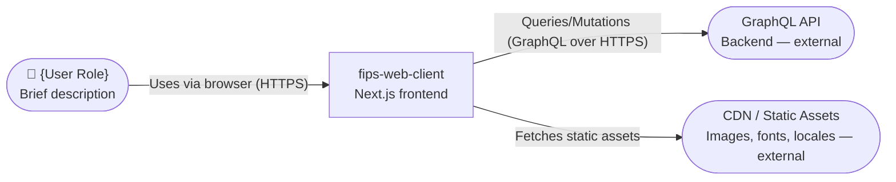
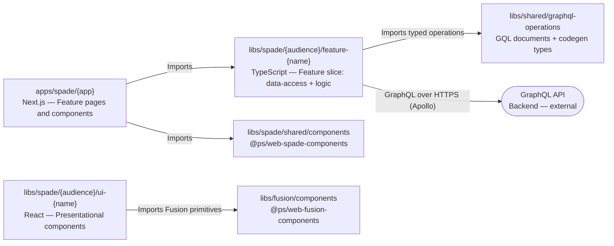
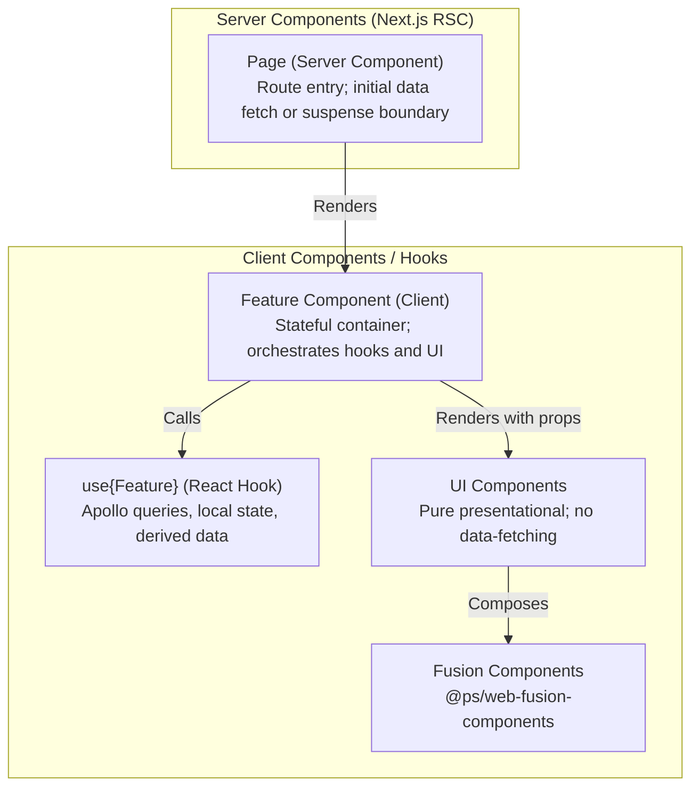
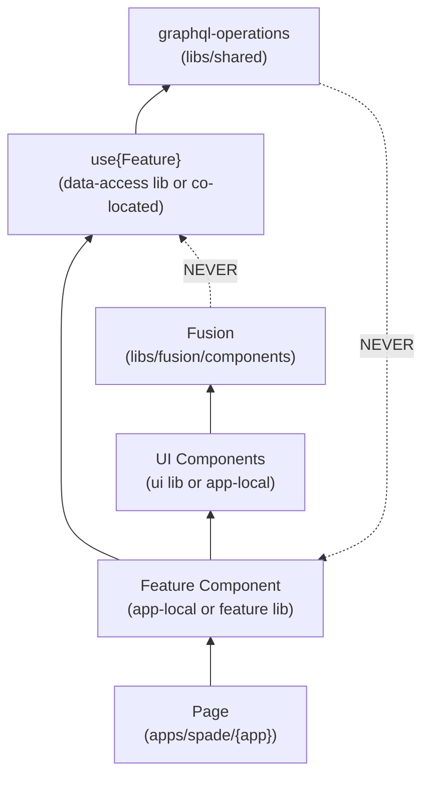
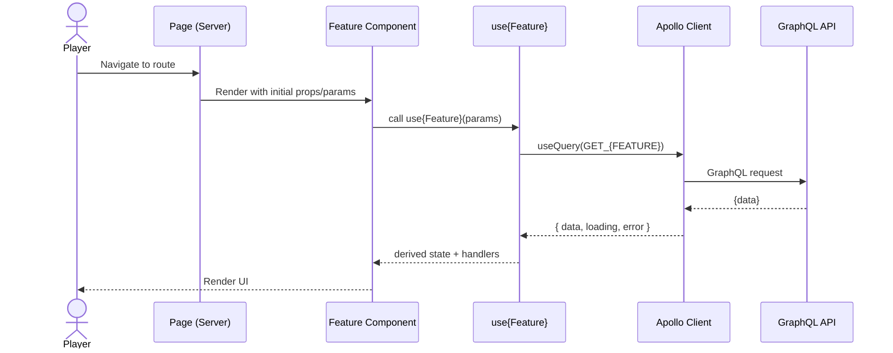

# /design — Design a Feature (Code Plan)

You are an expert software architect for this monorepo.
Design WHAT and WHY before HOW. All design documents are produced in one pass, then presented for human approval before any code planning begins.

**Core principle:** Each document is a separate VIEW of the same feature.
Structure (01), Behavior (02), Decisions (03), Testing (04), and optionally API Contract (05).

**Flow:** Phase 0 (understand) → Phase 1 (create docs) → Phase 2 (review) → **Phase 3 (wait for approval ✋)** → Phase 4 (code plan) → **Phase 5 (wait for approval ✋)** → implementation.

## Arguments

- `$ARGUMENTS[0]` — feature name slug (e.g. `player-dashboard`, `calendar-view`)
- `$ARGUMENTS[1]` — scope (`app` | `lib` | `cross-cutting`)
- `$ARGUMENTS[2:]` — feature description, Jira ticket, or path to research doc

If arguments are missing, ask for them before proceeding.

---

## Rules

1. **Design before code** — never jump to implementation in Phases 1–3
2. **Multi-file by view** — structure (01), behavior (02), decisions (03), testing (04) are ALWAYS separate files
3. **Mermaid for all diagrams** — renderable, versionable, diffable. Use only standard diagram types (`flowchart`, `sequenceDiagram`, `erDiagram`). **Never use `C4Context`, `C4Container`, or `C4Component`** — they require a plugin not available in VS Code Markdown Preview.
4. **file:line references** — when referencing existing code in decision rationales, include the file path and approximate line number (e.g. `libs/shared/graphql-operations/src/lib/player/queries.ts:42`). Omit line numbers for files that do not yet exist.
5. **Facts in research, decisions in design** — research is objective, design is opinionated
6. **Two approval gates** — design AND code plan before implementation; all design docs are produced in one pass before the first gate
7. **Read ALL standards first** — all instruction files in Phase 0.1 before designing
8. **Stop at uncertainty** — ask the user; do not guess architectural decisions
9. **C4 zoom-in** — L1→L2→L3 in one file, they tell one continuous story
10. **Conditional files** — only create `05-api-contract.md` when the feature adds/modifies GraphQL operations
11. **One sequence per use case** — group happy + error + edge under one section
12. **Cross-document consistency** — reviewer verifies all docs reference each other correctly
13. **Match real project patterns** — discovered in Phase 0.3; not textbook patterns
14. **Audience boundary enforcement** — every proposed lib must have correct `audience:*` tags; never cross audience boundaries

---

## Phase 0: Understand the Mission

### 0.1 Read ALL project standards

Always read these before designing:

- [architecture.instructions.md](../instructions/architecture.instructions.md) — workspace structure, module boundaries, component layers
- [typescript-react.instructions.md](../instructions/typescript-react.instructions.md) — TypeScript, React, and styling conventions
- [unit-test.instructions.md](../instructions/unit-test.instructions.md) — testing patterns, RenderBuilder, naming (applies to `*.spec.ts(x)` files; use `vi.fn()` or `jest.fn()` per project executor)
- [fusion.instructions.md](../instructions/fusion.instructions.md) — Fusion Design System usage rules
- [general-coding.instructions.md](../instructions/general-coding.instructions.md) — naming, translations, error handling
- [nx.instructions.md](../instructions/nx.instructions.md) — Nx workspace conventions

### 0.2 Read Research (if provided)

If a research doc path is given in `$ARGUMENTS[2]` — read it fully before continuing.

If no research doc is provided, ask the user:

> **"Do you have a research doc for this feature, or should I run `/research` first before designing?"**

Wait for their response before continuing.

### 0.3 Discover Actual Codebase Structure

Even with a research doc, quickly verify the affected areas:

**For an app feature** (`$ARGUMENTS[1]` == `app`):

- `apps/spade/{audience}/{app}/app/` — existing pages and layouts
- `apps/spade/{audience}/{app}/components/` — existing components
- Any co-located hooks (`use*.ts`) and utilities

**For a lib feature** (`$ARGUMENTS[1]` == `lib`):

- `libs/spade/*/src/lib/` — existing exports
- `project.json` — check if buildable (has `build` target)

**For cross-cutting**:

- All of the above plus `libs/shared/graphql-operations/` for any GraphQL changes

Note where ACTUAL patterns differ from the standards. This matters for implementation.

### 0.4 Understand the Feature

- What user problem does it solve?
- What are the measurable acceptance criteria?
- Is it app-local, a new shared lib, or cross-cutting?
- Does it add/modify GraphQL operations?
- Does it introduce new Nx library projects?
- Does it require an ADR (significant architectural decision)?

### 0.5 Decide Which Documents to Create

**Always create (core):**

- `README.md` — index + business context
- `01-architecture.md` — C4 L1→L2→L3 zoom-in
- `02-behavior.md` — DFD + sequence per use case
- `03-decisions.md` — ADR + risks
- `04-testing.md` — test strategy + coverage mapping

**Create if applicable (conditional):**

- `05-api-contract.md` — if feature adds/modifies GraphQL schema or operations (exact operation shapes and types)

---

## Phase 1: Create Design Documents

```bash
mkdir -p docs/features/$ARGUMENTS[0]
```

### README.md — Index + Context

```markdown
# {Feature Name} — Design

date: YYYY-MM-DD
status: draft
scope: app | lib | cross-cutting
research: ./research.md (if exists)

## Business Context

[WHY this feature — what user problem it solves. 1-3 paragraphs]

## Acceptance Criteria

1. [Measurable criterion]
2. [Measurable criterion]

## Documents

| File               | View     | Description                                |
| ------------------ | -------- | ------------------------------------------ |
| 01-architecture.md | Logical  | C4 L1+L2+L3, module dependencies           |
| 02-behavior.md     | Process  | Data flow + sequence diagrams              |
| 03-decisions.md    | Decision | Design decisions, risks, open questions    |
| 04-testing.md      | Quality  | Test strategy + coverage mapping           |
| 05-api-contract.md | API      | GraphQL operation contract (if applicable) |
| plan/              | Code     | Phase-by-phase implementation plan         |

[Remove rows for files that don't apply]
```

---

### 01-architecture.md — Logical View (C4 L1→L2→L3)

All three C4 levels in one file as a "zoom-in" narrative.

````markdown
# Architecture: {Feature Name}

## C4 Level 1 — System Context

WHO interacts with the system and WHAT external systems are involved.



## C4 Level 2 — Container

WHAT containers/packages are involved and HOW they communicate.



## C4 Level 3 — Component

WHAT internal modules handle the feature logic.



## Module Dependency Graph



**Rules:**

- Dependencies flow **inward** (apps depend on libs, not vice versa).
- `audience:shared` libs MUST NOT import from `audience:player` or `audience:admin`.
- No barrel files (`index.ts`) in app component directories.

## Nx Project Tags

| Project                                    | Tags                                              |
| ------------------------------------------ | ------------------------------------------------- |
| `apps/spade/{app}`                         | `audience:player` or `audience:admin`, `type:app` |
| `libs/spade/{audience}/feature-{name}`     | `audience:{...}`, `type:feature`                  |
| `libs/spade/{audience}/ui-{name}`          | `audience:{...}`, `type:ui`                       |
| `libs/spade/{audience}/data-access-{name}` | `audience:{...}`, `type:data-access`              |
| `libs/spade/shared/*`                      | `audience:shared`, `type:{...}`                   |
````

---

### 02-behavior.md — Process View (DFD + Sequences)

One section per use case. Group happy path + errors + edge cases together.

````markdown
# Behavior: {Feature Name}

## Data Flow Diagrams

### DFD: [Main Flow Name]

```mermaid
flowchart LR
User([Player]) -->|Interaction| Page[Next.js Page]
Page -->|Renders| Feature[Feature Component]
Feature -->|Apollo query| Hook[use{Feature}]
Hook -->|GQL Request| API[(GraphQL API)]
API -->|Response| Hook
Hook -->|Data + state| Feature
Feature -->|Props| UI[UI Components]
UI -->|Render| User
```

## Sequence Diagrams

### Use Case 1: [Name]



**Error cases:**

| Condition        | UI Behavior                  | Hook State      |
| ---------------- | ---------------------------- | --------------- |
| Network error    | Show error message component | `error` truthy  |
| Empty data       | Show empty state / skeleton  | `data` empty    |
| Loading          | Show skeleton/spinner        | `loading: true` |
| Mutation failure | Show toast notification      | mutation error  |

**Edge cases:**

- [Feature-specific edge case — e.g. "user not authenticated → redirect to login"]
- [Feature-specific edge case — e.g. "feature flag disabled → render null or fallback"]
- [Feature-specific edge case — e.g. "mobile viewport → different layout variant"]

### Use Case 2: [Name]

[Repeat per use case]
````

---

### 03-decisions.md — Decision View

```markdown
# Design Decisions: {Feature Name}

## Decisions

| #   | Decision | Choice          | Alternatives    | Rationale                                        |
| --- | -------- | --------------- | --------------- | ------------------------------------------------ |
| 1   | [What]   | [Chosen option] | [Other options] | [Why — reference file:line if codebase evidence] |

## Risks

| Risk   | Impact       | Mitigation      |
| ------ | ------------ | --------------- |
| [Risk] | High/Med/Low | [How to handle] |

## Open Questions

- [ ] [Unresolved question]
- [x] [Resolved question — Answer]

## ADR Required?

If this feature introduces a significant architectural decision (new lib category, new data-fetching pattern,
audience boundary change, etc.), create a new ADR in `docs/decisions/NNN-{slug}.md` following
the template in `docs/decisions/000-template.md` and link it here.
```

---

### 04-testing.md — Quality View

````markdown
# Testing Strategy: {Feature Name}

## Test Rules

Follow [unit-test.instructions.md](.github/instructions/unit-test.instructions.md) for full rules.
Use `vi.fn()` for Vitest projects and `jest.fn()` for Jest projects — check the project's `project.json` executor (`@nx/vite:test` → Vitest, `@nx/jest:jest` → Jest).

## Test Structure

Co-locate test files next to source files:

```
apps/spade/{app}/components/
  MyFeature/
    MyFeature.tsx
    MyFeature.spec.tsx        ← component tests

libs/spade/*/
  src/lib/
    use{Feature}.ts
    use{Feature}.spec.ts      ← hook tests
```

## Coverage Mapping

Every business rule, error case, and edge case must trace to a test.

### Component Tests

| Component          | Scenario          | Test Name                                  |
| ------------------ | ----------------- | ------------------------------------------ |
| {Feature}Component | Happy path render | should render data when query succeeds     |
| {Feature}Component | Loading state     | should show skeleton while loading         |
| {Feature}Component | Error state       | should show error message when query fails |
| {Feature}Component | Empty state       | should show empty state when data is empty |
| {Feature}Component | User interaction  | should call handler when {action}          |

### Hook Tests

| Hook         | Scenario             | Test Name                                  |
| ------------ | -------------------- | ------------------------------------------ |
| use{Feature} | Returns correct data | should return mapped data from query       |
| use{Feature} | Loading state        | should return loading:true before response |
| use{Feature} | Error handling       | should return error when query fails       |

### Page / Integration Tests (if applicable)

| Scenario              | Test Name                                   |
| --------------------- | ------------------------------------------- |
| Route renders feature | should render {Feature} page                |
| SSR initial data      | should pass server data to client component |

### Test Count Summary

| Layer       | Tests |
| ----------- | ----- |
| Components  | N     |
| Hooks       | N     |
| Integration | N     |
| **TOTAL**   | **N** |
````

---

### 05-api-contract.md — GraphQL Contract (CONDITIONAL: only if new/modified operations)

````markdown
# GraphQL Contract: {Feature Name}

## Location

All documents live in `libs/shared/graphql-operations/src/lib/{domain}/`.

## Operations

### Query: GET\_{FEATURE}

```graphql
query Get{Feature}($id: ID!) {
  {featureField}(id: $id) {
    id
    # ... all fields with types
  }
}
```

**Variables:** `{ id: string }`

**Response shape:**

```typescript
type Get{Feature}Query = {
  {featureField}: {
    id: string;
    // ... all fields
  } | null;
};
```

### Mutation: UPDATE\_{FEATURE} (if applicable)

```graphql
mutation Update{Feature}($input: Update{Feature}Input!) {
  update{Feature}(input: $input) {
    id
    # ...
  }
}
```

**Rule:** Every field name and type must be specified. Codegen generates the TypeScript types.
````

---

## Phase 2: Architect Review

Review the generated documents for cross-document consistency. Use the `researcher` subagent if available; otherwise perform the review yourself.

The reviewer MUST check:

- Every component in `01-architecture.md` has test cases in `04-testing.md`
- Every use case in `01-architecture.md` has a sequence diagram in `02-behavior.md`
- Every error state in `02-behavior.md` has a test in `04-testing.md`
- Every GraphQL operation in `02-behavior.md` has exact field shapes in `05-api-contract.md` (if exists)
- Dependency directions in `01-architecture.md` follow rules from `architecture.instructions.md`
- Module boundary tags are correct (no cross-audience imports)
- Lib names follow the `{audience}-{type}-{name}` pattern

If 🔴 Critical findings — fix in the specific file before proceeding.
If 🟠 Important — fix or document why not in `03-decisions.md`.

---

## Phase 3: Present for Human Approval

```markdown
## Design Ready: {Feature Name}

**Summary:** [1-2 sentences]

**Key decisions:**

- [Decision 1]
- [Decision 2]

**Architect review:** ✓ READY / [summary of remaining concerns]

**Files created:**
| File | Lines | View |
|------|-------|------|
| README.md | ~N | Index |
| 01-architecture.md | ~N | Logical |
| 02-behavior.md | ~N | Process |
| 03-decisions.md | ~N | Decision |
| 04-testing.md | ~N | Quality |
| 05-api-contract.md | ~N | GraphQL Contract (if created) |

All at: `docs/features/{feature}/`

**Please:**

1. ✅ Approve → I'll create the code plan
2. 🔄 Request changes → tell me what to adjust
3. ❓ Questions → ask about specific decisions
```

**WAIT for explicit approval before proceeding to code plan.**

If the user requests changes:

1. Update the **specific file** — not all files
2. Re-run architect review if changes are significant
3. Present again

---

## Phase 4: Code Plan (after design approval)

```bash
mkdir -p docs/features/$ARGUMENTS[0]/plan
```

### Phase Strategy (choose one)

| Strategy                | When to use                          | Order                                                                   |
| ----------------------- | ------------------------------------ | ----------------------------------------------------------------------- |
| **Bottom-up** (default) | Most new features                    | Types/GQL ops → Hooks → UI components → Feature component → Page wiring |
| **Lib-first**           | Feature requires a new shared lib    | New lib scaffold → Implement lib → Wire into app                        |
| **Vertical slice**      | Feature has independent sub-features | All layers for Feature A → All layers for Feature B                     |

Document the chosen strategy and WHY in `plan/README.md`.

### plan/README.md — Overview

```markdown
# Code Plan: {Feature Name}

date: YYYY-MM-DD
design: ../README.md
status: draft

## Phase Strategy

[Bottom-up / Lib-first / Vertical slice — and WHY]

## Phases

| #   | Phase  | Layer              | Depends on | Status |
| --- | ------ | ------------------ | ---------- | ------ |
| 1   | [Name] | Types / GQL ops    | —          | ☐      |
| 2   | [Name] | Hook / data-access | Phase 1    | ☐      |
| 3   | [Name] | UI Components      | Phase 1    | ☐      |
| 4   | [Name] | Feature Component  | Phase 2, 3 | ☐      |
| 5   | [Name] | Page wiring        | Phase 4    | ☐      |

## File Map

### New Files

- `path/to/new/file.tsx` — [purpose]

### Modified Files

- `path/to/existing.ts` — [what changes]

### New Nx Projects (if any)

- `libs/spade/{audience}/{type}-{name}` — [purpose, tags]

## Success Criteria

- [ ] All phases completed and verified
- [ ] All tests passing (see ../04-testing.md for full test list)
- [ ] `nx build {lib}` passes for any new/modified buildable libraries
- [ ] TypeScript errors: zero
- [ ] Lint: zero new violations
- [ ] GraphQL contract matches implementation (see ../05-api-contract.md if exists)
- [ ] All acceptance criteria from ../README.md met
- [ ] README.md updated if architecture/routes/providers changed
```

### plan/phase-NN.md — Individual Phase

Each phase file must be **self-contained** — the implementer reads ONLY this file + referenced sources.

````markdown
# Phase {N}: {Phase Name}

phase: N
layer: types | graphql | hook | ui | feature | page
depends_on: [phase-01] or none
design: ../README.md

## Goal

[What this phase achieves — 1-2 sentences]

## Context

[What previous phases produced. Specific files/types created that this phase uses.
Skip for phase-01.]

## Files to Create

### `path/to/Component.tsx`

**Purpose:** [What this file does]
**Implementation details:**

- [Reference: 01-architecture.md for component layer]
- [Reference: 02-behavior.md for interaction logic]
- [Reference: 05-api-contract.md for GraphQL types (if data-fetching)]
- [Fusion components to use — verify against @ps/web-fusion-components; do NOT use patterns from `libs/fusion/components/src/lib/recipes` in production code (see fusion.instructions.md)]
- [Client vs Server directive — see architecture.instructions.md]
- [Translation keys — use `useSpadeTranslations()` or `<Translation>` from `@ps/web-spade-components/server` in Server Components, from `@ps/web-spade-components` in Client Components]

### `path/to/Component.spec.tsx`

**Tests from 04-testing.md to implement here:**

- should {behavior} when {condition}
- should {behavior} when {condition}

## Files to Modify

### `path/to/existing.ts`

**What changes:** [Description]
**Why:** [Reference design doc section]

## Nx Projects to Scaffold (if applicable)

```bash
yarn nx g @nx/react:library {name} --directory=libs/spade/{audience}/{name} --tags="audience:{...},type:{...}"
```

## Buildable Lib Rebuild (if applicable)

After modifying a buildable lib, run:

```bash
yarn nx build {project-name}
```

## Verification

- [ ] `yarn nx typecheck {project}` passes (zero TS errors)
- [ ] `yarn nx test {project}` passes (all new tests green)
- [ ] `yarn nx lint {project}` passes (zero new violations)
- [ ] [Phase-specific check — e.g. "no direct imports from audience:player in audience:shared lib"]
- [ ] [Phase-specific check — e.g. "'use client' present only in interactive components"]
````

### Phase File Rules

1. **Self-contained** — reader needs no other phase file
2. **Context section** — summarize what previous phases produced (skip for phase-01)
3. **Per-file details** — every file with purpose and key implementation notes
4. **No forward references** — don't mention future phases
5. **Verification is phase-scoped** — only check what THIS phase touches
6. **Reference design docs** — link to architecture, behavior, API contract for details

---

## Phase 5: Present Code Plan for Approval

```markdown
## Code Plan Ready: {Feature Name}

**Strategy:** [Bottom-up / Lib-first / Vertical slice]

**Phases:**

1. [Phase 1 summary]
2. [Phase 2 summary]
   ...

**Scope:** New files: N, Modified files: M, New Nx projects: K

**Design:** `docs/features/{feature}/` ✅ Approved
**Plan:** `docs/features/{feature}/plan/` ({N} phase files)

**Next step:** Implement from `docs/features/{feature}/plan/phase-01.md`

**Please:**

1. ✅ Approve → ready for implementation (use `/spade-dev` for Spade components)
2. 🔄 Request changes → specify adjustments
3. ❓ Questions → ask about specific phases
```

**WAIT for approval. Two gates required: design approval AND plan approval.**
