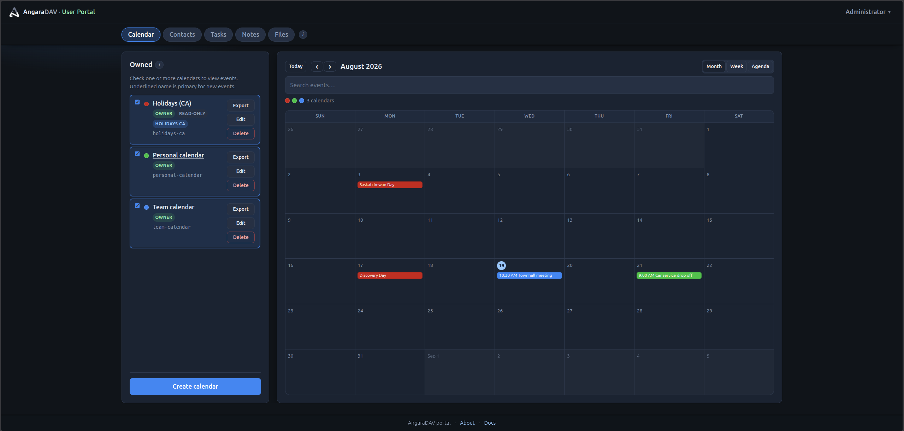
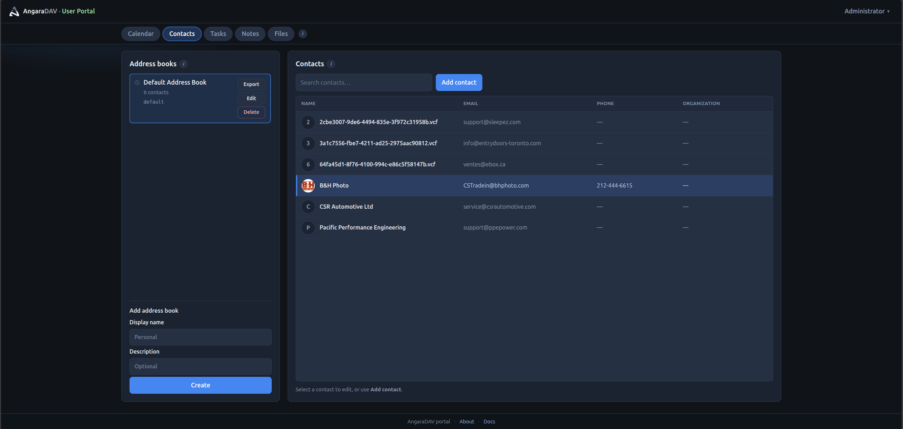
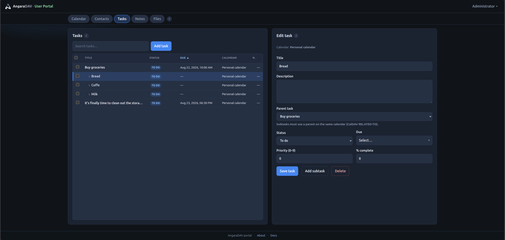
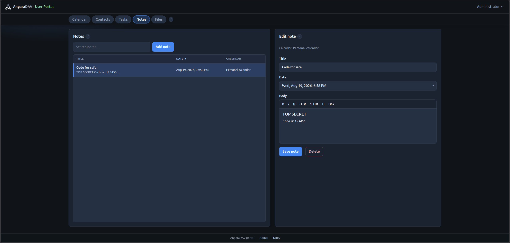
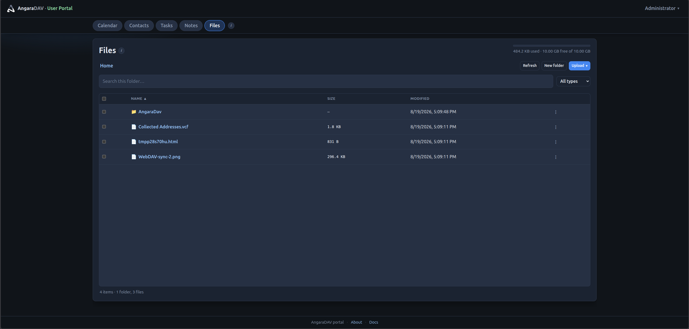
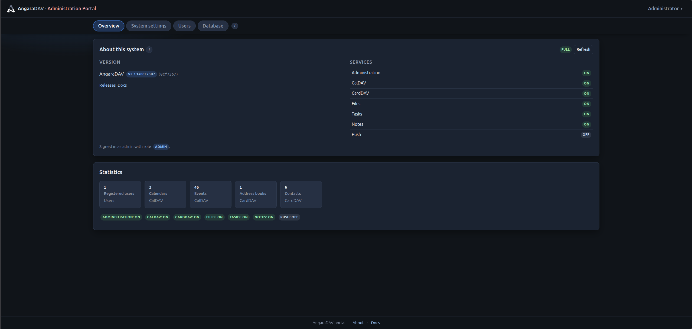

# AngaraDAV

[](https://github.com/offsyanka99/AngaraDAV/actions/workflows/ci.yml)
[](https://github.com/offsyanka99/AngaraDAV/actions/workflows/docker.yml)

Self-hosted **calendar, contacts, tasks, notes, and private files** — CalDAV, CardDAV, and WebDAV — with a browser portal.

**Version:** 2.5.0 · **License:** GPL-2.0-or-later (Baïkal lineage) · [Changelog](CHANGELOG.md)

Images: `ghcr.io/offsyanka99/angaradav` (`latest`, `2.5.0`, `sha-…`) · linux/amd64 + linux/arm64

---

## What you get

| In the portal (`/portal/`) | On the wire |
|----------------------------|-------------|
| **Calendar** — month / week / agenda, search, share, import/export `.ics`, holidays | CalDAV (`/dav.php/`, `/cal.php/`) |
| **Contacts** — address books, search, photos, import/export `.vcf` | CardDAV (`/dav.php/`, `/card.php/`) |
| **Tasks** — VTODO, subtasks, bulk edit, column filters | CalDAV |
| **Notes** — VJOURNAL rich text in a modal (H1–H3, quote, lists, checkboxes, strikethrough, inline code; jtx Markdown in `DESCRIPTION`) | CalDAV |
| **Files** — browse, upload, preview (images, PDF, Office, text, audio, video), copy/move/rename | WebDAV `/dav.php/files/{username}/` |
| **Administration** — users, system settings, database, settings backup/restore (Admin-role DAV users) | `/portal/install/` for setup |
| **WebDAV-Push** (optional) — near-real-time CalDAV/CardDAV change notices (DAVx⁵ and other Web Push clients) | Advertised on `/dav.php/` when enabled |

Clients (DAVx⁵, Thunderbird, Apple, Home Assistant, WebDAV-sync, …) use **DAV username and password**. Tabs follow Admin **DAV services** toggles.

Optional **WebDAV-Push** wakes CalDAV/CardDAV clients instead of waiting for the next poll (shared calendars included; portal writes enqueue the same jobs as `/dav.php/`). Enable it in **Administration → AngaraDAV Settings → Enable WebDAV-Push** and set the canonical HTTPS DAV base (`push_external_url` or `ANGARA_PUSH_EXTERNAL_URL`, typically `https://your-host/dav.php/`). Push is not advertised until that URL is valid HTTPS. It does **not** cover WebDAV file homes.

Companion app: [WebDAV-sync](https://github.com/offsyanka99/WebDAV-sync) for Android file homes.

---

## Screenshots

| | |
|---|--|
| **Calendar** | **Contacts** |
|  |  |
| **Tasks** | **Notes** |
|  |  |
| **Files** | **Administration** |
|  |  |

---

## Quick start

### Pull a release image

```bash
docker pull ghcr.io/offsyanka99/angaradav:latest
docker run -d --name angaradav -p 8080:80 \
  -v angaradav-config:/var/www/baikal/config \
  -v angaradav-data:/var/www/baikal/Specific \
  ghcr.io/offsyanka99/angaradav:latest
```

Open **http://127.0.0.1:8080/portal/install/**, then sign in at `/portal/` with the DAV user created there.

### Run from this repository (local Docker)

```bash
make local-up
```

Then **http://127.0.0.1:31088/portal/install/**. Data lives in gitignored `.local-run/` (created if missing).

| Piece | Value | Note |
|-------|--------|------|
| Image tag | `angaradav:local` | Independent of the container name |
| Container | `angaradav-local` | `docker rm angaradav` does **not** remove it |
| Port | `31088` | Release `docker run` examples often use `8080` |
| Compose | `docs/local.compose.yaml` (also `compose.yaml` include) | `make local-up` force-recreates so a new `nginx.conf` is picked up |

Ubuntu `docker.io` has no Compose plugin — `make local-up` falls back to `docker build`/`docker run` (`sudo apt install docker-compose-v2` if you want Compose). Leave `BAIKAL_SKIP_CHOWN` unset locally so the entrypoint can chown bind dirs Docker created as **root**. If you set `BAIKAL_SKIP_CHOWN=1` without `chown -R 101:101 .local-run`, the container **exits** (PHP cannot write `baikal.yaml`). Empty/`0`/`false` does **not** skip chown.

`docker compose restart` does **not** apply a rebuilt image or `nginx.conf` — use `make local-up` (or `up -d --build --force-recreate`).

Portal Vite (`npm run dev` in `portal/`) proxies `/api` to `:31088`. For a container on `8080`: `ANGARADAV_API=http://127.0.0.1:8080 npm run dev`. Keep `portal/node_modules` owned by your user (`make portal` fails if it is root-owned).

Put **HTTPS** in front for anything beyond a laptop. Do not expose port 80 to the internet.

**TrueNAS SCALE:** [docs/truenas-scale.compose.yaml](docs/truenas-scale.compose.yaml) (SQLite) or [postgres variant](docs/truenas-scale-postgres.compose.yaml). After host `chown -R 101:101` on the datasets, set `BAIKAL_SKIP_CHOWN=1`. Recreate the Custom App / container to pick up a new image (`nginx.conf` is not applied by a process restart).

---

## Endpoints

| Path | Purpose |
|------|---------|
| `/portal/` | User portal + Administration |
| `/portal/install/` | Installer / upgrade |
| `/dav.php/` | CalDAV + CardDAV + WebDAV (WebDAV-Push on collections when enabled) |
| `/dav.php/files/{username}/` | Private file home (when enabled) |
| `/cal.php/` · `/card.php/` | CalDAV / CardDAV only |
| `/api/` | Portal JSON API (session cookie) |
| `/health.php` · `/info.php` | Liveness / public status |

---

## Develop

```text
make help          # dist, portal, php-test, local-up, …
make portal        # TypeScript check, unit tests, Vite build → html/portal/
make php-test      # tests/php/*.php
```

Portal SPA: `portal/` (Vite). PHP API: `Core/Frameworks/Baikal/Portal/`. Keep `portal/node_modules` owned by your user (root-owned trees break Vite with EACCES on `.vite-temp`).

More: [portal/README.md](portal/README.md) · [docs/local.compose.yaml](docs/local.compose.yaml) · [upgrade path](docs/upgrade-path.md) · [Admin / YAML plan](docs/admin-settings-yaml.md)

---

## Compatibility

Upgrades keep existing data. These paths and names are **contracts**, not the product brand: `Baikal\*` PHP namespaces, `baikal.yaml`, `/var/www/baikal`, Digest realm `BaikalDAV`, `/dav.php/`. `ANGARA_SKIP_CHOWN`/`ANGARA_DAV_MAX_BODY_SIZE` still accept their legacy `BAIKAL_SKIP_CHOWN`/`BAIKAL_DAV_MAX_BODY_SIZE` forms indefinitely (Docker/nginx runtime knobs, not this program's scope). Databases: **SQLite** or **PostgreSQL** only.

Product/build globals use `ANGARA_VERSION_BASE`, `ANGARA_VERSION`, `ANGARA_HOMEPAGE`, `ANGARA_BUILD_GIT`, and `ANGARA_GIT_SHA`. As of **2.5.0**, the `BAIKAL_*` compatibility aliases for these (and for the runtime env vars migrated in Phases 1-4: context/path constants, files storage, WebDAV-Push, portal admin/log-level, and installer lock/reinstall) have been removed; only `ANGARA_*` (and any previously-supported unprefixed variable) is read. Rebuild images so `Core/BuildInfo.php` defines `ANGARA_BUILD_GIT` — old images stamping only `BAIKAL_BUILD_GIT` no longer resolve a build SHA.

Admin role: env `PORTAL_ADMIN_USERS`, or YAML `system.portal_admin_users`. If unset, DAV user `admin` is Admin.

---

## Credits

Derived from [Baïkal](https://sabre.io/baikal/) 0.11.1 by [Jérôme Schneider](https://github.com/jeromeschneider) / Net Gusto and [fruux](https://fruux.com/), powered by [SabreDAV](https://sabre.io/). GPL license and copyright notices are preserved.

Contact: [hummersoft@mailbox.org](mailto:hummersoft@mailbox.org)
