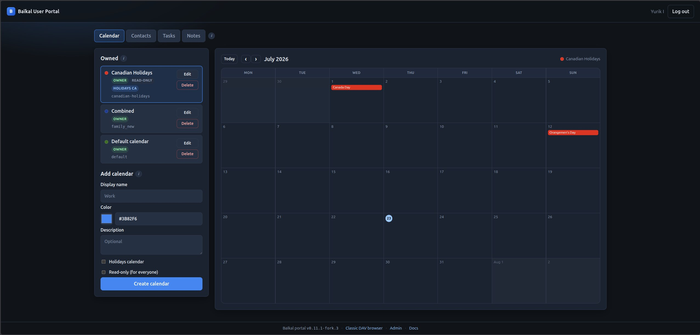
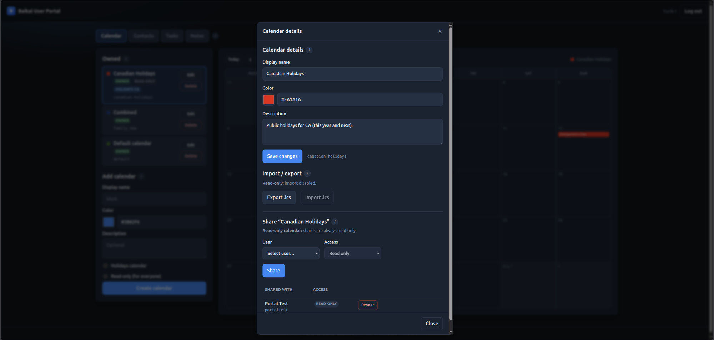
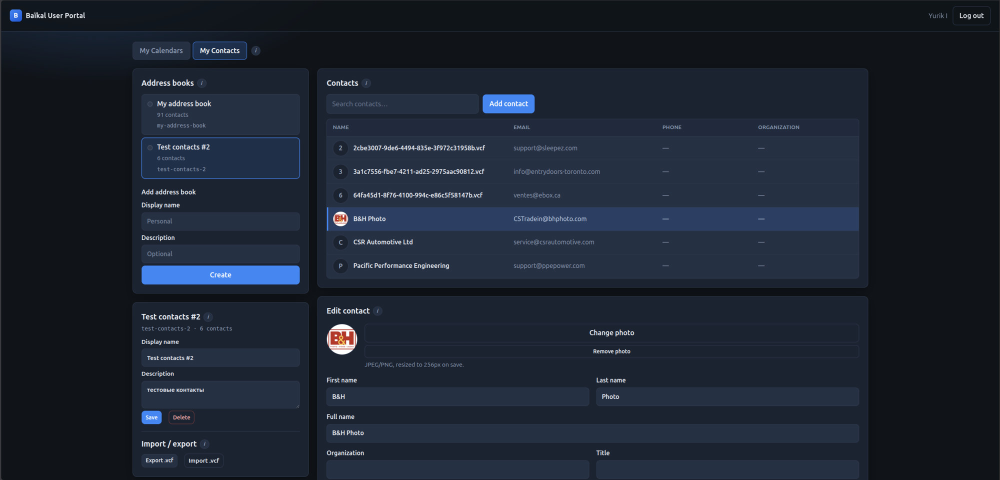
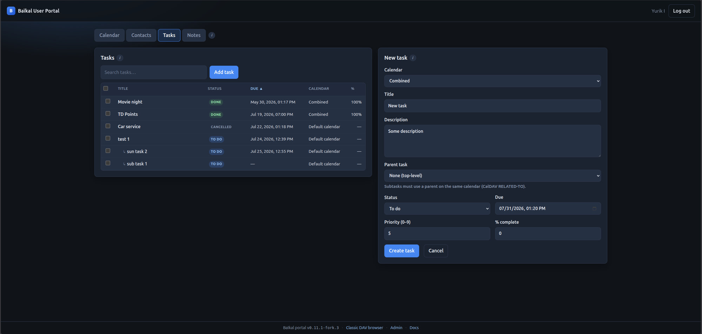
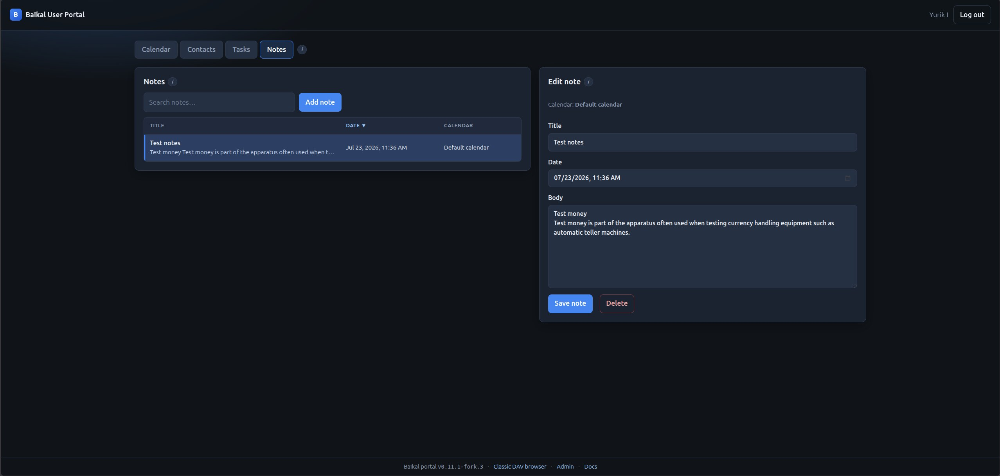

# AngaraDAV deployment guide

**Compatibility version:** `1.0.0` (derived from Baïkal 0.11.1)

AngaraDAV packages a self-hosted calendar, contacts, tasks, notes, and file server for Docker and TrueNAS SCALE. It is derived from [Baïkal](https://sabre.io/baikal/) and powered by SabreDAV.

## Images

| Image | When |
|-------|------|
| `ghcr.io/offsyanka99/angaradav:latest` | Default tracking `main` (GitHub Actions) |
| `ghcr.io/offsyanka99/angaradav:sha-…` | Pin to a tested git SHA |
| Build from `Dockerfile` | Dev / offline packaging |

Multi-arch: `linux/amd64`, `linux/arm64`.

## TrueNAS SCALE

See [`truenas-scale.compose.yaml`](truenas-scale.compose.yaml) for the SQLite variant, or
[`truenas-scale-postgres.compose.yaml`](truenas-scale-postgres.compose.yaml) to bundle a
PostgreSQL 18 container instead. AngaraDAV supports only **SQLite** and **PostgreSQL**
backends — MySQL is not supported.

1. Create dataset dirs and `chown -R 101:101` (nginx UID in the image).
2. Install via Custom App YAML. Prefer **`image: …:latest`** (or a pinned tag) — pull only; do not use the `build:` block on the NAS.
3. Set **`BAIKAL_SKIP_CHOWN=1`** after host `chown 101:101` so startup does not re-chown mounts (avoids hanging on `40-fix-baikal-file-permissions.sh`).
4. Complete the web installer once.
5. Put **HTTPS** in front (TrueNAS proxy, Caddy, Traefik). Do not expose plain HTTP to the internet.
6. After install, ensure `Specific/INSTALL_DISABLED` exists, or set env **`BAIKAL_LOCK_INSTALL=1`** so the installer cannot reopen if the marker is deleted.

### Stuck on `40-fix-baikal-file-permissions.sh`?

The entrypoint was doing a recursive `chown` that can take a very long time on TrueNAS bind mounts. Current images only chown `config/` + `Specific/`, and log start/done. If it still hangs:

```bash
# On the NAS host (adjust path):
chown -R 101:101 /mnt/tank/apps/angaradav
```

Then in compose:

```yaml
environment:
  BAIKAL_SKIP_CHOWN: "1"
```

Redeploy / recreate the container (not only restart).

### Volumes to back up

| Mount | Contents |
|-------|----------|
| `/var/www/baikal/config` | `baikal.yaml` (admin password hash, DAV feature flags, auth, file limits) |
| `/var/www/baikal/Specific` | SQLite DB, private WebDAV file homes/quarantine, `INSTALL_DISABLED`, rate-limit state, portal metadata, WebDAV-Push VAPID identity |

### Settings reset after restart (TrueNAS / Docker)

All admin system settings live in **`config/baikal.yaml`**. The SQLite database and install lock live under **`Specific/`**. Nothing else stores them.

If settings (or the whole install) return to defaults after a container restart/recreate, the host paths are almost never actually persisting. Typical causes:

1. **Host Path volumes not applied** — TrueNAS Custom App fell back to anonymous Docker volumes. Data survives a simple process restart of the *same* container id, but is lost when the app is edited/upgraded/recreated.
2. **Wrong host directories** — compose still points at an empty or different path than the dataset you inspect.
3. **Ownership** — with `BAIKAL_SKIP_CHOWN=1`, the host dirs must be `chown -R 101:101`. If PHP cannot write, the UI now surfaces an error instead of a silent fake “saved”.

**Verify on the NAS after install / after saving settings:**

```bash
# Host dataset must contain the live config (not empty)
ls -la /mnt/tank/apps/angaradav/config/
# expect: baikal.yaml (and usually .htaccess)

ls -la /mnt/tank/apps/angaradav/Specific/
# expect: INSTALL_DISABLED, db/db.sqlite (SQLite installs)

# Confirm the running container's mounts
docker inspect angaradav --format '{{range .Mounts}}{{.Source}} -> {{.Destination}} ({{.Type}}){{println}}{{end}}'
# Destination paths must be host binds, e.g.:
#   /mnt/tank/apps/angaradav/config -> /var/www/baikal/config (bind)
#   /mnt/tank/apps/angaradav/Specific -> /var/www/baikal/Specific (bind)
```

**Health check fields** (`/health.php`):

| Field | Healthy value |
|-------|----------------|
| `configured` | `true` after install |
| `configWritable` / `specificWritable` | `true` |
| `configMount.bindLikely` / `specificMount.bindLikely` | `true` (host bind, not anonymous volume) |
| `persistenceWarning` | `null` |
| `installLocked` | `true` after wizard finishes |

If `bindLikely` is `false` or `persistenceWarning` is set, fix the Custom App **Host Path** volumes and reinstall/migrate data before treating the app as production.

Entrypoint also logs mount warnings at container start (`25-check-baikal-persistence.sh`).

## Endpoints

| Path | Purpose |
|------|---------|
| `/portal/` | **User portal** (calendars, contacts, tasks, notes, files; DAV user login) |
| `/api/` | Portal JSON API (session cookie; same origin as SPA) |
| `/health.php` | Liveness JSON (`status`, `version` with `+git.<sha>`, `git`, install lock, mount hints) |
| `/info.php` | Public feature flags (no secrets); same `version` / `git` fields |
| `/dav.php/` | Combined CalDAV + CardDAV + generic WebDAV + classic browser UI |
| `/dav.php/files/{username}/` | Private generic WebDAV file home (when enabled) |
| `/portal/` → **Files** tab | Browser UI for the same private WebDAV home (list/upload/download/rename/delete) |
| `/cal.php/` | CalDAV only |
| `/card.php/` | CardDAV only |
| `/admin/` | Web admin |

## User portal

Modern UI (TypeScript SPA, dark theme aligned with bookmarks-sync admin style) for **end users**.  
Tabs: **Calendar** · **Contacts** · **Tasks** · **Notes**. Section help is under **(i)** icons.

| Step | Action |
|------|--------|
| 1 | Open `http://NAS-IP:31088/portal/` |
| 2 | Sign in with a **DAV user** (created in Admin → Users), not the admin password |
| 3 | **Calendar:** owned list (Edit / Delete), month grid with create/edit/delete events (RRULE), holidays/read-only; details, share, import/export `.ics`; **select shared calendars** (read-only or full access) to view/edit events; **Add calendar → Import .ics**; large imports show **live %** (chunked SQLite txs keep NAS imports fast) |
| 4 | **Contacts:** address books (delete confirm), contact search/CRUD, photos, birthday/special dates, custom fields, book + single-contact `.vcf` export (progress dialog with **live %** of cards + result) |
| 5 | **Tasks / Notes:** CalDAV `VTODO` / `VJOURNAL` on writable calendars (bulk actions on tasks) |

### Screenshots

**Calendar** — owned calendars (Edit / Delete), badges (owner, read-only, holidays), add form, and month view of the selected calendar’s events:



**Calendar details** — edit name/color/description, share with other users, then import/export `.ics` (modal):



**Contacts** — address books (create/rename/delete), Google-style contact table, search, edit form with photo, import/export `.vcf`:



**Tasks** — sortable `VTODO` list (subtasks indented), multi-select bulk status/due/%, create/edit form with parent task:



**Notes** — sortable `VJOURNAL` list with preview, create/edit form (title, date, body) on a writable calendar:



- Backend: PHP API under `/api/` (session cookie; sabre CalDAV/CardDAV backends).
- Frontend source: [`portal/`](../portal/) (Vite + TypeScript); image build compiles into `html/portal/`.
- Footer **Docs** -> [github.com/offsyanka99/AngaraDAV/tree/main/docs](https://github.com/offsyanka99/AngaraDAV/tree/main/docs).
- **`/dav.php/` remains the combined endpoint** for CalDAV/CardDAV clients, optional private file homes, and the classic browser.
- Portal meta (read-only / holidays flags): `Specific/portal_meta.json` (include in backups).
- **Read-only calendars** are enforced on CalDAV (`/dav.php/`, `/cal.php/`) via `ReadOnlyPlugin` — clients get **403** on write methods, not only a portal import block.
- Contact photos require **PHP GD** (`php8.2-gd` in the Docker image); stored as **vCard 3.0** `PHOTO;ENCODING=b` JPEG (avoids vCard 4 raw-binary corruption).
- Portal sessions: idle timeout from `session_max_age_minutes` (same as admin, default **15** minutes). When the session expires, the SPA **clears all in-memory data**, shows the **Sign in** screen, and a banner: *“Your session timed out. Please sign in again.”* (server 401 + client idle timer aligned via `sessionIdleSeconds` from `/api/ui`). Login rate-limited; CSRF + same-origin checks on mutations.
- Optional portal locale helpers in `baikal.yaml` / env (override browser auto-detect):
  - `system.portal_time_format` or `TIME_FORMAT` / `BAIKAL_PORTAL_TIME_FORMAT`: `auto` | `12h` | `24h`
  - `system.portal_week_start` or `BAIKAL_PORTAL_WEEK_START`: `auto` | `monday` | `sunday`
- Portal debug logging (`off` by default; enable while troubleshooting):
  - `system.portal_log_level` or `PORTAL_LOG_LEVEL` / `BAIKAL_PORTAL_LOG_LEVEL`: `off` | `error` | `warn` | `info` | `debug`
  - **Browser:** open DevTools -> Console; messages are prefixed `[angaradav-portal]`
  - **Server:** all portal request tracing → `Specific/portal_debug.log` (never nginx `[error]`)
  - If Docker logs show `FastCGI sent in stderr: "PHP message: AngaraDAV portal: ..."`, request tracing was routed to stderr unexpectedly. Current images write portal traces to `Specific/portal_debug.log`.
  - Public `GET /api/ui` returns prefs (including log level and `sessionIdleSeconds`) without a session
- Large calendar/contact **import**: progress streams as NDJSON; nginx `/api` allows **900s** FastCGI read. Writes use **chunked SQLite transactions** (every 200 objects) so bulk imports on TrueNAS/ZFS finish in seconds rather than minutes. **Add calendar → Import .ics** creates a calendar and imports in one step.
- Portal static caching (nginx): `/portal/` HTML shell is `no-cache` so new image builds pick up hashed JS; `/portal/assets/*` may be cached long-term (content-hashed filenames).

### API (summary)

| Method | Path | Purpose |
|--------|------|---------|
| GET | `/api/ui` | Public portal prefs (`timeFormat`, `weekStart`, `logLevel`, `sessionIdleSeconds`) |
| POST | `/api/login` | DAV user session (+ `ui` prefs) |
| GET | `/api/me` | Session profile + `ui` prefs |
| GET | `/api/calendars` | List calendars |
| POST | `/api/calendars` | Create (`displayname`, `color?`, `description?`, `holidays?`, `holidayCountry?`, `readOnly?`) |
| PATCH | `/api/calendars/{id}` | Update name / color / description |
| GET | `/api/calendars/{id}/export` | Download `.ics` |
| POST | `/api/calendars/{id}/import` | Import `.ics` body `{ics}` |
| GET | `/api/calendars/{id}/events` | List events (`?from=&to=`) |
| POST | `/api/calendars/{id}/events` | Create VEVENT |
| GET/PATCH/DELETE | `/api/calendars/{id}/events/{uri}` | Get / update / delete VEVENT |
| POST/DELETE | `/api/calendars/{id}/shares` | Share / revoke |
| GET | `/api/addressbooks` | List address books |
| POST | `/api/addressbooks` | Create address book |
| PATCH | `/api/addressbooks/{id}` | Rename / description |
| DELETE | `/api/addressbooks/{id}` | Delete (`force` if non-empty) |
| GET | `/api/addressbooks/{id}/export` | Download `.vcf` |
| POST | `/api/addressbooks/{id}/import` | Import `.vcf` body `{vcf}` |
| GET | `/api/addressbooks/{id}/contacts` | List/search contacts (`?q=`) |
| POST | `/api/addressbooks/{id}/contacts` | Create contact |
| GET/PATCH/DELETE | `/api/addressbooks/{id}/contacts/{uri}` | Get / update / delete contact |
| GET | `/api/addressbooks/{id}/contacts/{uri}/export` | Download single contact `.vcf` |
| GET | `/api/addressbooks/{id}/contacts/{uri}/photo` | Contact photo JPEG |
| GET | `/api/holidays/countries` | Country list for holidays calendars |

See [`portal/README.md`](../portal/README.md).

Local SPA rebuild after UI edits:

```bash
cd portal && npm install && npm run build
# outputs to html/portal/
```

## Home Assistant / calendar-timezone

The inherited Baïkal schema stores each calendar's timezone as a **plain Olson id** (e.g. `America/Toronto`).
Stock sabre/dav expects a full iCalendar `VCALENDAR`/`VTIMEZONE` blob when clients
request `calendar-query` with `<C:expand/>` (Home Assistant does this). That
mismatch produced HTTP 500 / `ParseException` ([sabre-io/dav#1318](https://github.com/sabre-io/dav/issues/1318)).

AngaraDAV always applies a **dual-format** resolver after `composer install` (and
in the Docker image build): plain ids and RFC 4791 VTIMEZONE blobs both work.
No env flag required (unlike `ckulka/baikal`’s `APPLY_HOME_ASSISTANT_FIX`).
See [`patches/README.md`](../patches/README.md).

### Connecting Home Assistant

| Field | Example |
|-------|---------|
| URL | `https://nas.example/dav.php/` or `http://NAS-IP:31088/dav.php/` |
| Username / password | An AngaraDAV **DAV user** (not the admin account) |
| Calendar | Path under that user (HA discovers calendars after auth) |

Prefer **HTTPS** (TrueNAS reverse proxy / Caddy / Traefik) when HA and AngaraDAV
are not on a trusted LAN-only path. Digest auth is fine on LAN; for internet
exposure use TLS and consider Basic over HTTPS (see auth notes below).

## Authentication

### Admin UI

- Password stored with PHP `password_hash()` (bcrypt/argon depending on PHP).
- Legacy SHA-256 / old MD5 admin hashes are accepted once and upgraded on login.
- Rolling idle session (default **15 minutes**, configurable as **Admin session timeout**).
- Failed login rate limit: **10 attempts / 15 minutes / IP** (file under `Specific/`).
- Optional Fail2Ban via `failed_access_message` syslog lines.

### CalDAV / CardDAV users

| Mode | Storage | Recommendation |
|------|---------|----------------|
| **Digest** (default) | MD5 A1 hash `md5(user:realm:pass)` | LAN OK; weak if DB leaks — **use TLS** |
| **Basic** | Same digest hash table today | Prefer **only over HTTPS** |
| **Apache** | Web server auth | When reverse proxy handles users |

There is no separate “TasksDAV” / “NotesDAV”: tasks are **VTODO**, notes are **VJOURNAL** on CalDAV calendars.

Digest clients normally receive an HTTP `401` challenge and retry the same
request with credentials. A sequence such as `401` followed by `207` for
`PROPFIND` or `REPORT` is successful authentication negotiation, not a failed
sync. Expected DAV `4xx` responses remain visible in nginx access logs but are
not copied to PHP/FastCGI error logs. Configure Fail2Ban for DAV endpoints from
repeated terminal `401` access-log entries; `failed_access_message` remains an
admin-login hook.

Calendars marked read-only in the portal advertise a native read-only DAV ACL
to clients and also reject writes as defense in depth. A `PUT` returning `403`
for such a calendar means the client had a local change queued for a collection
that the server intentionally protects. Refresh the account's collection list
after upgrading. Clear the portal read-only flag only if clients should be
allowed to modify that calendar.

## System settings (admin)

| Setting | Effect |
|---------|--------|
| Enable CardDAV / CalDAV | Protocol roots and plugins |
| Enable WebDAV file storage | Owner-only private file homes under `/dav.php/files/` |
| WebDAV file storage path | Absolute path outside the web root; empty uses `Specific/files` |
| WebDAV maximum file size / quota | Per-file upload ceiling in **MB** and per-user application quota in bytes. Env vars (`BAIKAL_FILES_MAX_UPLOAD_BYTES`) and `baikal.yaml` still store the file size limit in bytes; the admin UI field converts to/from MB |
| Deleted user file retention | Days before quarantined homes become eligible for purge |
| Enable Tasks (VTODO) | Default calendars + UI checkbox for todos |
| Enable Notes (VJOURNAL) | Default calendars + UI checkbox for notes |
| Admin session timeout | Idle minutes for admin **and portal** cookie sessions (portal clears UI and shows Sign in on expiry) |
| WebDAV auth type | Digest / Basic / Apache |

## Environment variables (Docker / compose)

| Env | Values / default | Effect |
|-----|------------------|--------|
| `TZ` | e.g. `America/Toronto` | Container timezone (logs, PHP defaults). Also seeds the installer's default **Server Time zone** (`system.timezone`) when no `baikal.yaml` value exists yet — one-time default, not a live override; change it in Admin -> AngaraDAV Settings afterward if needed |
| `BAIKAL_LOCK_INSTALL` | `1` | Force installer lock even if `INSTALL_DISABLED` is missing |
| `BAIKAL_ALLOW_REINSTALL` | `1` | Allow re-opening the installer when lock env is set |
| `BAIKAL_SKIP_CHOWN` | `1` | Skip entrypoint chown of `config/` + `Specific/` (use after host `chown 101:101`; recommended on TrueNAS) |
| `BAIKAL_FILES_STORAGE_PATH` | absolute container path | Override `system.files_storage_path`; mount it persistently and make it writable by UID 101 |
| `BAIKAL_FILES_MAX_UPLOAD_BYTES` | `1073741824` | Maximum completed file size enforced while streaming PUT/COPY bodies |
| `BAIKAL_FILES_QUOTA_BYTES` | `10737418240` | Per-user application quota; `0` disables the application quota |
| `BAIKAL_DAV_MAX_BODY_SIZE` | `1G` | Nginx request-body ceiling; nginx size syntax such as `512M` or `2G` |
| `TIME_FORMAT` / `BAIKAL_PORTAL_TIME_FORMAT` | `auto` (default), `12h`, `24h` | Portal time display |
| `BAIKAL_PORTAL_WEEK_START` | `auto` (default), `monday`, `sunday` | Portal calendar week start |
| `PORTAL_LOG_LEVEL` / `BAIKAL_PORTAL_LOG_LEVEL` | `off` (default), `error`, `warn`, `info`, `debug` | Portal debug: browser console + `Specific/portal_debug.log` |
| `PUSH_LOG_LEVEL` / `BAIKAL_PUSH_LOG_LEVEL` | `off` (default), `error`, `warn`, `info`, `debug` | WebDAV-Push debug: `Specific/push_debug.log` |
| `BAIKAL_PUSH_EXTERNAL_URL` | e.g. `https://dav.example.com/dav.php/` | Canonical client-reachable HTTPS DAV base URL for Push registration URLs |

YAML equivalents under `system.*` in `baikal.yaml`: `files_storage_path`, `files_max_upload_bytes`, `files_quota_bytes`, `portal_time_format`, `portal_week_start`, `portal_log_level`, `push_external_url`, and `push_log_level`. **Env overrides YAML.** (`TZ` is the one exception: it only seeds the installer's initial `timezone` default and is not read again afterward.)

Leave `PORTAL_LOG_LEVEL` at `off` in production; use `debug` only while troubleshooting (verbose UI/API lines; no passwords). Request traces go to **`Specific/portal_debug.log`**, not nginx/docker error streams.

### Common deployment mistakes

- **Setting `BAIKAL_FILES_STORAGE_PATH` without mounting it.** The env var only tells AngaraDAV *where inside the container* to store WebDAV files — it does not create persistence. If that path isn't also bind-mounted (e.g. add `- type: bind, source: /mnt/tank/apps/angaradav/files, target: /var/lib/baikal-files`) and `chown`'d to UID 101 like the other two mounts, every file uploaded there is lost the next time the container is recreated.
- **`BAIKAL_FILES_STORAGE_PATH` / `BAIKAL_PUSH_EXTERNAL_URL` don't enable their features by themselves.** They only configure the path/URL to use *once* the corresponding feature is turned on in Admin → AngaraDAV Settings (**Enable WebDAV file storage**, **Enable WebDAV-Push**). Setting the env var alone does nothing until that admin checkbox is also checked.
- **Debug log files are not visible in Dozzle, `docker logs`, or any other stdout/stderr-based log viewer.** `Specific/portal_debug.log` and `Specific/push_debug.log` are deliberately written to files, not stdout/stderr, specifically so routine activity doesn't flood the container's general log stream (see the Portal/Push logging notes above). To read them: `docker exec <container> tail -f /var/www/baikal/Specific/push_debug.log`, or `tail -f` the equivalent path on the host's bind-mounted `Specific/` dataset.
- **Forgetting to turn `PORTAL_LOG_LEVEL`/`PUSH_LOG_LEVEL` back to `off`** after troubleshooting — both are meant to be temporary.
- **Raising "Maximum WebDAV file size" in the admin UI without also raising the nginx/PHP upload ceilings.** That field (entered in MB) only enforces the application-level limit while streaming a PUT/COPY body. It is independent of nginx's `client_max_body_size` (`BAIKAL_DAV_MAX_BODY_SIZE`, default `1G`) and PHP's `upload_max_filesize`/`post_max_size` (baked into the image at `1G`). Raising only the admin setting above those still gets uploads rejected by nginx/PHP first.

### Generic WebDAV file storage

Enable private mounted-drive storage with **Admin -> AngaraDAV Settings -> Enable
WebDAV file storage**, or configure YAML:

```yaml
system:
  files_enabled: true
  # Empty uses /var/www/baikal/Specific/files.
  files_storage_path: ''
  files_max_upload_bytes: 1073741824  # 1 GiB per file
  files_quota_bytes: 10737418240      # 10 GiB per user; 0 = unlimited
  files_quarantine_days: 30
```

Connect each client to:

```text
https://baikal.example/dav.php/files/USERNAME/
```

Use that user's DAV credentials, not the admin account. Use HTTPS for Basic or
Digest authentication. `/cal.php/` remains CalDAV-only and `/card.php/`
remains CardDAV-only; generic files are exposed only through `/dav.php/`.

The **User portal** (`/portal/`) includes a **Files** tab that uses the same
private home (session cookie + CSRF). Portal file operations are logged to
`Specific/portal_debug.log` when `PORTAL_LOG_LEVEL` / `system.portal_log_level`
is `info` or `debug` (list/upload/download/mkdir/rename/delete).

**Upload size limits:** the UI “max upload” value is the AngaraDAV app quota
(`files_max_upload_bytes`). Multipart portal uploads also need matching
**PHP** (`upload_max_filesize` / `post_max_size`, set to **1G** in the Docker
image) and **nginx** `/api/` `client_max_body_size` (default **1G**, same
`BAIKAL_DAV_MAX_BODY_SIZE` override as DAV). A 4 MB file failing with
“exceeds the server size limit” usually means PHP/nginx still at the old 2 M
defaults — pull a rebuild that includes the 1G PHP/nginx settings.

#### Storage and limits

The default `Specific/files` tree is already part of the packaged persistent
volume. It contains random-ID home directories, same-filesystem upload
temporaries, quarantine, and mutation locks. Physical directory names do not
contain usernames. The nginx route streams PUT bodies to PHP instead of first
buffering a second complete copy.

For a separate TrueNAS dataset or large external volume:

```yaml
services:
  baikal:
    environment:
      BAIKAL_FILES_STORAGE_PATH: /var/lib/baikal-files
      BAIKAL_FILES_MAX_UPLOAD_BYTES: "2147483648"
      BAIKAL_FILES_QUOTA_BYTES: "21474836480"
      BAIKAL_DAV_MAX_BODY_SIZE: 2G
    volumes:
      - /mnt/tank/apps/baikal/files:/var/lib/baikal-files
```

Create the host dataset and set ownership before starting the container:

```bash
chown -R 101:101 /mnt/tank/apps/baikal/files
chmod 700 /mnt/tank/apps/baikal/files
```

The admin UI's **Maximum WebDAV file size** field is entered in MB (stored
internally, and via `BAIKAL_FILES_MAX_UPLOAD_BYTES` / `files_max_upload_bytes`,
in bytes). It is **not** derived from, or synchronized with, the nginx/PHP
upload ceilings below — the nginx `BAIKAL_DAV_MAX_BODY_SIZE` and the image's
PHP `upload_max_filesize`/`post_max_size` must be set at least as large
separately, or uploads will be rejected by nginx/PHP before this application
limit is ever checked. Filesystem/ZFS quotas remain the strongest final
backstop; the application quota provides per-user reporting and `507
Insufficient Storage` responses.

#### Data integrity and account deletion

- PUT bodies are written to private temporary files, flushed, and atomically
  renamed only after file-size and quota checks pass.
- Per-home mutation locks serialize quota-sensitive writes, copies, moves, and
  deletes. Symbolic links are never exposed or followed.
- Persistent WebDAV locks use the existing database `locks` table; dead
  properties use `propertystorage`.
- A deleted user is detached from its random storage ID before the principal is
  removed. The physical home moves to quarantine and a recreated username gets
  a new empty home.
- `/health.php` reports `filesStorageReady` without revealing the configured
  path. An unavailable enabled mount produces status `degraded` while the
  liveness response remains HTTP 200.

Run bounded cleanup daily from cron or a systemd timer:

```bash
docker exec angaradav php scripts/files-maintenance.php
# Source install:
php scripts/files-maintenance.php
```

Use `--purge-quarantine` or `--cleanup-temporary` to run only one operation.
The command purges homes older than `files_quarantine_days` and upload
temporaries older than 24 hours. A mode-`0600` lock prevents overlapping runs.

Back up the database and file-storage tree as one consistency set. The
`file_homes` database table maps principals to random directories; restoring
only the database or only file bytes is incomplete. Disabling the feature does
not delete homes or metadata.

#### Initial scope

This is a private class-2 WebDAV drive with properties, locks, quotas, ranges,
and standard copy/move behavior. It passed all 104 tests in WebDAV Litmus 0.13.
The initial release intentionally does not provide user-to-user sharing,
public links, trash/version history, full-text search, vendor chunk protocols,
RFC 6578 file Sync, or WebDAV-Push for files.

### WebDAV-Push

Enable server-initiated CalDAV/CardDAV change notifications (over Web Push, e.g. for DAVx5) with `system.push_enabled: true` in `baikal.yaml` (admin UI: *AngaraDAV Settings -> Enable WebDAV-Push*). Set `system.push_external_url` (or `BAIKAL_PUSH_EXTERNAL_URL`) to the canonical client-reachable HTTPS DAV base URL. Push is not advertised until this URL is valid. Requires the `minishlink/web-push` and `guzzlehttp/guzzle` composer packages plus PHP `curl`, `mbstring`, and `openssl` extensions.

Minimal `baikal.yaml` configuration:

```yaml
system:
  push_enabled: true
  push_external_url: 'https://dav.example.com/dav.php/'
  push_log_level: 'off'
  # Strongly recommended when all clients use known Push services:
  # push_allowed_hosts:
  #   - updates.push.services.mozilla.com
  #   - fcm.googleapis.com
  push_max_subscriptions_per_principal: 20
  push_max_subscriptions_per_resource: 100
  push_max_registrations_per_hour: 30
  push_worker_batch_size: 20
  push_worker_poll_ms: 2000
  push_max_delivery_attempts: 5
```

`push_external_url` must be the client-reachable **HTTPS DAV base URL**, including `dav.php/` and its trailing slash. It is intentionally never inferred from `Host` or `X-Forwarded-*` headers. `BAIKAL_PUSH_EXTERNAL_URL` overrides the YAML value and is convenient behind reverse proxies.

- The `push_subscriptions` and `push_queue` tables are created idempotently when Push starts. DAV writes only enqueue merged jobs; the Docker image supervises a bounded unprivileged CLI worker that performs outbound delivery with retries.
- Push endpoints must use public HTTPS on port 443 and are resolved/checked again immediately before delivery. For strongest SSRF protection, configure `system.push_allowed_hosts` as an exact YAML host list for the push services you permit.
- Default limits are 20 subscriptions per principal, 100 per resource, and 30 new registrations per principal/hour. Tune the `system.push_max_*` settings conservatively.
- A server VAPID key pair is generated once in **`Specific/push_vapid.json`** with mode `0600`. Unsafe or malformed key files make Push fail closed instead of silently rotating keys.
- Subscriber endpoint/key material is encrypted in the database with authenticated AES-256-GCM using `database.encryption_key`; endpoint deduplication uses a keyed blind index.
- Debug tracing (`PUSH_LOG_LEVEL` / `system.push_log_level` = `debug`, or `info` for less noise) goes to **`Specific/push_debug.log`**, not nginx/docker error streams. The log is mode `0600`, rotated at 5 MiB, and strips secrets and URL paths. Keep it `off` in production.
- At `info` level, enqueued notifications log a `source` (`dav` for CalDAV/CardDAV clients such as a phone or desktop app, `portal` for `/portal/` writes) and, for `dav`, the client's `User-Agent` as `client`, so you can tell what actually triggered a given change.

#### Local network example

AngaraDAV itself may remain LAN-only. It does not need an inbound internet port when all DAV clients can reach it locally (or through a VPN). It does need a stable HTTPS name that those clients trust, and the Push worker needs outbound DNS and HTTPS access to the client's public Web Push/UnifiedPush provider.

Example local DNS and TLS setup:

- `angaradav.home.arpa` resolves to `192.168.1.20` only on the local DNS server.
- A reverse proxy terminates HTTPS and forwards to AngaraDAV.
- The reverse proxy certificate is issued by an internal CA installed as trusted on every DAV client. Alternatively, use split DNS with a real domain and a publicly trusted certificate.

Configure `baikal.yaml`:

```yaml
system:
  push_enabled: true
  push_external_url: 'https://angaradav.home.arpa/dav.php/'
  push_log_level: 'off'
```

For Docker/Compose, the environment variable can provide the canonical URL without rewriting YAML (Push must still be enabled in YAML or the admin UI):

```yaml
services:
  angaradav:
    environment:
      BAIKAL_PUSH_EXTERNAL_URL: 'https://angaradav.home.arpa/dav.php/'
```

Notification flow:

1. The CalDAV/CardDAV client registers its public Push endpoint while connected to the LAN.
2. A DAV change creates a local database queue job.
3. The AngaraDAV worker sends an encrypted notification outbound over HTTPS port 443 to the public Push provider.
4. The client receives the hint and connects directly to `https://angaradav.home.arpa/dav.php/` to synchronize.

Important limitations:

- Plain HTTP is not supported for WebDAV-Push, even on a trusted LAN.
- A fully offline network cannot use the Web Push transport because the public Push provider is unreachable. Continue using normal WebDAV polling.
- Private/local Push gateways are currently rejected: registered Push endpoints must resolve only to public, non-reserved addresses on HTTPS port 443. This is an intentional SSRF safeguard.
- A client away from the LAN can receive a Push hint, but it cannot synchronize until the LAN URL is reachable again (for example through a VPN).

#### Worker operation

The repository Docker image starts one unprivileged worker automatically. For a source/package installation, supervise this long-running command with systemd, runit, s6, or an equivalent process manager:

```bash
php scripts/push-worker.php
```

Example systemd unit (adjust paths and the service account to your installation):

```ini
[Unit]
Description=AngaraDAV WebDAV-Push worker
After=network-online.target
Wants=network-online.target

[Service]
Type=simple
User=www-data
Group=www-data
WorkingDirectory=/var/www/baikal
ExecStart=/usr/bin/php /var/www/baikal/scripts/push-worker.php
Restart=on-failure
RestartSec=5s
NoNewPrivileges=true
PrivateTmp=true

[Install]
WantedBy=multi-user.target
```

Enable it with `systemctl enable --now angaradav-push.service`. After upgrading AngaraDAV or changing Push configuration, restart both PHP-FPM/the container and this worker so they use the same code and settings.

For diagnostics or a cron-style bounded invocation, process one available batch and exit:

```bash
php scripts/push-worker.php --once
```

Only one worker should run against a given `Specific/` directory; a mode-`0600` lock file prevents accidental duplicates on one installation. Database queue locking also protects concurrent DAV writers.

#### Upgrade and backup

- Existing installations do not need manual SQL: enabling Push idempotently creates the two Push tables for SQLite or PostgreSQL.
- Run `composer install` after updating a source installation, then restart the supervised worker. Docker users should recreate the container from the updated image; the packaged entrypoint starts the worker automatically.
- Back up **both** `config/baikal.yaml` and **all** of `Specific/`. The database `encryption_key` decrypts subscription endpoints/key material; `Specific/push_vapid.json` is the stable VAPID server identity.
- Do not rotate or replace either key casually. Losing `database.encryption_key` makes existing subscription records unusable. Losing the VAPID key requires clients to create new restricted subscriptions.
- Keep `Specific/push_vapid.json`, `push_worker.lock`, and Push logs inaccessible to the web server and other local users. The packaged nginx configuration denies `Specific/`.

#### Troubleshooting

1. Confirm `push_enabled: true` and a valid `https://.../dav.php/` `push_external_url`.
2. Run `php scripts/push-worker.php --once`; inspect `Specific/push_debug.log` after temporarily setting `push_log_level: debug`.
3. Send `OPTIONS` to a readable DAV collection and confirm the `DAV` header contains `webdav-push`.
4. Use `PROPFIND` for `transports`, `topic`, and `supported-triggers` in the `https://bitfire.at/webdav-push` namespace.
5. If registrations are rejected, verify the endpoint uses public HTTPS port 443, its DNS records contain no private/reserved addresses, and its host is in `push_allowed_hosts` when an allowlist is configured.
6. **Portal vs DAV:** changes made in `/portal/` (or `/api/`) write the calendar/contact DB directly. They update CalDAV/CardDAV sync tokens, and (when Push is enabled) enqueue the same WebDAV-Push jobs as `/dav.php/` writes. Older images only enqueued Push for SabreDAV (`/dav.php/`) mutations — portal creates would not wake DAVx5 until the next poll.
7. **`registration rejected {"condition":"no-trigger-supported"}`:** older images rejected DAVx5 registrations that omit `<trigger>` (DAVx5 often sends only subscription + expires). Current images default omitted triggers to the collection’s supported content/property depths. Redeploy, then in DAVx5 disable/enable UnifiedPush or refresh collections so subscriptions re-register. Expect `subscription registered` in `Specific/push_debug.log`.

Keep normal client polling enabled at a reduced frequency. The experimental specification explicitly requires clients not to rely solely on Push.

## Installer lock

After a normal install, `Specific/INSTALL_DISABLED` is created and `/admin/install/` returns **403**.

| Env | Effect |
|-----|--------|
| `BAIKAL_LOCK_INSTALL=1` | Force lock even if the marker file is missing |
| `BAIKAL_ALLOW_REINSTALL=1` | Allow re-opening the wizard when lock env is set |

## Local Docker

```bash
docker build -t angaradav:local .
docker run --rm -p 8080:80 \
  -v angaradav-config:/var/www/baikal/config \
  -v angaradav-data:/var/www/baikal/Specific \
  angaradav:local
```

Open http://127.0.0.1:8080/ and complete setup.

### From source (without Docker)

```bash
composer install
# post-install applies patches/ (calendar-timezone, …)
php tests/php/CalendarTimeZoneResolveTest.php   # optional smoke check
```

Requires the `patch` command on `PATH`. Re-run after `composer update` if you
upgrade `sabre/dav` and the patch still applies; refresh
[`patches/sabre-dav-calendar-timezone.patch`](../patches/sabre-dav-calendar-timezone.patch)
if a new sabre/dav release changes those files.

## Upstream

Core CalDAV/CardDAV remains based on [sabre-io/Baikal](https://github.com/sabre-io/Baikal) **0.11.1**.  
AngaraDAV `1.0.0` is the first independent release, replacing the inherited fork-version scheme. Compatibility identifiers and data paths remain stable for upgrades.

## Release notes

### 1.0.0

- First independent AngaraDAV release (previously versioned as `0.11.1-fork.*`)
- Supported database backends: **SQLite** and **PostgreSQL**. MySQL support has been removed
- New `docs/truenas-scale-postgres.compose.yaml` for deploying with a bundled PostgreSQL 18 container
- `main` is now the default Git branch (`master` removed)
- WebDAV Basic/Digest auth (`/dav.php/`, `/cal.php/`, `/card.php/`) now has IP-based rate limiting, matching the admin and portal logins; digest comparison uses constant-time `hash_equals()`
- Admin panel CSP hardened with explicit `object-src 'none'; frame-src 'none'`

### 0.11.1-fork.5

- Experimental WebDAV-Push service discovery and subscription management for CalDAV/CardDAV clients such as DAVx⁵
- Encrypted `aes128gcm` Web Push delivery with a stable VAPID identity
- Persistent, deduplicating SQLite/PostgreSQL queue with bounded retries and a supervised unprivileged Docker worker
- DAV ACL enforcement, opaque registration tokens, registration quotas, strict input/key validation, and caller-scoped `Push-Dont-Notify`
- SSRF protection: public HTTPS port 443 only, private/reserved IP rejection, delivery-time DNS revalidation and cURL connection pinning, disabled redirects/proxies, optional exact host allowlist
- Subscription endpoints and key material encrypted at rest with AES-256-GCM; rotating sanitized mode-`0600` diagnostics
- Idempotent Push schema provisioning for existing installations; no manual SQL migration required
- New deployment, source-worker/systemd, backup, TrueNAS, security, and troubleshooting documentation
- Config save: atomic `baikal.yaml` write with hard failure if the volume is not writable; health/entrypoint mount diagnostics for TrueNAS “settings reset after restart”
- Portal `/api` calendar and contact writes enqueue WebDAV-Push (same as `/dav.php/`) so DAVx5 wakes when events are created in the user portal
- Accept DAVx5 push-register bodies that omit `<trigger>` (default to collection-supported content/property depths instead of `no-trigger-supported`)
- Product version includes build git SHA (`0.11.1-fork.5+git.<sha>`): Docker `GIT_SHA` build-arg → `Core/BuildInfo.php`; shown on `/health.php`, `/info.php`, and portal footer

### 0.11.1-fork.4

- Portal calendar **event CRUD** (create/edit/delete VEVENT from month view) with **RRULE** support
- Single-contact `.vcf` export; address-book delete confirmation modal; contact birthday / special date
- Tasks bulk-bar UX (green apply icons; Delete / Clear selection on second row); Calendar details: Share before Import/export
- Portal time format / week start prefs (`portal_time_format`, `portal_week_start` or env overrides)
- Portal debug log level (`portal_log_level` / `PORTAL_LOG_LEVEL`: off|error|warn|info|debug) → browser + `Specific/portal_debug.log`
- **Import progress modal** for large calendar (`.ics`) and contact (`.vcf`) files (live %, elapsed time, result)
- **Import performance (Phase 1):** chunked SQLite transactions (commit every 200 objects) for calendar + contact portal imports
- **Add calendar → Import .ics** one-shot create + import
- Nginx `/api` FastCGI timeouts **900s** + unbuffered NDJSON streaming
- TrueNAS hardening: `BAIKAL_SKIP_CHOWN`, entrypoint chown limited to `config/` + `Specific/`
- Public `GET /api/ui` for portal prefs before login

#### Bug fixes in this release

| Issue | Fix |
|-------|-----|
| Shared calendars listed but **not selectable** (read-only or full access) | “Shared with me” rows use `select-cal`; month grid loads events |
| Full-access share could not be used in portal | Same selection fix; write rules already allowed readwrite |
| Import fails **immediately** on first progress line | Stop calling `ob_flush()` with no output buffer |
| Import **504** after ~5 minutes | `fastcgi_read_timeout` / `send_timeout` **900s** on `/api` |
| Docker/nginx full of fake `[error]` during portal debug | Request traces → `Specific/portal_debug.log`, not PHP stderr |
| Container **stuck** on `40-fix-baikal-file-permissions.sh` | Skip/chown only `config`+`Specific`; `BAIKAL_SKIP_CHOWN` |
| Large `.ics` import **~6 min** for ~2.7k events on TrueNAS | Chunked SQLite transactions (~**2s** measured) |
| Import success shown **three times** (progress dialog, modal top flash, sticky banner under Import/export) | Removed sticky bottom import-result banner from address-book and calendar details modals |
| After idle timeout, **dashboard still visible** with calendars/contacts | SPA clears state, shows Sign in + “session timed out” message (server 401 + client timer) |
| Stale portal JS after image upgrade (browser cache) | nginx: no-cache on `/portal/` HTML; long-cache only on hashed `/portal/assets/*` |

### 0.11.1-fork.3

- Full portal contacts: address book CRUD, contact table/search/edit, photos, multi email/phone, Unicode custom fields
- CalDAV `ReadOnlyPlugin` for portal read-only calendars
- Portal auth hardening (rate limit, idle timeout, CSRF/same-origin), import quotas, GD photos, CSP
- Calendar tab: month event grid, Edit/Delete on owned calendars, details/share modal; Tasks/Notes tabs; bulk task actions
- Updated portal screenshots (Calendar, Calendar details, Contacts, Tasks, Notes)

### 0.11.1-fork.2

- Portal tabs: My Calendars / My Contacts
- Calendar import/export (`.ics`), holidays calendars, read-only flag
- Contacts import/export (`.vcf`)
- Info (i) modals; import result UI; large-import timeout handling

### 0.11.1-fork.1

- User portal: create/edit calendars (name, color, description), share/revoke
- HA-friendly dual-format calendar-timezone (no `APPLY_HOME_ASSISTANT_FIX`)
- Docker/GHCR multi-arch, TrueNAS compose, `/health.php` + `/info.php`
