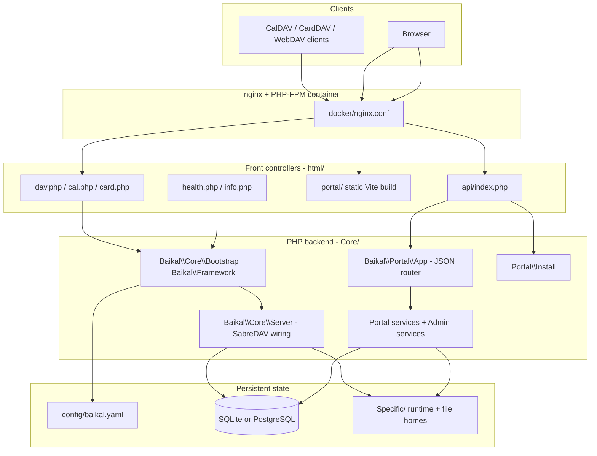

# AngaraDAV — Architecture, Compatibility Boundaries, and Conventions

Inspected snapshot of the repository as it exists on disk (product version `2.5.2` in [`Core/Distrib.php`](../Core/Distrib.php)). Descriptive only: paths, roles, dependencies, and observed patterns. Not a proposal.

Companion docs (not duplicated here): [README.md](../README.md) · [AGENTS.md](../AGENTS.md) · [portal/README.md](../portal/README.md) · [CHANGELOG.md](../CHANGELOG.md) · [SECURITY.md](SECURITY.md) · [patches/README.md](../patches/README.md) · [baikal-to-angara-migration-plan.md](baikal-to-angara-migration-plan.md). A shorter overview already lives at [ARCHITECTURE.md](ARCHITECTURE.md); this file is the path-level inventory.

---

## 1. System overview

AngaraDAV is a self-hosted CalDAV / CardDAV / WebDAV server derived from Baïkal and powered by SabreDAV, plus a TypeScript SPA (“portal”) that talks to a hand-rolled PHP JSON API. Both HTTP surfaces share **one database** and **one** [`config/baikal.yaml`](../config/baikal.yaml.dist).



Two independent HTTP surfaces sit on the same data:

| Surface | Entry | Auth | Consumers |
|---|---|---|---|
| DAV protocol | [`html/dav.php`](../html/dav.php), [`html/cal.php`](../html/cal.php), [`html/card.php`](../html/card.php) | SabreDAV Digest / Basic / Apache | Thunderbird, DAVx⁵, Apple, Home Assistant |
| Portal JSON API | [`html/api/index.php`](../html/api/index.php) → `Baikal\Portal\App` | PHP session cookie + CSRF + same-origin | The SPA only |

They do **not** share request handling. Portal writes that mutate CalDAV/CardDAV collections go through Sabre backends so `synctoken` / change tables stay consistent, and they enqueue WebDAV-Push via `ChangeNotifier` the same way `/dav.php/` writes do.

---

## 2. Toolchains and targets

### PHP

| Item | Value | Source |
|---|---|---|
| Runtime | `php: ^8.4` | [`composer.json`](../composer.json) |
| Autoload | **PSR-0** (not PSR-4): `Baikal` and `BaikalAdmin` → `Core/Frameworks/` | [`composer.json`](../composer.json) `autoload.psr-0` |
| Core deps | `sabre/dav ~4.7.0`, `symfony/yaml ^8.1`, `minishlink/web-push ^11.0`, `symfony/http-client ^8.1`, `nyholm/psr7 ^1.8` | [`composer.json`](../composer.json) |
| Required ext | `curl`, `dom`, `mbstring`, `openssl`, `pdo`, `zlib` (`gmp` suggested for faster VAPID) | [`composer.json`](../composer.json) |
| Dev deps | `php-cs-fixer ^3.95`, `phpstan ^2.2` + `phpstan-deprecation-rules ^2.0` | [`composer.json`](../composer.json) |
| Static analysis | PHPStan **level 0**, analysing only `Core` and `html` | [`phpstan.neon`](../phpstan.neon) |
| Formatting | `@PSR2` + `@Symfony`; same-line opening braces for functions/classes; repo-wide except `vendor` | [`.php-cs-fixer.dist.php`](../.php-cs-fixer.dist.php) |
| Vendor patching | `post-install-cmd` / `post-update-cmd` run `scripts/apply-vendor-patches.sh` | [`composer.json`](../composer.json) `scripts` |

Composer scripts:

| Script | Runs |
|---|---|
| `composer cs-fixer` | `php-cs-fixer fix` |
| `composer phpstan` | `phpstan analyse Core html` |
| `composer test` | **cs-fixer then phpstan only** — does **not** run `tests/php` |
| `composer apply-vendor-patches` | `sh scripts/apply-vendor-patches.sh` |

Image runtime PHP is **8.5** by default (`ARG PHP_VERSION=8.5` in [`Dockerfile`](../Dockerfile)); CI matrices 8.4 / 8.5 / 8.6.

### Portal (TypeScript)

| Item | Value | Source |
|---|---|---|
| Build | `tsc --noEmit && vite build` | [`portal/package.json`](../portal/package.json) |
| Runtime deps | **None** | [`portal/package.json`](../portal/package.json) `dependencies` absent |
| Dev deps | `typescript ^6.0.3`, `vite ^8.2.2` | [`portal/package.json`](../portal/package.json) |
| TS config | ES2022, `moduleResolution: bundler`, `strict`, `noEmit`, `noUnusedLocals` / `noUnusedParameters`; `src/**/*.test.ts` excluded from typecheck | [`portal/tsconfig.json`](../portal/tsconfig.json) |
| Vite | `base: "/portal/"`, `outDir: "../html/portal"`, `emptyOutDir`, `sourcemap: false`; dev proxy `/api` → `ANGARADAV_API` or `http://127.0.0.1:31088` | [`portal/vite.config.ts`](../portal/vite.config.ts) |
| Tests | Node built-in `node:test` via `--experimental-strip-types`; **14 files enumerated explicitly** (no glob) | [`portal/package.json`](../portal/package.json) `scripts.test` |

### Make targets — [`Makefile`](../Makefile)

`.PHONY` plus the `vendor/autoload.php` rule = **11 targets**.

| Target | Runs |
|---|---|
| `help` | Prints `ANGARA_VERSION` + target list |
| `dist` | Zip source into `build/angaradav-$(VERSION).zip` (`composer install --no-dev`, `platform.php` pinned to 8.4) |
| `build-assets` | Regenerates [`Core/Resources/Db/SQLite/db.sql`](../Core/Resources/Db/SQLite/db.sql) from `vendor/sabre/dav/examples/sql/sqlite.*.sql` |
| `portal` | Guards against root-owned `portal/node_modules`, then `npm test && npm run build` |
| `php-test` | `set -e` loop over every `tests/php/*.php` |
| `local-build` | `sh scripts/local-docker.sh build` |
| `local-up` | `sh scripts/local-docker.sh up` — recreate `angaradav-local` on `:31088` |
| `local-down` | Stop the local container |
| `local-logs` | Follow local container logs |
| `clean` | Removes `config/baikal.yaml`, `Specific/db/db.sqlite`, `Specific/INSTALL_DISABLED` |
| `vendor/autoload.php` | `composer install --no-interaction` when `composer.lock` is newer |

### CI

**[`.github/workflows/ci.yml`](../.github/workflows/ci.yml)** — two jobs, PHP matrix `8.4` / `8.5` / `8.6`:

- `code-analysis` runs **17 named** `php tests/php/*.php` scripts individually, then `php-cs-fixer --dry-run --diff --allow-unsupported-php-version=yes` and `composer phpstan`.
- `tests` runs [`FileSchemaDriverTest.php`](../tests/php/FileSchemaDriverTest.php) against a `postgres:18` service (`POSTGRES_DB=baikal_test`).

It does **not** run `make php-test`, portal `npm test`, `npm run build`, or pytest.

**[`.github/workflows/docker.yml`](../.github/workflows/docker.yml)** — multi-arch (`linux/amd64,linux/arm64`) GHCR publish to `ghcr.io/offsyanka99/angaradav`. `docker/metadata-action` tags:

| Tag | When |
|---|---|
| `latest` | Default branch only (`enable={{is_default_branch}}`) |
| `sha-<sha>` | Always (`type=sha,prefix=sha-`) |
| Branch ref | `type=ref,event=branch` |
| Tag ref | `type=ref,event=tag` |
| Semver `{{version}}` | When the git tag is semver |
| `import-tx-test` | Only `refs/heads/perf/import-sqlite-tx` |

Build args: `GIT_SHA=${{ github.sha }}`, `BUILD_TIME=${{ github.event.head_commit.timestamp || github.event.repository.updated_at }}`. **Push is skipped on pull_request.** Image publish only happens for branches in `on.push.branches` (`master`, `main`, `refactor/angara-product-constants`, `perf/import-sqlite-tx`, `release/**`) plus tags `v*`.

**[`.github/actions/build/action.yaml`](../.github/actions/build/action.yaml)** — composite: `shivammathur/setup-php@v2` (mbstring, dom, fileinfo, pgsql, pdo_pgsql, pdo_sqlite, sqlite3, redis, opcache), Composer cache, install `patch` for the vendor-patch hook, `composer install`.

---

## 3. Repository layout

| Path | Role |
|---|---|
| [`Core/Distrib.php`](../Core/Distrib.php) | Product constants: `ANGARA_VERSION_BASE` (`2.5.2`), `ANGARA_GIT_SHA`, `ANGARA_VERSION`, `ANGARA_HOMEPAGE`; helpers `baikal_version_base()`, `baikal_needs_upgrade()`, `baikal_resolve_git_sha()`, `baikal_short_git_sha()` |
| `Core/BuildInfo.php` | **Generated at image build, gitignored**; defines `ANGARA_BUILD_GIT` and leftover `BAIKAL_BUILD_TIME` |
| [`Core/Frameworks/Baikal/Core`](../Core/Frameworks/Baikal/Core) | Bootstrap, SabreDAV wiring, DAV auth, plugins, WebDAV file storage |
| [`Core/Frameworks/Baikal/Portal`](../Core/Frameworks/Baikal/Portal) | **Active** portal JSON backend (routes, services, admin, install) |
| [`Core/Frameworks/Baikal/Model`](../Core/Frameworks/Baikal/Model) | YAML config models (`system`, `database`) |
| [`Core/Frameworks/Baikal/Framework.php`](../Core/Frameworks/Baikal/Framework.php) | Install / upgrade gate after Bootstrap |
| [`Core/Frameworks/BaikalAdmin`](../Core/Frameworks/BaikalAdmin) | Legacy compatibility scaffolding only — no new features |
| [`Core/Resources/Db`](../Core/Resources/Db) | SQLite + PostgreSQL schema snapshots |
| [`Core/Resources/Web`](../Core/Resources/Web) | Static web assets; `html/res/core` is a symlink into here |
| [`html/`](../html) | Document root / front controllers |
| [`html/portal/`](../html/portal) | **Generated Vite output — never hand-edit** |
| [`portal/`](../portal) | SPA source |
| [`docker/`](../docker) | nginx config + ordered entrypoint scripts |
| [`scripts/`](../scripts) | Vendor patching, push worker, files maintenance, local Docker, PHP built-in-server router |
| [`patches/`](../patches) | sabre/dav patch applied post-install |
| [`tests/php/`](../tests/php) | Standalone PHP test scripts (36 files) |
| [`tests/portal_admin_e2e.py`](../tests/portal_admin_e2e.py) | Live pytest e2e (not CI) |
| `Specific/` | Runtime state — only named lock/secret/log files are gitignored (see §7) |
| [`config/baikal.yaml.dist`](../config/baikal.yaml.dist) | Committed YAML template; live `config/baikal.yaml` is gitignored |
| [`docs/`](../docs) | Architecture, compose templates, local/gitignored plans |
| [`.github/workflows`](../.github/workflows) | `ci.yml`, `docker.yml` |
| [`.github/agents`](../.github/agents) | Copilot/agent personas (`test-engineer`, `researcher`) |
| [`.github/instructions`](../.github/instructions) | Shared coding instructions |
| [`.github/prompts`](../.github/prompts) | Copilot prompts (`design`, `implement`, `research`) |
| [`.github/skills`](../.github/skills) | Task playbooks (admin API, portal, DAV, security, workspace) |
| [`composer.json`](../composer.json) / [`composer.lock`](../composer.lock) | PHP deps (lock committed for reproducible images) |
| [`Makefile`](../Makefile) | Dist, tests, portal build, local Docker |
| [`Dockerfile`](../Dockerfile) | 3-stage image |
| [`compose.yaml`](../compose.yaml) | Includes [`docs/local.compose.yaml`](local.compose.yaml) |

There is **no** Nx / `nx.json` / `project.json`.

---

## 4. Core runtime and DAV

### Front controllers — [`html/`](../html)

| Path | Context constants | What it does |
|---|---|---|
| [`html/dav.php`](../html/dav.php) | `ANGARA_CONTEXT`, `PROJECT_CONTEXT_BASEURI` | Combined CalDAV + CardDAV + optional WebDAV files. Base URI `…/dav.php/`. Flags from YAML `cal_enabled` / `card_enabled` / `files_enabled`. |
| [`html/cal.php`](../html/cal.php) | same | CalDAV-only (`enableCalDAV=true`, CardDAV/files off). Base URI `…/cal.php/`. Throws if `cal_enabled` is not true. |
| [`html/card.php`](../html/card.php) | same | CardDAV-only. Base URI `…/card.php/`. Throws if `card_enabled` is not true. |
| [`html/api/index.php`](../html/api/index.php) | `ANGARA_CONTEXT`, **`ANGARA_CONTEXT_PORTAL_API`** | JSON API. OPTIONS → 204. `/api/install*` → `InstallApp` **before** `App::bootstrap()`. Else `App::bootstrap()->handle()`. `ApiException` payload merged here (not in `App::handle()`). |
| [`html/index.php`](../html/index.php) | `ANGARA_CONTEXT` | Redirects `/` → `/portal/` or `/portal/install/` when unconfigured / upgrade pending. |
| [`html/admin/index.php`](../html/admin/index.php) | — | 302 `/portal/` (Formal admin removed). |
| [`html/admin/install/index.php`](../html/admin/install/index.php) | — | 302 `/portal/install/`; query `upgradeConfirmed` → `#upgrade`; `database` → `#database`. |
| [`html/health.php`](../html/health.php) | none (optional `Distrib.php`) | Liveness JSON; no DB required. **200** `ok`; **503** `incomplete` if `vendor/sabre` missing; **200** `degraded` if config/Specific unwritable or files enabled but not active. |
| [`html/info.php`](../html/info.php) | none | Public service-info JSON (enabled flags, no secrets). |

DAV controllers resolve `PROJECT_PATH_ROOT` as `getcwd()` (flat FTP) or `dirname(getcwd())` (dedicated server with `html/` as docroot).

### Bootstrap chain

Every DAV/API entry defines `PROJECT_PATH_ROOT`, then:

1. [`Baikal\Core\Bootstrap::bootstrap()`](../Core/Frameworks/Baikal/Core/Bootstrap.php) — all-static.
2. [`Baikal\Framework::bootstrap()`](../Core/Frameworks/Baikal/Framework.php) — install/upgrade gate.

**[`Bootstrap.php`](../Core/Frameworks/Baikal/Core/Bootstrap.php)**

- Defines `PROJECT_PATH_CORE`, `PROJECT_PATH_CONFIG`, `PROJECT_PATH_SPECIFIC`, `PROJECT_PATH_DOCUMENTROOT`, base URI.
- Config dir: env `ANGARA_PATH_CONFIG` else `config/`.
- Runtime dir: env `ANGARA_PATH_SPECIFIC` else `Specific/`.
- Requires `Distrib.php`; starts a session (non-CLI) and seeds `$_SESSION['CSRF_TOKEN']` (20-byte hex). **This is not** the portal CSRF key (`baikal_portal_csrf` in `Auth`).
- `initDb()`: `database.backend === 'pgsql'` vs SQLite; `ERRMODE_EXCEPTION`; skipped during install. PDO singleton also mirrored into `$GLOBALS['pdo']`.

**[`Framework.php`](../Core/Frameworks/Baikal/Framework.php)**

- `Tools::assertEnvironmentIsOk()` requires `ANGARA_CONTEXT === true`.
- Loads YAML, sets timezone, calls `installTool($reason)` when config is missing, `configured_version` is empty, `baikal_needs_upgrade()` is true, or admin password hash is empty.
- `installTool()`:
  - no-op under `ANGARA_CONTEXT_INSTALL`;
  - throws `ApiException` **503** with `code` / `installUrl` / `productVersion` under `ANGARA_CONTEXT_PORTAL_API`;
  - otherwise HTTP-redirects to `/portal/install/`.
- Converts PHP errors to `\ErrorException` (SabreDAV requirement).

**[`Tools.php`](../Core/Frameworks/Baikal/Core/Tools.php)** — environment assertions (PDO, sqlite/pgsql driver, `XMLReader`, temp dir), table lists, `defaultCalendarComponents()` (`VEVENT` always; `VTODO` when `tasks_enabled`; `VJOURNAL` when `notes_enabled`).

**[`Distrib.php`](../Core/Distrib.php)** — SHA precedence: env `ANGARA_BUILD_GIT` → env `GITHUB_SHA` → constant `ANGARA_BUILD_GIT` → `git rev-parse`.

### SabreDAV wiring — [`Server.php`](../Core/Frameworks/Baikal/Core/Server.php)

`initServer()` is the single place the node tree and plugins are assembled.

**Auth backend** by `dav_auth_type`:

| Value | Class |
|---|---|
| `Basic` | [`Baikal\Core\PDOBasicAuth`](../Core/Frameworks/Baikal/Core/PDOBasicAuth.php) |
| `Apache` | `\Sabre\DAV\Auth\Backend\Apache` |
| default `Digest` | `\Sabre\DAV\Auth\Backend\PDO` with realm |

**Node tree:** principals collection always; `CalDAV\CalendarRoot` over [`ReadOnlyCalendarBackend`](../Core/Frameworks/Baikal/Core/ReadOnlyCalendarBackend.php) when CalDAV on; `CardDAV\AddressBookRoot` when CardDAV on; [`Files\HomeCollection`](../Core/Frameworks/Baikal/Core/Files/HomeCollection.php) when files enabled.

**Plugins (order observed):** Auth, DAVACL, Browser, PropertyStorage; Locks + [`IfHeaderPreconditionPlugin`](../Core/Frameworks/Baikal/Core/Files/IfHeaderPreconditionPlugin.php) when files active; Sync; CalDAV set (ICS export, Schedule, Sharing, [`ReadOnlyPlugin`](../Core/Frameworks/Baikal/Core/Plugins/ReadOnlyPlugin.php), IMip when `invite_from` set); CardDAV set (VCF export); [`PushPlugin`](../Core/Frameworks/Baikal/Core/Plugins/PushPlugin.php) when `push_enabled`.

**Convention:** files and push init are wrapped in `try/catch (\Throwable)` + `error_log` so CalDAV/CardDAV keep working if they fail. `exception()` logs only HTTP ≥ 500 (expected 4xx stay in the access log).

### WebDAV files — [`Core/Frameworks/Baikal/Core/Files`](../Core/Frameworks/Baikal/Core/Files)

| Class | Path | Role |
|---|---|---|
| `FileStorageConfig` | [`FileStorageConfig.php`](../Core/Frameworks/Baikal/Core/Files/FileStorageConfig.php) | Storage root: env `ANGARA_FILES_STORAGE_PATH` → YAML `files_storage_path` → `Specific/files`. Upload/quota: `ANGARA_FILES_MAX_UPLOAD_MB` / `ANGARA_FILES_QUOTA_MB` (byte-key fallbacks `ANGARA_FILES_*_BYTES`). Layout `homes/ tmp/ quarantine/ locks/`. Dirs `0700`. |
| `SchemaManager` | [`SchemaManager.php`](../Core/Frameworks/Baikal/Core/Files/SchemaManager.php) | `file_homes` table (SQLite + PostgreSQL) |
| `HomeRepository` | [`HomeRepository.php`](../Core/Frameworks/Baikal/Core/Files/HomeRepository.php) | Random storage ids; quarantine on user delete; purge expired quarantine; temp cleanup |
| `HomeCollection` / `Directory` / `File` | [`HomeCollection.php`](../Core/Frameworks/Baikal/Core/Files/HomeCollection.php), [`Directory.php`](../Core/Frameworks/Baikal/Core/Files/Directory.php), [`File.php`](../Core/Frameworks/Baikal/Core/Files/File.php) | SabreDAV nodes; owner-only ACL; listing disabled at collection root; symlinks skipped; home root cannot be deleted/renamed |
| `HomeStorage` | [`HomeStorage.php`](../Core/Frameworks/Baikal/Core/Files/HomeStorage.php) | Mutations; `MAX_PATH_BYTES 4096`, `MAX_SEGMENT_BYTES 255`, `MAX_DEPTH 64`, quota |
| `IfHeaderPreconditionPlugin` | [`IfHeaderPreconditionPlugin.php`](../Core/Frameworks/Baikal/Core/Files/IfHeaderPreconditionPlugin.php) | SabreDAV 4.7 RFC 4918 `If:` workaround, scoped to `files/` |
| `PayloadTooLarge` | [`PayloadTooLarge.php`](../Core/Frameworks/Baikal/Core/Files/PayloadTooLarge.php) | DAV 413 |

**Path safety (`FileStorageConfig::assertSafeStoragePath` / `assertNoSymlinkComponents`):** absolute paths only; not filesystem/share root; never inside `html/`; no symlink components on the path; `..` cannot escape the storage root.

### WebDAV-Push — [`Core/Frameworks/Baikal/Core/Plugins/Push`](../Core/Frameworks/Baikal/Core/Plugins/Push)

Implements draft-bitfire-webdav-push. Optional; not advertised until `push_external_url` / `ANGARA_PUSH_EXTERNAL_URL` is valid HTTPS. **Does not cover file homes.**

| Class | Role |
|---|---|
| [`PushPlugin.php`](../Core/Frameworks/Baikal/Core/Plugins/PushPlugin.php) | Sabre plugin: registration + change dispatch |
| [`ChangeNotifier.php`](../Core/Frameworks/Baikal/Core/Plugins/Push/ChangeNotifier.php) | Portal API writes enqueue the same jobs as DAV writes |
| [`Notifier.php`](../Core/Frameworks/Baikal/Core/Plugins/Push/Notifier.php) | Delivery |
| [`QueueStorage.php`](../Core/Frameworks/Baikal/Core/Plugins/Push/QueueStorage.php) / [`SubscriptionStorage.php`](../Core/Frameworks/Baikal/Core/Plugins/Push/SubscriptionStorage.php) | Persistence |
| [`SubscriptionValidator.php`](../Core/Frameworks/Baikal/Core/Plugins/Push/SubscriptionValidator.php) | SSRF-style endpoint validation + host pinning |
| [`SecretCipher.php`](../Core/Frameworks/Baikal/Core/Plugins/Push/SecretCipher.php) | Encrypts stored secrets with `database.encryption_key` |
| [`VapidKeyStore.php`](../Core/Frameworks/Baikal/Core/Plugins/Push/VapidKeyStore.php) | VAPID identity → `Specific/push_vapid.json` |
| [`PushWorker.php`](../Core/Frameworks/Baikal/Core/Plugins/Push/PushWorker.php) | Bounded CLI loop; driven by [`scripts/push-worker.php`](../scripts/push-worker.php) |
| [`PushLogger.php`](../Core/Frameworks/Baikal/Core/Plugins/Push/PushLogger.php) | Writes only `Specific/push_debug.log` — never `error_log()` |
| [`RegisterParser.php`](../Core/Frameworks/Baikal/Core/Plugins/Push/RegisterParser.php), [`SchemaManager.php`](../Core/Frameworks/Baikal/Core/Plugins/Push/SchemaManager.php), `Property/SupportedTriggers.php`, `Property/Transports.php` | Registration XML + schema + DAV properties |

Worker env log level: `ANGARA_PUSH_LOG_LEVEL` then unprefixed `PUSH_LOG_LEVEL` then YAML `push_log_level`. Exit code **2** = permanent config failure (entrypoint 45 stops restarting).

### Atomic YAML config models — [`Core/Frameworks/Baikal/Model`](../Core/Frameworks/Baikal/Model)

| Class | Path | Role |
|---|---|---|
| `Config` | [`Config.php`](../Core/Frameworks/Baikal/Model/Config.php) | Abstract. `writeConfigFile()`: dump YAML depth 4 → temp + `LOCK_EX` → `rename()` → `chmod 0600` → re-parse to verify. `persist()` merges the model onto the existing section so keys the model does not own (`portal_log_level`, `portal_time_format`, `portal_week_start`, `portal_admin_users`, …) survive an upgrade’s `configured_version` write. |
| `Config\Standard` | [`Config/Standard.php`](../Core/Frameworks/Baikal/Model/Config/Standard.php) | `system` section (service flags, files limits, auth realm, session age, push, `admin_passwordhash`). Clamps numeric ranges. Password getters return `""` so hashes are never echoed. |
| `Config\Database` | [`Config/Database.php`](../Core/Frameworks/Baikal/Model/Config/Database.php) | `database` section |

The **only** portal writer of live YAML is [`AdminSettingsService`](../Core/Frameworks/Baikal/Portal/Admin/AdminSettingsService.php) (plus the installer). Do not hand-edit or commit `config/baikal.yaml`.

### Other Core classes

| Class | Path | Role |
|---|---|---|
| `AdminPassword` | [`AdminPassword.php`](../Core/Frameworks/Baikal/Core/AdminPassword.php) | Shared password-hash helpers (installer + settings) |
| `PDOBasicAuth` | [`PDOBasicAuth.php`](../Core/Frameworks/Baikal/Core/PDOBasicAuth.php) | DAV Basic auth + per-IP rate limit (Digest uses Sabre’s PDO backend; portal/admin logins are rate-limited separately in `Auth` / `AdminUserService`) |

---

## 5. Portal JSON API

`Baikal\Portal\App` ([`App.php`](../Core/Frameworks/Baikal/Portal/App.php)) is a hand-rolled router. Its constructor is the DI root (every service + three route modules). Reached only from [`html/api/index.php`](../html/api/index.php).

### Request pipeline (order matters)

Installer is **outside** this pipeline (`/api/install*` handled in the front controller before `App::bootstrap()`).

Inside `App::handle()` / `dispatch()`:

1. **Binary responses first** (before `dispatch()` JSON):
   - `GET /files/download`
   - `GET /calendars/{id}/export`
   - `GET /addressbooks/{id}/export`
   - `GET /addressbooks/{id}/contacts/{uri}/export`
   - `GET /addressbooks/{id}/contacts/{uri}/photo`
2. `GET /ui` — public, unauthenticated (log level + locale prefs for first paint).
3. `POST /login` — same-origin checked.
4. **State-changing gate** for `POST|PUT|PATCH|DELETE`: `assertSameOrigin()` → session check (401) → `assertCsrf()`. GET never CSRF-checks. `/logout` is special-cased here.
5. `GET /me` (or `GET /`) — HTTP **200** with `user: null` when anonymous (avoids a spurious 401 on first paint).
6. **Admin gate:** path `/admin` or `/admin/*` → `AdminAuth::requireAdmin()` → `dispatchAdminRoutes()`. This is the only admin entry.
7. `Auth::requireUser()`. `POST /me/password` changes that user's DAV digest (`Auth::changePassword`) and returns `{"ok":true}`. Then route modules in order: **calendars → contacts → files → items**.
8. Fallthrough → `ApiException('Not found', 404)`.

**Pattern:** all three `Http/*Routes` modules share `dispatch(string $method, string $path, string $username): array|list|null`. `null` means “not mine”. **No module touches auth or CSRF** — that already happened in `App::dispatch()`.

### Response and error envelope

[`HttpIO::json()`](../Core/Frameworks/Baikal/Portal/Http/HttpIO.php): `application/json; charset=utf-8`, `Cache-Control: no-store`, `X-Content-Type-Options: nosniff`, `JSON_UNESCAPED_SLASHES | JSON_UNESCAPED_UNICODE` (+ `JSON_INVALID_UTF8_SUBSTITUTE` when defined).

| Kind | Shape |
|---|---|
| Success | Bare object keyed by resource: `{"calendars":[…]}`, `{"event":{…}}`, `{"ok":true}` |
| Admin reads | Often wrapped `{"data": …}` |
| Error | `{"error":"message"}` at `ApiException` status. Extra keys from `getPayload()` are merged **only** in [`html/api/index.php`](../html/api/index.php) (bootstrap/install 503), not in `App::handle()`’s catch (which emits `{error}` only). |
| Long imports | NDJSON `{"type":"progress"|"done"|"error"}` with `X-Accel-Buffering: no` |

[`ApiException`](../Core/Frameworks/Baikal/Portal/ApiException.php) extends `\RuntimeException`; `$status` default 400.

CSRF header: `X-CSRF-Token`, fallback `X-Baikal-CSRF` (`HTTP_X_BAIKAL_CSRF`).

### Calendar routes — [`CalendarRoutes.php`](../Core/Frameworks/Baikal/Portal/Http/CalendarRoutes.php)

| Method | Path | Service |
|---|---|---|
| GET | `/directory` | `ShareService::directory()` |
| GET | `/holidays/countries` | `Holidays::countries()` |
| GET | `/calendars` | `CalendarService::listCalendars()` |
| POST | `/calendars` | `CalendarService::createCalendar()` |
| PATCH/PUT | `/calendars/{id}` | `updateCalendar()` |
| DELETE | `/calendars/{id}` | `deleteCalendar()` |
| GET | `/calendars/{id}/events?from&to` | `EventService::listEvents()` |
| POST | `/calendars/{id}/events` | `createEvent()` |
| GET | `/calendars/{id}/events/{uri}` | `getEvent()` |
| PATCH/PUT | `/calendars/{id}/events/{uri}` | `updateEvent()` |
| DELETE | `/calendars/{id}/events/{uri}` | `deleteEvent()` |
| POST | `/calendars/{id}/import` | `CalendarImportService::importCalendar()` (NDJSON) |
| GET/POST/DELETE | `/calendars/{id}/shares` | `ShareService` list / add / revoke |

`{id}` is the **calendar instance** id (sharees have their own instance row; owner `synctoken` is shared by `calendarid`).

### Contact routes — [`ContactRoutes.php`](../Core/Frameworks/Baikal/Portal/Http/ContactRoutes.php)

`/contacts/bulk` and `/contacts/export` are matched **before** `/contacts/{uri}`.

| Method | Path | Service |
|---|---|---|
| GET/POST | `/addressbooks` | list / create |
| PATCH/PUT/DELETE | `/addressbooks/{id}` | update / delete |
| POST | `/addressbooks/{id}/import` | `ContactImportService` (NDJSON) |
| POST | `/addressbooks/{id}/contacts/bulk` | bulk ops |
| POST | `/addressbooks/{id}/contacts/export` | selected VCF export |
| GET/POST | `/addressbooks/{id}/contacts` | list / create |
| GET/PATCH/PUT/DELETE | `/addressbooks/{id}/contacts/{uri}` | get / update / delete |

### Item routes — [`ItemRoutes.php`](../Core/Frameworks/Baikal/Portal/Http/ItemRoutes.php)

One `foreach` over `['tasks' => KIND_TASK, 'notes' => KIND_NOTE]`. Response key is singular via `rtrim($seg, 's')`. `?cascade=1` honoured for **tasks only**.

| Method | Path |
|---|---|
| GET | `/tasks`, `/notes` (`q`, `sort`, `order`) |
| POST | `/tasks`, `/notes` |
| POST | `/tasks/bulk`, `/notes/bulk` |
| GET/PATCH/PUT/DELETE | `/tasks/{instanceId}/{uri}`, `/notes/{instanceId}/{uri}` |

### Files routes — `App::dispatchFileRoutes()` in [`App.php`](../Core/Frameworks/Baikal/Portal/App.php)

Same storage as `/dav.php/files/{username}/`. Upload releases the PHP session lock (`session_write_close()`).

| Method | Path |
|---|---|
| GET | `/files` (status) |
| GET | `/files/entries?path=` |
| GET | `/files/download?path=&inline=` (binary, in `handle()`) |
| POST | `/files/mkdir` |
| POST | `/files/upload` (multipart or raw body) |
| DELETE | `/files/entry` |
| POST | `/files/rename`, `/files/move`, `/files/copy`, `/files/bulk` |

### Admin API — [`Core/Frameworks/Baikal/Portal/Admin`](../Core/Frameworks/Baikal/Portal/Admin)

Seven focused types (six services + audit). Routed only from `dispatchAdminRoutes()`.

| Class | Path | Responsibility |
|---|---|---|
| `AdminAudit` | [`AdminAudit.php`](../Core/Frameworks/Baikal/Portal/Admin/AdminAudit.php) | One-line records: `admin audit actor= action= target= result=`. Drops context keys matching `/pass\|digest\|secret\|token\|hash\|csrf/i`. Writes `Specific/portal_debug.log`. |
| `AdminDashboardService` | [`AdminDashboardService.php`](../Core/Frameworks/Baikal/Portal/Admin/AdminDashboardService.php) | Read-only counts (allow-listed table names) + service flags + links |
| `AdminCapabilitiesService` | [`AdminCapabilitiesService.php`](../Core/Frameworks/Baikal/Portal/Admin/AdminCapabilitiesService.php) | `uiEnabled` + admin page URLs; API stays available when UI is hidden |
| `AdminUserService` | [`AdminUserService.php`](../Core/Frameworks/Baikal/Portal/Admin/AdminUserService.php) | User CRUD in one transaction (principal + user + default calendar + default address book); never returns `digesta1`; refuses deleting last user or last admin; quarantines file home before cascade; password changes IP rate-limited |
| `AdminUserResourceService` | [`AdminUserResourceService.php`](../Core/Frameworks/Baikal/Portal/Admin/AdminUserResourceService.php) | Per-user calendars / address books, scoped by the **target** principal |
| `AdminSettingsService` | [`AdminSettingsService.php`](../Core/Frameworks/Baikal/Portal/Admin/AdminSettingsService.php) | Only portal writer of `baikal.yaml`. `FORBIDDEN_BODY_KEYS` + `EDITABLE_KEYS`; atomic write + verify; `push_enabled` requires `https://` external URL; factory reset honours install lock |
| `AdminBackupService` | [`AdminBackupService.php`](../Core/Frameworks/Baikal/Portal/Admin/AdminBackupService.php) | Settings export / preview / restore; checksummed, size/key capped; restore re-uses `updateSystemSettings()` |

Admin routes:

| Method | Path |
|---|---|
| GET | `/admin/ping` |
| GET | `/admin/dashboard` |
| GET | `/admin/capabilities` |
| GET/PATCH/PUT | `/admin/settings/system` |
| POST | `/admin/settings/reset-to-default` (password re-auth + confirm) |
| GET | `/admin/settings/backup` |
| POST | `/admin/settings/restore` (`dryRun` preview) |
| GET/PATCH/PUT/POST | `/admin/settings/database` (write requires `confirm: "CONFIRM"`) |
| POST | `/admin/settings/database/test` |
| GET/POST | `/admin/users` |
| GET/PATCH/PUT/DELETE | `/admin/users/{u}` |
| GET/POST | `/admin/users/{u}/calendars` |
| GET/PATCH/PUT/DELETE | `/admin/users/{u}/calendars/{id}` |
| GET/POST | `/admin/users/{u}/addressbooks` |
| GET/PATCH/PUT/DELETE | `/admin/users/{u}/addressbooks/{id}` |

**Conventions:** every mutation `try { … audit 'ok' } catch (ApiException $e) { audit 'error:'.$status; throw; }`; destructive ops need `confirm`; secrets surface as `has*` booleans; unmatched `/admin/*` returns **404 not 403**.

### Auth

**[`Auth.php`](../Core/Frameworks/Baikal/Portal/Auth.php)**

| Contract | Value |
|---|---|
| Session name | `BAIKALPORTAL` |
| User key | `baikal_portal_user` |
| CSRF key | `baikal_portal_csrf` |
| Last-seen | `baikal_portal_last` |
| Login-at | `baikal_portal_login_at` |
| Idle default | `DEFAULT_SESSION_MAX_AGE` 900 s (`session_max_age_minutes`) |
| Cookie | `HttpOnly`, `SameSite=Lax`, `Secure` on HTTPS; strict mode; `session_regenerate_id(true)` on login |
| Login rate | 20 failures / 900 s per IP in `Specific/portal_login_rate.json`; Fail2Ban-friendly `error_log` line |
| Password change | `POST /me/password` → `changePassword()`. Current password required (`verifyPassword`; wrong password is **400**, not 401). New password at least 8 characters, confirmed, and different. Writes `users.digesta1` only — not `system.admin_passwordhash`. Success limit 5 / 900 s per username in `Specific/portal_self_password_rate.json`. `session_regenerate_id(true)` after a successful change. Body fields `digesta1` / `password_hash` / `passwordhash` / `hash` are refused. |

`username()` always `touchSession()`. Digest is `md5(user:realm:password)` with realm from YAML (`BaikalDAV`).

**[`AdminAuth.php`](../Core/Frameworks/Baikal/Portal/AdminAuth.php)** — first match wins:

1. env `ANGARA_PORTAL_ADMIN_USERS`
2. env `PORTAL_ADMIN_USERS`
3. YAML `system.portal_admin_users`
4. if the list is empty → DAV user named `admin` (case-insensitive)

**[`SameOrigin.php`](../Core/Frameworks/Baikal/Portal/SameOrigin.php)** — shared with installer. Empty `Host` allowed; `Origin` must host-match; else `Referer`; neither → **fail closed 403**.

### Domain services

| Class | Path | Responsibility |
|---|---|---|
| `CalendarStore` | [`CalendarStore.php`](../Core/Frameworks/Baikal/Portal/CalendarStore.php) | Shared CalDAV PDO backend, ACL, URI helpers, push notify, import tx |
| `ContactStore` | [`ContactStore.php`](../Core/Frameworks/Baikal/Portal/ContactStore.php) | Same for CardDAV |
| `CalendarService` | [`CalendarService.php`](../Core/Frameworks/Baikal/Portal/CalendarService.php) | Calendar CRUD |
| `EventService` | [`EventService.php`](../Core/Frameworks/Baikal/Portal/EventService.php) | VEVENT CRUD; RRULE expansion capped at 500 |
| `ShareService` | [`ShareService.php`](../Core/Frameworks/Baikal/Portal/ShareService.php) | Calendar sharing + user directory |
| `CalendarItemService` | [`CalendarItemService.php`](../Core/Frameworks/Baikal/Portal/CalendarItemService.php) | Tasks + notes; subtasks `RELATED-TO;RELTYPE=PARENT` with cycle detection |
| `ContactService` | [`ContactService.php`](../Core/Frameworks/Baikal/Portal/ContactService.php) | Contact CRUD |
| `VCardMapper` | [`VCardMapper.php`](../Core/Frameworks/Baikal/Portal/VCardMapper.php) | Unknown vCard props preserved; photo sanitize/resize; custom fields as `X-BAIKAL-CUSTOM` JSON |
| `CalendarImportService` / `ContactImportService` | [`CalendarImportService.php`](../Core/Frameworks/Baikal/Portal/CalendarImportService.php), [`ContactImportService.php`](../Core/Frameworks/Baikal/Portal/ContactImportService.php) | ICS/vCard; `IMPORT_TX_CHUNK = 200` so SQLite does not fsync per row |
| `FileService` | [`FileService.php`](../Core/Frameworks/Baikal/Portal/FileService.php) | Portal API over the same homes as DAV |
| `FileDownloadRateLimiter` | [`FileDownloadRateLimiter.php`](../Core/Frameworks/Baikal/Portal/FileDownloadRateLimiter.php) | Download/view rate limit, same ceiling as login: **20 / 900 s** per IP+user |
| `PortalMeta` | [`PortalMeta.php`](../Core/Frameworks/Baikal/Portal/PortalMeta.php) | Per-instance `readOnly` / `holidaysCountry` in `Specific/portal_meta.json`; also enforced by `ReadOnlyPlugin` for DAV |
| `Holidays` | [`Holidays.php`](../Core/Frameworks/Baikal/Portal/Holidays.php) | Holiday country list + import |
| `NoteDescriptionFormat` | [`NoteDescriptionFormat.php`](../Core/Frameworks/Baikal/Portal/NoteDescriptionFormat.php) | VJOURNAL HTML ↔ Markdown (jtx Board) |

### Installer — [`Core/Frameworks/Baikal/Portal/Install`](../Core/Frameworks/Baikal/Portal/Install)

Unauthenticated router at `/api/install/*`. Shares `SameOrigin` + session start with the main app. Sets `ANGARA_CONTEXT_INSTALL`.

| Class | Path |
|---|---|
| `InstallApp` | [`InstallApp.php`](../Core/Frameworks/Baikal/Portal/Install/InstallApp.php) |
| `InstallService` | [`InstallService.php`](../Core/Frameworks/Baikal/Portal/Install/InstallService.php) |
| `SchemaUpgrade` | [`SchemaUpgrade.php`](../Core/Frameworks/Baikal/Portal/Install/SchemaUpgrade.php) — `run()` never throws; returns `{ok, errors, success}` |

| Method | Path |
|---|---|
| GET | `/install` or `/install/status` |
| POST | `/install/initialize` |
| POST | `/install/database` |
| POST | `/install/upgrade` (`confirm`) |

Mutations: SameOrigin + CSRF from `X-CSRF-Token` / `X-Baikal-CSRF` **or** JSON `csrfToken`/`csrf`. `InstallService::status()` step order: `permissions` → `initialize` → `upgrade` → `locked` → `done` → `database`.

Lock: marker `Specific/INSTALL_DISABLED`; env hard lock when `ANGARA_LOCK_INSTALL=1` and not `ANGARA_ALLOW_REINSTALL=1` (strict `'1'`). Session keys: `baikal_install_csrf`, `baikal_install_admin_password`.

---

## 6. Portal SPA

Source: [`portal/src`](../portal/src). Built to [`html/portal/`](../html/portal). Entry [`portal/src/main.ts`](../portal/src/main.ts): installer if path is `/portal/install`, else `mountApp()`.

### Render loop

[`mountApp()`](../portal/src/app.ts) is the composition root: one mutable `AppState`, six domain hosts, one `AppOrchestrator` bag, delegated listeners registered once, then full re-render.

```
user event → events.ts (delegated) → onAction.ts → domain *ActionsRouter
  → mutate state → state.busy = true → render()
  → await api.* → catch → setFlash("error") → finally { state.busy = false; render(); }
```

`render()` captures scroll → login or `renderHome()` → `bindAfterRender()` → restores scroll → repositions popovers in `requestAnimationFrame`.

[`onAction.ts`](../portal/src/app/onAction.ts) dispatch order: shell → admin (`admin-*`) → files → calendars → tasks → notes → contacts.

### API client layer — [`portal/src/api`](../portal/src/api)

| File | Role |
|---|---|
| [`client.ts`](../portal/src/api/client.ts) | **Only** network primitive. `request<T>()` always `credentials: "same-origin"`; `X-CSRF-Token` on non-GET. `ApiError` has `status` + `payload`. `setOnUnauthorized` / `setOnSessionActivity`. Exempt paths: `/login`, `/ui`, `/logout`, `/install*`. `streamImport()` posts raw `text/calendar` / `text/vcard` (**not JSON**, so non-UTF-8 exports survive) and consumes NDJSON. |
| [`types.ts`](../portal/src/api/types.ts) | All wire types; JSDoc names the endpoint |
| [`sessionApi.ts`](../portal/src/api/sessionApi.ts) | Public only: `/ui`, `/install/status` |
| [`adminApi.ts`](../portal/src/api/adminApi.ts) | `/admin/*` **and** session auth: `/me`, `/login`, `/logout`, `/me/password` (CSRF token is set here) |
| [`calendarsApi.ts`](../portal/src/api/calendarsApi.ts) | calendars, events, shares, holidays, ICS |
| [`contactsApi.ts`](../portal/src/api/contactsApi.ts) | address books, contacts, VCF |
| [`itemsApi.ts`](../portal/src/api/itemsApi.ts) | tasks + notes |
| [`filesApi.ts`](../portal/src/api/filesApi.ts) | files; uploads via XHR (progress) using CSRF helpers directly |
| [`../api.ts`](../portal/src/api.ts) | Barrel: spreads domain objects into one flat `api` |

**Pattern:** each domain client is `export const <domain>Api = { … }` of arrow functions returning `request<T>()` with an inline generic. Callers write `api.tasks()`, `api.filesList()`, `api.adminUsers()`. Never `fetch()` from feature code.

### Orchestrator / AppState

| File | Role |
|---|---|
| [`orchestrator.ts`](../portal/src/app/orchestrator.ts) | Type only — shared runtime bag. Header says new code should take a domain host instead of growing this type. |
| [`context.ts`](../portal/src/app/context.ts) | `AppState` (flat, mutable, grouped by domain) + `createAppState()` |
| [`app.ts`](../portal/src/app.ts) | Wires hosts; `AppContext` is constructed and discarded (`void ctx`) |

All UI state is `state.*`. Domain modules take `o` or a host — they do not import `app.ts`.

### Host pattern

Each domain exports a **type only** from `host.ts`. Common surface: `{ state, root, render, setFlash, clearFlash }`. Domains add capabilities as function properties (tasks/notes: `renderPortalDateTimeField`; calendars: datetime helpers, `accessBadge`, `loadHome`). Concrete hosts are built **only** in `mountApp`. Domain functions are free functions whose first parameter is the host:

```ts
export async function loadTasks(host: TasksHost) { /* … */ }
```

Unused host parameters are prefixed `_` (`noUnusedParameters`).

### Recurring per-domain file roles

| File | Role |
|---|---|
| `host.ts` | Host type |
| `index.ts` | Barrel |
| `loaders.ts` | Fetch + mutate `state` |
| `actions.ts` | Submit / bulk handlers |
| `actionsRouter.ts` | `handle<Domain>Action(host, action, t, ev) => Promise<boolean>` |
| `render.ts` | `render<Domain>Tab(host) => string` |
| `listing.ts` | Pure list/filter/sort (unit-tested) |
| `tree.ts` | Hierarchy (tasks) |
| `bind.ts` | Post-render DOM-only |
| `home.ts` | Calendars / contacts home takes the **orchestrator**, not the host |

### Domain inventories

Source file counts (excluding `*.test.ts`): **calendars 17**, **files 17**, **admin 13**, **contacts 9**, **tasks 8**, **notes 8**. Admin has no `actions.ts` / `render.ts` / `listing.ts` (mutations live in page modules). Calendars/contacts have no `render.ts` / `listing.ts` (`home.ts` owns the tab). Notes have no `listing.ts`.

**Admin** [`portal/src/app/admin/`](../portal/src/app/admin) — Overview / Settings / Users / Database / Configuration.

| File | Role |
|---|---|
| `host.ts` | `AdminHost` |
| `index.ts` | Barrel |
| `page.ts` | Admin shell pages |
| `overview.ts` | Dashboard |
| `settings.ts` | System settings form |
| `users.ts` | User CRUD UI |
| `database.ts` | DB form (`CONFIRM`) |
| `configuration.ts` | Backup / restore / reset |
| `loaders.ts` | Admin fetches |
| `actionsRouter.ts` | `admin-*` actions |
| `bind.ts` | Post-render |
| `meta.ts` | Page metadata (local `parseAdminPageId` duplicates `routing.ts`) |
| `backupFileName.ts` | Backup filename helper |

**Calendars** [`portal/src/app/calendars/`](../portal/src/app/calendars) — month grid, events, ICS import.

`host.ts`, `index.ts`, `home.ts`, `loaders.ts`, `actions.ts`, `actionsRouter.ts`, `month.ts`, `week.ts`, `weekScroll.ts`, `agenda.ts`, `eventsView.ts`, `eventModal.ts`, `toolbar.ts`, `holidays.ts`, `import.ts`, `importProgress.ts`, `selectionPersist.ts`.

**Contacts** [`portal/src/app/contacts/`](../portal/src/app/contacts) — `host.ts`, `index.ts`, `home.ts`, `loaders.ts`, `actions.ts`, `actionsRouter.ts`, `form.ts`, `photo.ts`, `import.ts`.

**Tasks** [`portal/src/app/tasks/`](../portal/src/app/tasks) — `host.ts`, `index.ts`, `loaders.ts`, `actions.ts`, `actionsRouter.ts`, `render.ts`, `listing.ts`, `tree.ts`.

**Notes** [`portal/src/app/notes/`](../portal/src/app/notes) — `host.ts`, `index.ts`, `loaders.ts`, `actions.ts`, `actionsRouter.ts`, `render.ts`, `editor.ts`, `html.ts` (`sanitizeNoteHtml`).

**Files** [`portal/src/app/files/`](../portal/src/app/files) — `host.ts`, `index.ts`, `loaders.ts`, `actions.ts`, `actionsRouter.ts`, `render.ts`, `listing.ts`, `transfer.ts`, `upload.ts`, `preview.ts`, `previewKind.ts`, `itemMenu.ts`, `itemMenuModel.ts`, `officePreview.ts`, `officeXml.ts`, `zip.ts`, `bind.ts`.

### Top-level `portal/src/app/*.ts`

| File | Role |
|---|---|
| [`constants.ts`](../portal/src/app/constants.ts) | Storage keys, version fallback, docs URL |
| [`types.ts`](../portal/src/app/types.ts) | `TabId`, `AdminPageId`, `Flash` |
| [`events.ts`](../portal/src/app/events.ts) | Mount-time delegated listeners (click/submit/change/input/keydown/drag/error), `WeakMap` once per root |
| [`afterRender.ts`](../portal/src/app/afterRender.ts) | Re-apply what `innerHTML` destroys |
| [`overlays.ts`](../portal/src/app/overlays.ts) | `#portal-page` + `#portal-overlays`; overlays re-render only when a stability key changes (PDF iframe) |
| [`notify.ts`](../portal/src/app/notify.ts) | Toasts on `<body>` (outside re-render root, so timers survive). Errors sticky; info/success auto-dismiss; duplicates **without** an action collapse to `×N`; action toasts **do not** coalesce |
| [`flash.ts`](../portal/src/app/flash.ts) | In-page flash banner |
| [`session.ts`](../portal/src/app/session.ts) | Role/service gating (fails open until capabilities load), idle timer, session wipe |
| [`routing.ts`](../portal/src/app/routing.ts) | Hash `#admin`, `#admin/{page}`, `#admin/users/{user}` |
| [`navigation.ts`](../portal/src/app/navigation.ts) | `loadHome` / `activateTab` / `normalizeActiveTab` |
| [`bootstrap.ts`](../portal/src/app/bootstrap.ts) | `/api/install/status` → `/api/ui` → `/api/me` |
| [`home.ts`](../portal/src/app/home.ts) | Signed-in shell; `layout-*` + `cal-modal-open` body classes |
| [`shell.ts`](../portal/src/app/shell.ts) | Topnav / tabs / footer |
| [`shellActionsRouter.ts`](../portal/src/app/shellActionsRouter.ts) | Chrome actions |
| [`login.ts`](../portal/src/app/login.ts) | Sign-in screen. Password uses the shared view-password field (`passwordFieldHtml`) |
| [`infoModal.ts`](../portal/src/app/infoModal.ts) | `(i)` help dialog. Opens a `SectionInfo` (inline payload or a `SECTION_INFO` entry) |
| [`sectionInfo.ts`](../portal/src/app/sectionInfo.ts) | Help copy. `SECTION_INFO` + `infoTitle()` for registered sections. `infoIconHtml()` is the reusable **(i)** button: `data-info-title` and `data-info-paragraphs` (JSON) travel with it |
| [`format.ts`](../portal/src/app/format.ts) | Display formatters |
| [`datetime.ts`](../portal/src/app/datetime.ts) / [`datetimeFields.ts`](../portal/src/app/datetimeFields.ts) / [`datetimeSync.ts`](../portal/src/app/datetimeSync.ts) | Date/time helpers |
| [`paths.ts`](../portal/src/app/paths.ts) | WebDAV path join/basename |
| [`keys.ts`](../portal/src/app/keys.ts) | Shared `itemKey` for tasks/notes |
| [`badges.ts`](../portal/src/app/badges.ts) | Access / import badges |
| [`theme.ts`](../portal/src/app/theme.ts) | `html[data-theme]` |
| [`userSettings.ts`](../portal/src/app/userSettings.ts) | Local user prefs (theme, day range, week numbers) and the User settings password section. Password values and the view-password toggle stay in memory until save or close; they are not written to `localStorage`. Password rules are an `infoIconHtml()` **(i)** on the Password legend, not body copy |
| [`scroll.ts`](../portal/src/app/scroll.ts) | Scroll capture/restore |
| [`confirmDelete.ts`](../portal/src/app/confirmDelete.ts) | Delete-confirm modal state |
| [`exportBlob.ts`](../portal/src/app/exportBlob.ts) | Download helper |
| [`bindColorPair.ts`](../portal/src/app/bindColorPair.ts) | Color pair widgets |
| [`selectionToolbar.ts`](../portal/src/app/selectionToolbar.ts) | Multi-select chrome |
| [`about.ts`](../portal/src/app/about.ts) | About copy |

Other source: [`ui.ts`](../portal/src/ui.ts) (`esc`, `renderModal`, flash HTML), [`log.ts`](../portal/src/log.ts), [`timezones.ts`](../portal/src/timezones.ts), [`filesUploadPick.ts`](../portal/src/filesUploadPick.ts), [`install.ts`](../portal/src/install.ts).

### Escaping / `innerHTML`

[`esc()`](../portal/src/ui.ts) escapes `& < > "` — **not** `'`.

All list/tab HTML is template literals with `esc()` on interpolated values. Event contract: `data-action` / `data-form` plus `data-id`, `data-uri`, `data-instance`, `data-path`, `data-info`, `data-info-title`, `data-info-paragraphs`, `data-sort`. `data-info` names a `SECTION_INFO` entry. `data-info-title` plus `data-info-paragraphs` (JSON string array) is the inline **(i)** payload and wins when both are set. Dialogs use `.cal-modal` from `renderModal()` (historical name). Toasts use `createElement` + `textContent`. The info dialog (`z-index: 100`) stacks above other dialogs (`z-index: 50`); Escape closes it before User settings.

**Main-app `innerHTML` writes (five sites):**

| File:line | Site |
|---|---|
| [`home.ts:107`](../portal/src/app/home.ts) | Page chrome + tab |
| [`overlays.ts:76`](../portal/src/app/overlays.ts) | Overlay slot |
| [`login.ts:43`](../portal/src/app/login.ts) | Login shell |
| [`infoModal.ts:16`](../portal/src/app/infoModal.ts) | Help paragraphs |
| [`notes/editor.ts:165`](../portal/src/app/notes/editor.ts) | Note editor list-item unwrap |

Note editor content is sanitized (`sanitizeNoteHtml`). Reads of `editor.innerHTML` in notes actions/html are not chrome writes.

**Installer** ([`install.ts`](../portal/src/install.ts)) has two additional `root.innerHTML` assignments; it is a separate app (own state, own `api()` helper, per-element listeners).

### Styling — [`styles.css`](../portal/src/styles.css), [`styles/files.css`](../portal/src/styles/files.css), [`styles/admin.css`](../portal/src/styles/admin.css)

Theme is attribute-based on `<html data-theme="dark|light">` with CSS custom properties (`--bg`, `--surface`, `--surface-2`, `--border`, `--text`, `--muted`, `--primary`, `--danger`, `--ok`, `--warn`, `--radius`, `--topnav-height`, `--tabs-bar-height`, …). Not strict BEM: hyphenated component prefixes + `is-*` state (`.cal-modal-card`, `.tab-btn.is-active`, `.files-panel.is-dragover`).

Body `layout-*` classes pin chrome and confine scrolling:

| Class | When |
|---|---|
| `layout-auth` | Login |
| `layout-install` | Installer |
| `layout-calendars` | Calendar tab |
| `layout-contacts` | Contacts tab |
| `layout-tasks` | **Tasks and Notes** |
| `layout-files` | Files tab |
| `layout-admin` | Administration — **toggled in JS only; no matching CSS rules** |

`renderModal()` does **not** escape `body` (caller supplies already-escaped HTML). Section comments in CSS often cite the owning TS file.

---

## 7. Data and runtime state

| Location | Contents | Gitignored? |
|---|---|---|
| `config/baikal.yaml` | Live `system` + `database` | **Yes** |
| `Specific/INSTALL_DISABLED` | Install lock marker | **Yes** |
| `Specific/push_vapid.json` | VAPID private key | **Yes** — never commit |
| `Specific/push_debug.log` (+ `.1`) | Push logs | **Yes** |
| `Specific/push_worker.lock` | Push worker flock | **Yes** |
| `Specific/db/db.sqlite` | SQLite database | **No** (often present in working trees) |
| `Specific/portal_meta.json` | Per-instance read-only / holiday flags | **No** |
| `Specific/portal_install_rate.json` | Installer rate counters | **No** |
| `Specific/files/{homes,tmp,quarantine,locks}` | WebDAV file homes (dirs `0700`) | **No** |
| `Specific/portal_debug.log` | Portal + admin audit log | Not listed in `.gitignore` |
| `Specific/portal_login_rate.json` / download limiter files | Login / download rate counters | Not listed in `.gitignore` |
| `Specific/files/maintenance.lock` | Files-maintenance flock | **No** |

`Specific/` as a directory is **not** gitignored wholesale — only the named lock/secret/log files above. Portal logging never uses `error_log()` (php-fpm would tag `[error]`).

**YAML `system` keys** (from dist + `AdminSettingsService` allow-list): `configured_version`, `timezone`, `card_enabled`, `cal_enabled`, `files_enabled`, `files_storage_path`, `files_max_upload_mb`, `files_quota_mb`, `files_quarantine_days`, `tasks_enabled`, `notes_enabled`, `invite_from`, `dav_auth_type`, `admin_passwordhash`, `failed_access_message`, `auth_realm`, `base_uri`, `session_max_age_minutes`, push block (`push_enabled`, `push_external_url`, `push_allowed_hosts`, subscription/worker caps, `push_log_level`), `portal_time_format`, `portal_week_start`, `portal_log_level`, `portal_admin_users`, optional `portal_admin_ui_enabled`.

**YAML `database` keys:** `encryption_key`, `backend` (`sqlite` \| `pgsql`), `sqlite_file`, `pgsql_host`, `pgsql_dbname`, `pgsql_username`, `pgsql_password`.

Databases: **SQLite and PostgreSQL only** — MySQL support was removed.

---

## 8. Deployment and ops

### 3-stage Dockerfile — [`Dockerfile`](../Dockerfile)

| Stage | Base image | Does |
|---|---|---|
| `builder` | `composer:2.10.2` | `apk add patch`; `composer install --no-dev`; `apply-vendor-patches.sh`; copies `scripts/push-worker.php` and `scripts/files-maintenance.php` |
| `portal` | `node:24-alpine` | `npm install` + `npm run build` → `/build/html/portal` |
| runtime | `nginx:1.31.3-trixie` | Sury PHP-FPM (`ARG PHP_VERSION=8.5`): cli, curl, fpm, gd, gmp, mbstring, pgsql, sqlite3, xml; msmtp; PHP-FPM as `nginx` on `/var/run/php-fpm.sock` |

PHP uploads: `upload_max_filesize = 1G`, `post_max_size = 1G`, `max_file_uploads = 50` (`99-angaradav-uploads.ini`).

Generated [`Core/BuildInfo.php`](../Dockerfile):

```php
define('ANGARA_BUILD_GIT', '<7-char sha>');
define('BAIKAL_BUILD_TIME', '<BUILD_TIME>');
```

App path in the image: **`/var/www/baikal`**. Volumes: `/var/www/baikal/config`, `/var/www/baikal/Specific`. Expose 80. No `CMD` override — stock nginx entrypoint runs `/docker-entrypoint.d/*`.

### nginx — [`docker/nginx.conf`](../docker/nginx.conf), [`docker/nginx-security-headers.inc`](../docker/nginx-security-headers.inc)

| Location | Behavior |
|---|---|
| `/.well-known/caldav` / `carddav` | Redirect `/dav.php` |
| `/health.php`, `/info.php` | FastCGI. `health.php`: **200** `ok`, **503** `incomplete` (no vendor), **200** `degraded` (unwritable mounts / files not active) |
| `/admin`, `/admin/` | 302 `/portal/` |
| `/portal/assets/` | immutable cache 1y |
| `/portal/index.html`, `/portal/` | `no-store`; SPA fallback `index.html` |
| `/api/*` | `html/api/index.php` + `PATH_INFO`; `fastcgi_buffering off`; read/send timeout 900s; `client_max_body_size 1G; # BAIKAL_DAV_UPLOAD_LIMIT` |
| `/dav.php` | `fastcgi_request_buffering off` for large PUT; same upload-limit marker; timeouts 3600s |
| `server {}` default | `client_max_body_size 50M` — **no** sed marker, **not** rewritten by entrypoint 35 |
| `/Core`, `/Specific`, `/config`, dotfiles | deny 404 |

Every location that sets `add_header` re-includes the header file (nginx does not inherit `add_header`). CSP: `default-src 'self'`; `frame-src 'self' blob:` for PDF preview.

The comment `# BAIKAL_DAV_UPLOAD_LIMIT` is a **sed target** for entrypoint 35 — do not reword it.

### Entrypoint scripts — [`docker/entrypoint.d`](../docker/entrypoint.d)

Lexical order (three `40-` scripts share a prefix). **10 scripts** on disk:

| Order | Script | Purpose | Env |
|---|---|---|---|
| 25 | [`25-check-baikal-persistence.sh`](../docker/entrypoint.d/25-check-baikal-persistence.sh) | Warn-only: `config` / `Specific` should be real bind mounts | — |
| 26 | [`26-check-skip-chown-writable.sh`](../docker/entrypoint.d/26-check-skip-chown-writable.sh) | If skip-chown is on, **fails hard** unless dirs exist, uid 101, writable | `ANGARA_SKIP_CHOWN` then `BAIKAL_SKIP_CHOWN`. Truthy: `1\|true\|TRUE\|yes\|YES\|on\|ON` |
| 30 | [`30-create-baikal-database-folder.sh`](../docker/entrypoint.d/30-create-baikal-database-folder.sh) | `mkdir -p Specific/db` | — |
| 35 | [`35-configure-nginx-dav-upload-limit.sh`](../docker/entrypoint.d/35-configure-nginx-dav-upload-limit.sh) | Size `^[1-9][0-9]*[kKmMgG]?$` (`256MB` invalid, `256M` valid); rewrites marked `client_max_body_size` | `ANGARA_DAV_MAX_BODY_SIZE` (legacy `BAIKAL_DAV_MAX_BODY_SIZE`), default `1G` |
| 40 | [`40-disable-nginx-ipv6-if-unsupported.sh`](../docker/entrypoint.d/40-disable-nginx-ipv6-if-unsupported.sh) | Comments `listen [::]:80` if IPv6 missing | — |
| 40 | [`40-fix-baikal-file-permissions.sh`](../docker/entrypoint.d/40-fix-baikal-file-permissions.sh) | Bounded chown/chmod (not fully recursive over file homes) | `ANGARA_SKIP_CHOWN` |
| 40 | [`40-php-fpm.sh`](../docker/entrypoint.d/40-php-fpm.sh) | Starts PHP-FPM | `PHP_VERSION` (default 8.5) |
| 45 | [`45-webdav-push-worker.sh`](../docker/entrypoint.d/45-webdav-push-worker.sh) | Supervises push worker as `nginx`; stops permanently on exit 2 | — |
| 46 | [`46-webdav-files-maintenance.sh`](../docker/entrypoint.d/46-webdav-files-maintenance.sh) | Loop: `sleep` then `php scripts/files-maintenance.php` as `nginx` | `ANGARA_FILES_MAINTENANCE_INTERVAL_SECONDS` (default `3600`; non-digits → 3600). **No `BAIKAL_*` alias.** |
| 50 | [`50-start-msmtp.sh`](../docker/entrypoint.d/50-start-msmtp.sh) | Writes `/etc/msmtprc` | `MSMTPRC` |

### Compose templates and helpers

| Path | Role |
|---|---|
| [`compose.yaml`](../compose.yaml) | `include: docs/local.compose.yaml` |
| [`docs/local.compose.yaml`](local.compose.yaml) | Build `angaradav:local`, port **31088**, binds `.local-run/config` + `.local-run/Specific` |
| [`docs/truenas-scale.compose.yaml`](truenas-scale.compose.yaml) | GHCR image, host-path binds, `/health.php` healthcheck, SQLite |
| [`docs/truenas-scale-postgres.compose.yaml`](truenas-scale-postgres.compose.yaml) | Same + PostgreSQL |
| [`scripts/local-docker.sh`](../scripts/local-docker.sh) | Falls back to `docker build`/`run` when Compose plugin is absent; polls health ~60 s |
| [`scripts/apply-vendor-patches.sh`](../scripts/apply-vendor-patches.sh) | Idempotent; “already applied” if `resolveCalendarTimeZone` exists in sabre CalDAV Plugin |
| [`scripts/push-worker.php`](../scripts/push-worker.php) | Push delivery; `flock`; exit 2 = permanent failure. Also defines unused `BAIKAL_CONTEXT`. |
| [`scripts/files-maintenance.php`](../scripts/files-maintenance.php) | Quarantine purge + temp cleanup; self-locks; no-ops if Files unprovisioned. Invoked by entrypoint 46. |
| [`scripts/dev-server-router.php`](../scripts/dev-server-router.php) | Router for `php -S` |

`nginx.conf` lives **in the image**. `docker compose restart` does not pick up a new image or nginx config — recreate with `--force-recreate`.

**Image tag selection:** `latest` tracks the default branch; `sha-<sha>` pins an exact commit; a branch tag exists only if that branch is in the `docker.yml` `push.branches` allowlist.

### sabre/dav patch — [`patches/README.md`](../patches/README.md)

Baikal stores `{urn:ietf:params:xml:ns:caldav}calendar-timezone` as a plain Olson id. Stock sabre/dav parses it as a VCALENDAR blob, so `calendar-query` + `<C:expand/>` (Home Assistant) returns HTTP 500. Patch adds `Sabre\CalDAV\Plugin::resolveCalendarTimeZone()` accepting both forms. Target: sabre/dav **4.7.x** as locked. Applied by Composer post-install.

---

## 9. Compatibility boundaries

These are **contracts**. Changing them breaks live installs, stored hashes, or remote clients.

### Never rename

| Contract | Where |
|---|---|
| PHP namespaces `Baikal\*`, `BaikalAdmin\*` | PSR-0 map in [`composer.json`](../composer.json) — directory ↔ namespace must stay aligned |
| `config/baikal.yaml` filename and schema | Bootstrap, models, services |
| Docker path `/var/www/baikal` | Image layout, volumes, all compose templates |
| Digest realm `BaikalDAV` | Stored `digesta1` is `md5(user:realm:password)` — changing the realm invalidates every DAV password |
| DAV endpoints `/dav.php/`, `/cal.php/`, `/card.php/` | Configured in every client |
| vCard property `X-BAIKAL-CUSTOM` | Persisted inside user data ([`VCardMapper.php`](../Core/Frameworks/Baikal/Portal/VCardMapper.php)) |
| Session keys `baikal_portal_*`, session name `BAIKALPORTAL`, install keys `baikal_install_*` | Renaming logs out every session |
| Header fallback `X-Baikal-CSRF` | Accepted alongside `X-CSRF-Token` |
| Global functions `baikal_version_base()`, `baikal_needs_upgrade()`, `baikal_resolve_git_sha()`, `baikal_short_git_sha()` | Called across `Core/` and `html/` |
| nginx marker `# BAIKAL_DAV_UPLOAD_LIMIT` | Entrypoint 35 rewrites by this exact comment |

### `ANGARA_*` env after the 2.5.0 removal

As of **2.5.0**, `BAIKAL_*` aliases for product/build constants, context/path constants, files storage, push, portal admin/log level, and installer lock/reinstall were **removed** from PHP. Only `ANGARA_*` (and previously supported unprefixed variables) is read.

**PHP still reads:**

| Variable | Role |
|---|---|
| `ANGARA_BUILD_GIT`, `GITHUB_SHA` | Build SHA ([`Distrib.php`](../Core/Distrib.php)) |
| `ANGARA_PATH_CONFIG`, `ANGARA_PATH_SPECIFIC` | Config / runtime dirs |
| `ANGARA_CONTEXT`, `ANGARA_CONTEXT_PORTAL_API`, `ANGARA_CONTEXT_INSTALL` | Bootstrap / gate (constants, not env) |
| `ANGARA_FILES_STORAGE_PATH`, `ANGARA_FILES_MAX_UPLOAD_MB`, `ANGARA_FILES_QUOTA_MB`, `ANGARA_FILES_*_BYTES` | File homes |
| `ANGARA_PUSH_EXTERNAL_URL`, `ANGARA_PUSH_LOG_LEVEL` | Push |
| `PUSH_LOG_LEVEL` | Unprefixed fallback for push log |
| `ANGARA_PORTAL_ADMIN_USERS`, `PORTAL_ADMIN_USERS` | Admin role list |
| `ANGARA_PORTAL_LOG_LEVEL`, `PORTAL_LOG_LEVEL` | Portal log level |
| `ANGARA_LOCK_INSTALL`, `ANGARA_ALLOW_REINSTALL` | Installer hard lock (`=== '1'`) |
| `TZ` | Default timezone in installer / Standard model |

**Docker/nginx still accept legacy `BAIKAL_*`:**

| Canonical | Legacy alias |
|---|---|
| `ANGARA_SKIP_CHOWN` | `BAIKAL_SKIP_CHOWN` |
| `ANGARA_DAV_MAX_BODY_SIZE` | `BAIKAL_DAV_MAX_BODY_SIZE` |

**Test-harness only:** `BAIKAL_TEST_PGSQL_DSN` / `_USER` / `_PASSWORD`, `BAIKAL_BASE_URL`, `PORTAL_TEST_ADMIN_PASSWORD`, `PORTAL_E2E`.

**Not read by PHP anymore** (comments in [`baikal.yaml.dist`](../config/baikal.yaml.dist) still mention some of them): `BAIKAL_FILES_*`, `BAIKAL_PORTAL_LOG_LEVEL`, `BAIKAL_PORTAL_ADMIN_USERS`, `BAIKAL_PUSH_*`, `BAIKAL_LOCK_INSTALL`, `BAIKAL_ALLOW_REINSTALL`, `BAIKAL_CONTEXT*`, `BAIKAL_PATH_*`, `BAIKAL_VERSION*`.

Precedence used throughout: **`ANGARA_*` → existing unprefixed variable (if any) → YAML → default**. Never reorder; only prepend `ANGARA_*`.

`scripts/push-worker.php` and `scripts/files-maintenance.php` still `define('BAIKAL_CONTEXT', true)` but [`Tools.php`](../Core/Frameworks/Baikal/Core/Tools.php) only checks `ANGARA_CONTEXT`.

### Layered upload-limit formula

Three independent ceilings; the effective max is the minimum:

```
effective max = min(
  ANGARA_DAV_MAX_BODY_SIZE,          // nginx on /dav.php and /api only (default 1G)
  php upload_max_filesize / post_max_size,  // image bake: 1G — not rewritten at runtime
  ANGARA_FILES_MAX_UPLOAD_MB / files_max_upload_mb  // app Files quota (MB × 1048576)
)
```

`ANGARA_DAV_MAX_BODY_SIZE` rewrites only locations marked `# BAIKAL_DAV_UPLOAD_LIMIT` (`/dav.php` and `/api/*`). The `server {}` default remains **50M** and is unused for those two locations. PHP ini is baked into the image and is **not** tied to the nginx env. Legacy `ANGARA_FILES_MAX_UPLOAD_BYTES` applies only when the MB env and YAML keys are both absent.

### Other invariants

- [`html/portal/`](../html/portal) is generated — `make portal`, never hand-edit.
- `Core/BuildInfo.php` is generated at image build and gitignored.
- [`BaikalAdmin`](../Core/Frameworks/BaikalAdmin) is legacy; Formal web admin was removed.
- [`docs/portal-*-plan.md`](portal-admin-configuration-plan.md), `docs/DEPLOYMENT.md`, `docs/IMPROVEMENTS.md` are gitignored local docs (see [`.gitignore`](../.gitignore)).

---

## 10. Task-specific conventions

Playbooks also live as skills: [admin-api-development](../.github/skills/admin-api-development/SKILL.md), [portal-feature-development](../.github/skills/portal-feature-development/SKILL.md), [dav-protocol-development](../.github/skills/dav-protocol-development/SKILL.md), [security-review](../.github/skills/security-review/SKILL.md).

### Adding an admin API endpoint

1. Logic/validation in a `Baikal\Portal\Admin\*Service`; parse with `HttpIO::jsonBody()`; throw `ApiException`.
2. Wire in `App::dispatchAdminRoutes()` — not the front controller.
3. Audit every mutation with `AdminAudit`; never log secrets.
4. Explicit `confirm` for destructive actions.
5. Typed client in [`portal/src/api/adminApi.ts`](../portal/src/api/adminApi.ts), exported from [`api.ts`](../portal/src/api.ts).
6. Standalone PHP test following [`tests/php/AdminSettingsServiceTest.php`](../tests/php/AdminSettingsServiceTest.php).
7. Keep PSR-0 alignment under `Core/Frameworks/Baikal/Portal/Admin/`.

### Adding a user API endpoint

Add it to the owning `Http/*Routes` module (or a new module wired in the `App` constructor). Return `null` for non-matching paths. Keep auth/CSRF in `App::dispatch()`. Binary/stream responses belong in `handle()` before `dispatch()`.

### Adding a portal feature

1. Own it under [`portal/src/app/<domain>/`](../portal/src/app); follow that domain’s host.
2. Wire types in [`types.ts`](../portal/src/api/types.ts); add the call to the matching `*Api.ts` — never `fetch()`.
3. Render from `state`; escape with `esc()`; wire `data-action` / `data-form` in `actionsRouter.ts`.
4. Keep mutate → `busy` → `render` → `await` → `finally render`.
5. Pure logic in `listing.ts`-style modules + colocated `*.test.ts`.
6. **Register the test file in [`portal/package.json`](../portal/package.json) `scripts.test`** or it will not run.
7. `make portal`. Do not chown `node_modules` as root.

### Changing DAV behavior

Wire plugins in [`Server.php`](../Core/Frameworks/Baikal/Core/Server.php). Keep optional subsystems in `try/catch (\Throwable)`. Honour `PortalMeta` read-only in both the portal and `ReadOnlyPlugin`. Preserve endpoint paths and `BAIKALDAV` realm. If sabre/dav must change, add a documented patch under [`patches/`](../patches).

### Per-area coding style

**PHP** — `@PSR2` + `@Symfony`, same-line braces; `composer cs-fixer`. `Core/` retains legacy Baïkal style in places (static classes, `#` comments, Hungarian `$aData`, `exit()` on fatal misconfiguration). `Portal/` is modern typed PHP with constructor promotion and `ApiException`. **Match the file you are editing.** Namespace directory must match PSR-0.

**TypeScript** — no classes for API clients (object literals of arrow functions); free functions taking a host first; explicit return types on exported functions; `strict` + no unused locals/params; 2-space indent; single quotes in TS; `const`/`let`; `async`/`await`. CamelCase functions, PascalCase types. Default to no comments except non-obvious constraints.

**CSS** — tokens on `html[data-theme]`; `layout-*` on `body`; hyphenated prefixes; `is-*` state. New rules go in `styles.css` or the existing `styles/files.css` / `styles/admin.css` split.

**Env** — new knobs are `ANGARA_*` (or an existing unprefixed name). Do not introduce new `BAIKAL_*` reads.

---

## 11. Testing

| Layer | How to run | Notes |
|---|---|---|
| PHP | `make php-test`, or `php tests/php/<File>.php` | Standalone scripts, **not** PHPUnit |
| Static | `composer phpstan`, `composer cs-fixer` | `composer test` = these two only |
| Portal | `npm test` in [`portal/`](../portal), or `make portal` | `node:test`; 14 files listed in `package.json` |
| E2E | `pytest tests/portal_admin_e2e.py -v` | Live instance only; `make local-up` first |

### Standalone PHP test convention

Observed in every `tests/php/*.php` file (canonical: [`AdminSettingsServiceTest.php`](../tests/php/AdminSettingsServiceTest.php)):

1. `declare(strict_types=1);`
2. `$root = dirname(__DIR__, 2); require $root . '/vendor/autoload.php';`
3. Local `$failures = 0;`
4. `assert_true(bool $condition, string $message): void` printing `OK  …` / `FAIL …` and incrementing `$failures`
5. Construct fixtures directly (in-memory `PDO('sqlite::memory:')`, temp dirs via `sys_get_temp_dir()`); instantiate the production class; no shared bootstrap/base class
6. `exit($failures === 0 ? 0 : 1);` with an `All … tests passed.` line

`make php-test` relies on those exit codes. New files: `PascalCaseNameTest.php`, self-contained. Optional backends self-skip (`SKIP`, exit 0) when env is unset ([`FileSchemaDriverTest.php`](../tests/php/FileSchemaDriverTest.php) + `BAIKAL_TEST_PGSQL_*`).

Do **not** introduce PHPUnit/Pest or a shared test base class.

### PHP test files (32)

| File | Covers |
|---|---|
| `AdminAuditTest.php` | Audit redaction / write |
| `AdminAuthTest.php` | Admin role precedence |
| `AdminAuthzRoutesTest.php` | `/api/admin` 401/403/404 |
| `AdminBackupServiceTest.php` | Settings backup/restore |
| `AdminCapabilitiesServiceTest.php` | Capabilities payload |
| `AdminDashboardServiceTest.php` | Dashboard stats |
| `AdminSecurityReviewTest.php` | Admin security invariants |
| `AdminSettingsServiceTest.php` | YAML allow-list / atomic write |
| `AdminUserResourceServiceTest.php` | Per-user calendars/ABs |
| `AdminUserServiceTest.php` | User CRUD |
| `AngaraEnvPrecedenceTest.php` | `ANGARA_*` vs YAML |
| `ApiExceptionTest.php` | Status + payload |
| `CalendarItemServiceTest.php` | Tasks/notes |
| `CalendarTimeZoneResolveTest.php` | Patched timezone helper |
| `ContactServiceTest.php` | Contacts + `X-BAIKAL-CUSTOM` |
| `FileDownloadRateLimiterTest.php` | Download limiter |
| `FileHomeStorageTest.php` | HomeStorage safety |
| `FileSchemaDriverTest.php` | SQLite + optional Postgres |
| `FileServiceTest.php` | Portal FileService |
| `FilesMaintenanceSchedulerTest.php` | Entrypoint 46 + maintenance script |
| `HealthEndpointTest.php` | `health.php` |
| `InstallServiceTest.php` | Installer |
| `LocalDockerDxTest.php` | `local-docker.sh` / compose DX |
| `NginxCspHeadersTest.php` | CSP include |
| `NoteDescriptionFormatTest.php` | HTML/Markdown bridge |
| `PortalUiSettingsTest.php` | `/ui` settings |
| `PushPluginTest.php` | WebDAV-Push |
| `ReadOnlyPluginTest.php` | CalDAV read-only |
| `SameOriginTest.php` | Origin/Referer gate |
| `ServerExceptionLoggingTest.php` | DAV exception logger |
| `UpgradeGateTest.php` | Framework install/upgrade gate |
| `VersionCompareTest.php` | `baikal_needs_upgrade` |

### Portal tests vs `package.json`

All **14** `*.test.ts` files currently on disk are listed in `scripts.test`. There is still **no glob** — a new file that is not added to `package.json` will not run.

E2E: [`tests/portal_api_helpers.py`](../tests/portal_api_helpers.py) uses stdlib `urllib` + `CookieJar` and synthesizes `Origin`/`Referer` plus `X-CSRF-Token`. Env: `BAIKAL_BASE_URL`, `PORTAL_TEST_ADMIN_PASSWORD`. Skips when no server or `PORTAL_E2E=0`. Disposable local instances only.

---

## 12. Observations

Recorded as facts, not recommendations:

- CI `code-analysis` runs **17** named PHP scripts and the `tests` job runs **1** more (`FileSchemaDriverTest.php`) → **18 of 36** `tests/php/` files. The other 18 run only via `make php-test`.
- No CI job runs portal `npm test` or `npm run build`; the portal is built only in the Docker `portal` stage.
- `composer test` does not execute `tests/php`.
- Portal test files must be added to `package.json` manually — there is no glob. (Today all 17 on-disk tests are registered.)
- [`scripts/files-maintenance.php`](../scripts/files-maintenance.php) **is** invoked by [`docker/entrypoint.d/46-webdav-files-maintenance.sh`](../docker/entrypoint.d/46-webdav-files-maintenance.sh) on a timer. It is unused on non-Docker installs (no cron unit ships in the zip).
- [`Dockerfile`](../Dockerfile) still emits `BAIKAL_BUILD_TIME` alongside `ANGARA_BUILD_GIT`. PHP does not read `BAIKAL_BUILD_TIME`.
- [`esc()`](../portal/src/ui.ts) escapes `&`, `<`, `>`, `"` but not `'`.
- [`admin/meta.ts`](../portal/src/app/admin/meta.ts) re-declares `parseAdminPageId` already exported from [`routing.ts`](../portal/src/app/routing.ts).
- `AppContext` is constructed in `mountApp` and immediately discarded via `void ctx`.
- `ApiException::getPayload()` extras are merged in [`html/api/index.php`](../html/api/index.php), not in `App::handle()`.
- [`baikal.yaml.dist`](../config/baikal.yaml.dist) comments still document `BAIKAL_FILES_*` / `BAIKAL_PORTAL_*` env names that PHP no longer reads.
- `scripts/push-worker.php` and `scripts/files-maintenance.php` still `define('BAIKAL_CONTEXT', true)` though `Tools` only checks `ANGARA_CONTEXT`.
- [`App.php`](../Core/Frameworks/Baikal/Portal/App.php) documents `TIME_FORMAT` / `BAIKAL_PORTAL_TIME_FORMAT` / `BAIKAL_PORTAL_WEEK_START` as **ignored**; locale comes from YAML `portal_time_format` / `portal_week_start` only ([`PortalUiSettingsTest.php`](../tests/php/PortalUiSettingsTest.php)).
- Session login/me/logout and `POST /me/password` live in [`adminApi.ts`](../portal/src/api/adminApi.ts), not `sessionApi.ts` (which is public `/ui` + `/install/status` only).
- `layout-admin` is toggled on `<body>` but has no CSS rules.
- nginx `server {}` `client_max_body_size 50M` is not an upload-limit sed target.
- `docker.yml` branch allowlist means ordinary feature branches produce no GHCR image unless added.
- Image PHP default is **8.5** while Composer requires `^8.4` and `make dist` pins platform 8.4.
- PHPStan level **0** analyses only `Core` and `html` (not `tests/`, not `scripts/`).
- General coding instructions under [`.github/instructions`](../.github/instructions) still mention Nx/Storybook/spec.tsx patterns that this repo does not use; portal tests are `*.test.ts` + `node:test`.
- [`SECURITY.md`](SECURITY.md) still mentions `BAIKAL_LOCK_INSTALL=1`; PHP reads `ANGARA_LOCK_INSTALL` only.
- WebDAV Basic auth is per-IP rate-limited in `PDOBasicAuth`; portal login (`Auth`) and admin password changes (`AdminUserService`) are rate-limited too. Self-service password changes (`Auth::changePassword`) allow 5 successes / 900 s per username (`Specific/portal_self_password_rate.json`). A wrong current password shares the login limiter and returns **400**. File download/view uses the same 20/900 s ceiling.
- [ARCHITECTURE.md](ARCHITECTURE.md) is a shorter overview of the same ground. Stale counts there (CI “14 of 31” PHP tests; `Specific/` described as wholly gitignored) are superseded by this file.
